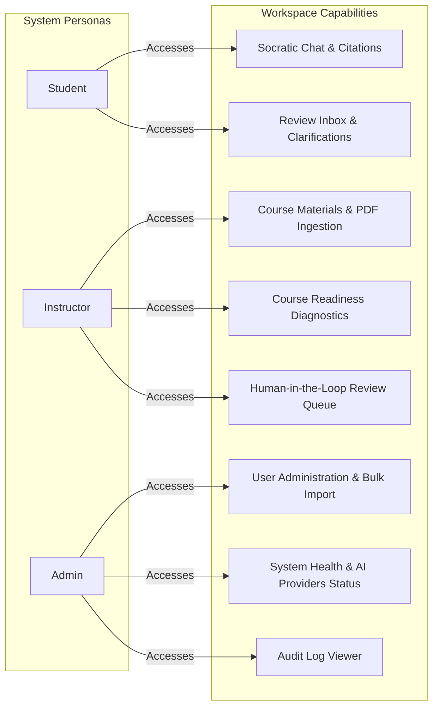

```mermaid
flowchart TD
    subgraph Traditional["Traditional Chatbot / LLM Wrapper"]
        Q1[Student: 'Write me a function for binary search'] --> A1[LLM: 'Here is the complete code...']
        A1 --> F1[Short-circuits learning]
    end

    subgraph MorshidModel["Morshid Socratic System"]
        Q2[Student: 'Write me a function for binary search'] --> V[Validate Course & Evidence]
        V --> EA[Educational Analysis: Misconception & Effort]
        EA --> TP[Teaching Decision: Guidance Level & Strategy]
        TP --> TG[Tutor Generation: Socratic Probing Question]
        TG --> SG[3-Stage Guardrails & Over-Reveal Check]
        SG --> A2[Tutor: 'What is the middle element condition in an array?']
        A2 --> F2[Encourages active discovery]
    end
```

# 01. System Overview & Mental Model

**Morshid** (مرشد, Arabic for "Guide" or "Advisor") is an enterprise-grade, pedagogical AI tutoring platform. It is engineered specifically to deliver grounded, Socratic educational guidance to students while strictly adhering to pedagogical guardrails and instructor oversight.

---

## 1. Core Mental Model & Pedagogical Principles

Unlike standard conversational chatbots that generate direct answers or code solutions, Morshid operates as an active **Socratic Tutor**.

### Core Pedagogical Invariants:
1. **Never Give the Final Answer / Code Solution**: The system enforces a strict `NO_FINAL_ANSWER` reveal policy. It will never generate copy-pasteable assignment solutions or complete function implementations.
2. **Strict Grounding on Course Materials**: All factual teaching points must be grounded in verified, instructor-uploaded PDF materials for the student's enrolled course.
3. **Non-Executable Debugging Guidance**: When a student submits broken code, the tutor analyzes logical or syntax misunderstandings and asks guiding questions. Student code is **never executed in a sandbox/VM**, preventing security hazards and output cheating.
4. **Human-in-the-Loop (HITL) Fallback**: Any model low-confidence detection, potential safety violation, or student-escalated query is immediately queued for instructor review.

---

## 2. User Personas & System Roles

Morshid defines three distinct, mutually isolated roles:

### 1. Student (`STUDENT`)
- Interacts with the AI tutor through course-scoped conversational chat sessions.
- Receives iterative hints, conceptual explanations, and source citations linked to exact PDF chunks.
- Can flag any turn by clicking **"Request Instructor Review"**.
- Receives direct instructor resolutions in their student inbox.

### 2. Instructor (`INSTRUCTOR`)
- Manages assigned courses and uploads course syllabi, lecture notes, and textbooks (PDF format).
- Monitors material processing status (`PROCESSING` -> `READY` / `WARNING` / `FAILED`).
- Reviews course readiness reports before opening tutoring to students.
- Moderates the **Review Queue**: reviews student-flagged or guardrail-flagged turns, providing overrides, explanations, or approvals.

### 3. Administrator (`ADMIN`)
- Governs the overall tenant: creates/updates/disables users, assigns instructor/student course memberships, and handles bulk CSV/JSON user imports.
- Monitors system health probes (`/health/live`, `/health/ready`), PostgreSQL/Redis connectivity, and AI provider status.
- Inspects comprehensive, tamper-evident audit logs (`audit_logs`).

---

## 3. High-Level Architectural Topology

Morshid is built as an npm workspace monorepo consisting of a modern client SPA and a structured NestJS backend supported by PostgreSQL (with `pgvector`), Redis, and external AI providers.

---

## 4. Key End-to-End System Invariants

1. **Strict Dependency Graph**: Production architecture enforces an acyclic dependency graph via `dependency-cruiser`. Framework platform adapters and common utilities never import business capability modules; capability modules never cross boundaries except through explicit public interfaces.
2. **Transaction-Bounded Atomicity (ADR 0007)**: Cross-capability database operations (such as finalizing a tutoring turn, creating message retrievals, updating topic state, and inserting audit logs) execute atomically within an opaque `DatabaseTransaction` contract without leaking Prisma-specific client types across seams.
3. **Corpus Isolation & Course Readiness**: A student query is never embedded or matched against a course until all candidate materials in that course are 100% indexed in the active vector space. Partial indexing blocks retrieval for that course to prevent hallucinations and ungrounded output.
4. **Project-Aware Gemini Chat Pool (ADR 0008)**: High-concurrency AI chat calls are distributed round-robin across an array of distinct Google Cloud quota projects via Redis, with automatic jittered exponential backoff upon receiving HTTP 429 status codes.
