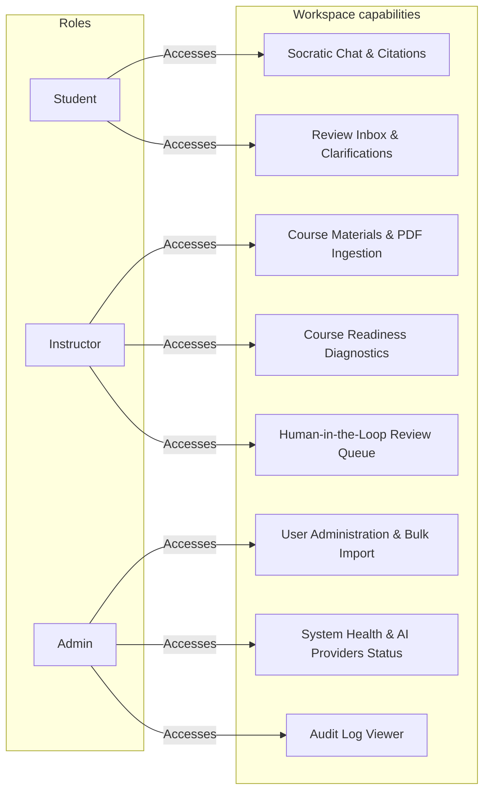
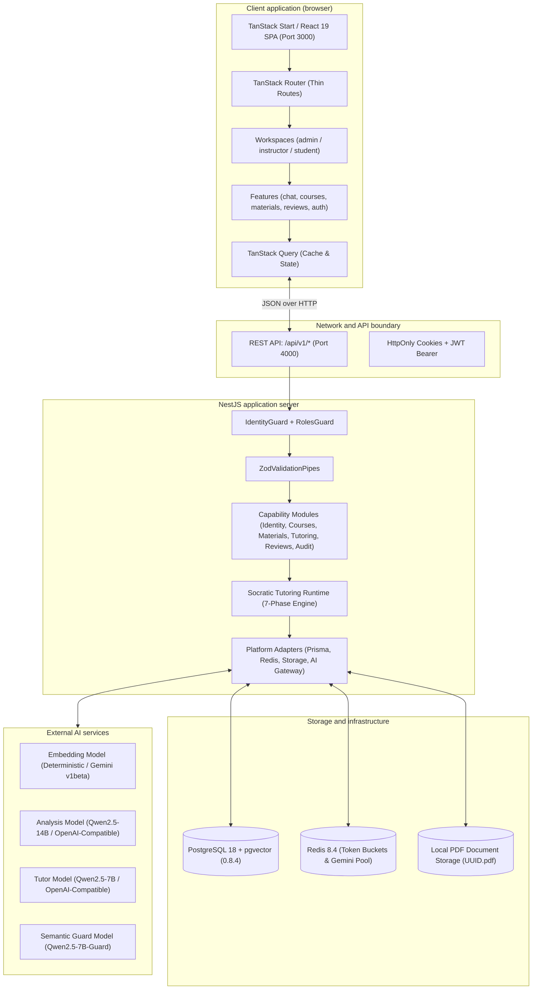

# 01. System overview and mental model

Morshid (مرشد, Arabic for "Guide" or "Advisor") is an AI tutoring platform that guides students using the Socratic method within course-specific boundaries and instructor oversight.

---

## 1. Core mental model and pedagogical principles

Standard conversational chatbots generate direct answers or code. Morshid teaches Socratically instead.

```mermaid
flowchart TD
    subgraph Traditional["Traditional Chatbot / LLM Wrapper"]
        Q1[Student: 'Write me a function for binary search'] --> A1[LLM: 'Here is the complete code...']
        A1 --> F1[Short-circuits learning]
    end

    subgraph MorshidModel["Morshid Socratic System"]
        Q2[Student: 'Write me a function for binary search'] --> V[Validate Course & Evidence]
        V --> EA[Educational Analysis: Misconception & Effort]
        EA --> TP[Teaching Decision: Guidance Level & Strategy]
        TP --> TG[Tutor Generation: Socratic Probing Question]
        TG --> SG[3-Stage Guardrails & Over-Reveal Check]
        SG --> A2[Tutor: 'What is the middle element condition in an array?']
        A2 --> F2[Encourages active discovery]
    end
```

### Core pedagogical invariants

1. **Never give the final answer or code.** Morshid enforces a `NO_FINAL_ANSWER` reveal policy. It will not generate copy-paste assignment solutions or complete function implementations.
2. **Ground all answers in course materials.** All factual explanations must cite verified, instructor-uploaded PDFs from the student's enrolled course.
3. **No code execution.** When a student submits broken code, the tutor spots logical or syntax misunderstandings and asks guiding questions. Morshid never runs student code in a sandbox or virtual machine, avoiding execution security risks and automated test evasion.
4. **Instructor fallback.** When model confidence drops below threshold, safety guardrails trigger, or a student requests help, the turn enters the instructor review queue.

---

## 2. User personas and system roles

Morshid separates users into three roles:

### 1. Student (`STUDENT`)
- Chats with the AI tutor inside enrolled courses.
- Receives hints, explanations, and citations linked to specific PDF text chunks.
- Can flag any turn by clicking **Request Instructor Review**.
- Receives instructor replies directly in their review inbox.

### 2. Instructor (`INSTRUCTOR`)
- Manages assigned courses and uploads PDFs (syllabi, lecture notes, textbooks).
- Tracks material processing state (`PROCESSING`, `READY`, `WARNING`, `FAILED`).
- Checks course readiness reports before opening tutoring to students.
- Reviews flagged turns in the review queue to provide overrides, explanations, or approvals.

### 3. Administrator (`ADMIN`)
- Manages tenant accounts: creates, updates, and disables users, assigns course memberships, and runs bulk CSV or JSON user imports.
- Monitors health check endpoints (`/health/live`, `/health/ready`), database connectivity, and AI provider status.
- Inspects system audit logs (`audit_logs`).

---

## 3. High-level architectural topology

Morshid is an npm workspace monorepo with a TanStack Start client SPA, a NestJS API backend, PostgreSQL with `pgvector`, Redis, and external LLM providers.

---

## 4. Key end-to-end system invariants

1. **Strict dependency graph.** `dependency-cruiser` enforces an acyclic module graph. Platform adapters and common utilities never import capability modules. Capability modules only interact through explicit public interfaces.
2. **Transaction-bounded atomicity (ADR 0007).** Cross-capability database writes execute atomically inside an opaque `DatabaseTransaction` interface. Finalizing a tutoring turn, saving retrieval records, updating topic mastery, and appending audit logs run in a single transaction without exposing Prisma client types outside the platform layer.
3. **Corpus isolation and course readiness.** The system does not embed or match student queries until every material in the course reaches `READY` status in the vector store. Partial indexing blocks tutoring for that course to prevent answers from incomplete material.
4. **Project-aware Gemini pool (ADR 0008).** The system distributes Gemini chat calls round-robin across multiple Google Cloud projects tracked in Redis, retrying with jittered exponential backoff when encountering HTTP 429 responses.
