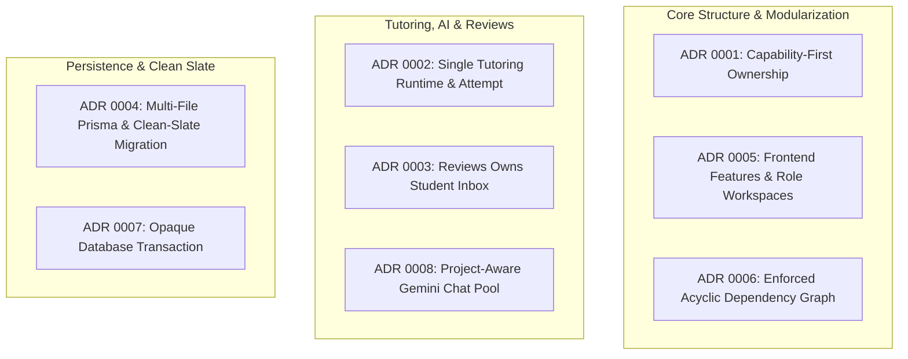
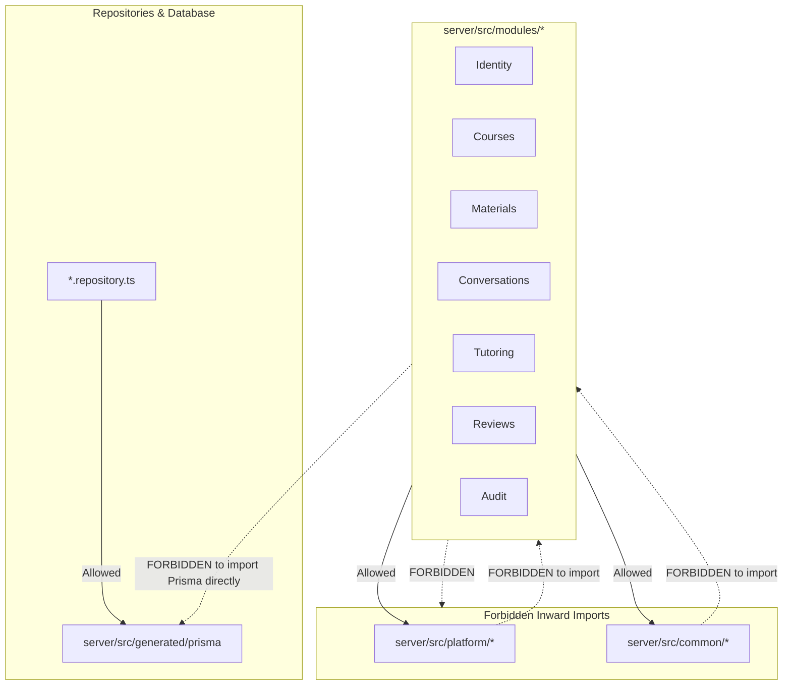
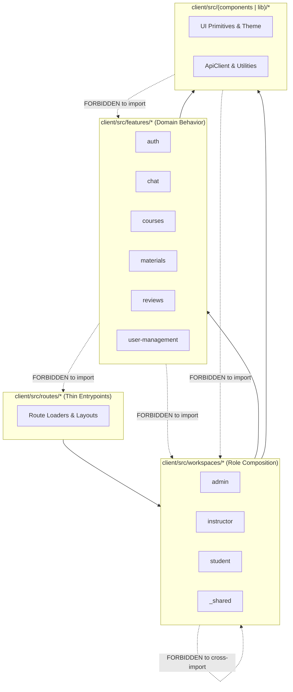

# 03. Architecture, Dependency Boundaries & ADRs

Morshid follows a strictly governed, capability-first architecture. Layering rules, interface boundaries, and import permissions are enforced automatically on every commit via [dependency-cruiser](file:///home/mahmoud-ahmed/Projects/Morshid/dependency-cruiser.config.mjs).

---

## 1. The 8 Accepted Architectural Decision Records (ADRs)

The architectural baseline is codified in eight accepted ADRs located in [`docs/adr/`](file:///home/mahmoud-ahmed/Projects/Morshid/docs/adr/):



### Summary of ADR Decisions:

| ADR | Title | Core Decision & Rationale |
|---|---|---|
| **0001** | [Capability-First Ownership](file:///home/mahmoud-ahmed/Projects/Morshid/docs/adr/0001-capability-first-ownership.md) | Organizes product behavior by named business capabilities (`Identity`, `Courses`, `Materials`, `Conversations`, `Tutoring`, `Reviews`, `Audit`, `Health`). Framework primitives (`common/`) and technical adapters (`platform/`) must never depend on product modules. |
| **0002** | [One Tutoring Runtime & Attempt](file:///home/mahmoud-ahmed/Projects/Morshid/docs/adr/0002-one-tutoring-runtime-and-attempt.md) | Tutoring owns a single authoritative `TutoringAttempt` aggregate and exposes a single external execution seam: `TutoringRuntime.run(command): Promise<TutoringTurnReceipt>`. Code diagnosis is handled as Socratic debugging guidance; student code is never executed. |
| **0003** | [Reviews Owns the Student Inbox](file:///home/mahmoud-ahmed/Projects/Morshid/docs/adr/0003-reviews-owned-student-inbox.md) | Eliminates generic "Notifications" abstractions. The `Reviews` capability owns review case intake, instructor moderation queues, resolution workflows, and the student-facing review inbox atomically. |
| **0004** | [Multi-File Prisma & Clean-Slate Migration](file:///home/mahmoud-ahmed/Projects/Morshid/docs/adr/0004-clean-slate-prisma-migration.md) | Authors the Prisma schema across cohesive domain files (`*.prisma`). Uses a single clean-slate initial migration (`20260811150000_initial`) verified via database catalog semantic hashing. |
| **0005** | [Frontend Features & Role Workspaces](file:///home/mahmoud-ahmed/Projects/Morshid/docs/adr/0005-frontend-features-and-workspaces.md) | Keeps client routes thin. Domain behavior lives in `client/src/features/`; role-specific composition lives in `client/src/workspaces/` (`admin`, `instructor`, `student`). Cross-feature access is permitted only through explicit `interface/` files. |
| **0006** | [Enforce An Acyclic Dependency Graph](file:///home/mahmoud-ahmed/Projects/Morshid/docs/adr/0006-enforced-dependency-graph.md) | Enforces strict, zero-exception dependency graphs via `depcruise` across client and server workspaces. Broad barrels and circular imports are forbidden. |
| **0007** | [Opaque Database Transaction Participation](file:///home/mahmoud-ahmed/Projects/Morshid/docs/adr/0007-opaque-database-transaction.md) | Defines an opaque `DatabaseTransaction` token. Product module interfaces accept this token for multi-module atomicity without leaking Prisma ORM types across architectural boundaries. |
| **0008** | [Project-Aware Gemini Chat Credential Pool](file:///home/mahmoud-ahmed/Projects/Morshid/docs/adr/0008-project-aware-gemini-chat-pool.md) | Distributes interactive chat traffic across distinct Google Cloud projects in Redis with exponential backoff on HTTP 429 to avoid multi-replica rate exhaustion. |

---

## 2. Server Boundary Rules

The server architecture separates framework primitives, infrastructure platform code, and business capability modules.



### Server Rules Enforced by `depcruise`:
1. **`server-common-independent`**: Code in `server/src/common` must never import from `server/src/modules`.
2. **`server-platform-independent`**: Code in `server/src/platform` must never import from `server/src/modules`.
3. **`server-generated-prisma-ownership`**: Generated Prisma client types (`server/src/generated/prisma`) may only be imported by `platform/database`, `seeds`, and `*.repository.ts` persistence files. Domain services, orchestrators, DTOs, and controllers must use domain entities and interfaces.
4. **`server-controller-not-to-persistence-or-controller`**: Controllers depend strictly on application/domain services and DTOs, never on repositories or sibling controllers.
5. **`server-persistence-not-to-http-or-application`**: Repository persistence adapters must never import HTTP adapters or application orchestrators.
6. **Capability Interface Encapsulation (`*-interface-only`)**:
   - `identity-interface-only`: External modules may only consume Identity via `identity.module.ts`, `identity.guard.ts`, `identity.roles.ts`, `identity.public.ts`, and `identity.types.ts`.
   - `courses-interface-only`: External modules consume Courses only via `courses.module.ts` or `courses/interface/`.
   - `materials-interface-only`: External modules consume Materials only via `materials.module.ts` or `materials/interface/`.
   - `conversations-interface-only`: External modules consume Conversations only via `conversations.module.ts` or `conversations/interface/`.
   - `tutoring-interface-only`: External modules consume Tutoring only via `tutoring.module.ts` and `tutoring/interface/(tutoring-runtime | run-tutoring-turn-command | tutoring-turn-receipt).ts`.
   - `conversations-not-to-tutoring`: Conversations owns ordered messages and must not depend on Tutoring attempt internals.

---

## 3. Client Boundary Rules

The frontend client enforces a strict separation between shared primitives, domain features, role workspaces, and route entrypoints.



### Client Rules Enforced by `depcruise`:
1. **`client-shared-independent`**: Shared UI primitives (`client/src/components`) and library utilities (`client/src/lib`) must never import from `features/`, `workspaces/`, `routes/`, or `app/`.
2. **`client-features-not-to-composition`**: Feature modules own transport, validation schemas, React Query hooks, and domain logic. They must never import from `workspaces/`, `routes/`, or `app/`.
3. **`client-workspaces-not-to-routes-or-app`**: Role workspaces compose feature views and shared UI without importing route adapters or application root files.
4. **Role Isolation**:
   - `client-admin-not-to-other-workspaces`: Admin workspace code cannot import Instructor or Student workspaces.
   - `client-instructor-not-to-other-workspaces`: Instructor workspace code cannot import Admin or Student workspaces.
   - `client-student-not-to-other-workspaces`: Student workspace code cannot import Admin or Instructor workspaces.
   - `client-shared-workspace-not-to-role`: `workspaces/_shared` cannot import any role-specific workspace.
5. **Cross-Feature Interface Seam (`client-${feature}-interface-only`)**:
   - If feature `chat` needs auth state, it may only import from `@/features/auth/session/interface`.
   - Directly importing another feature's internal components, hooks, or styles is an immediate build failure.

---

## 4. Verifying Boundaries Locally

Run the architecture gate at any time:

```bash
# Verify both Client and Server boundaries
npm run test:architecture

# Verify Client only
npm run test:architecture:client

# Verify Server only
npm run test:architecture:server
```
