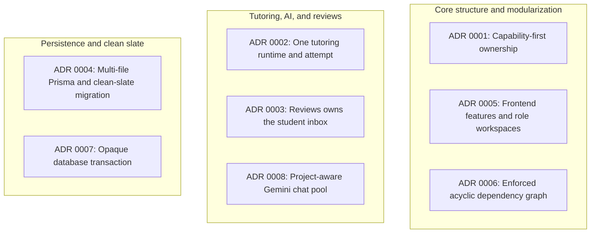
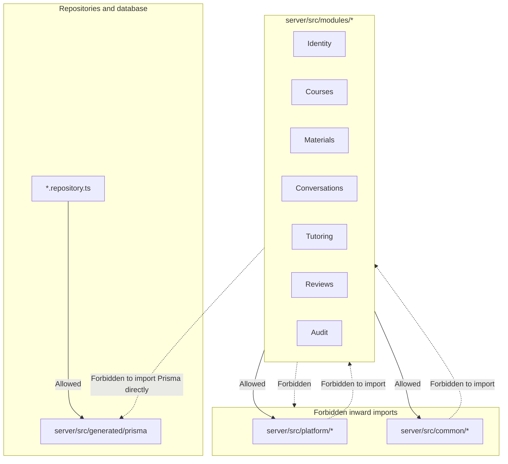
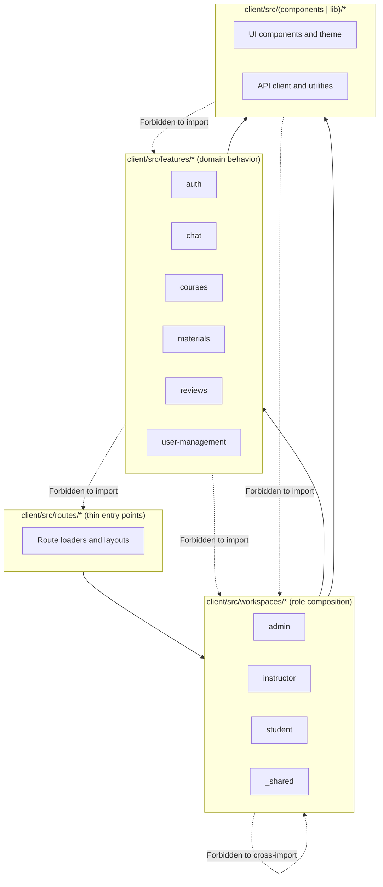

# 03. Architecture, dependency boundaries, and ADRs

Morshid follows a capability-first architecture. `dependency-cruiser` automatically checks layering rules, interface boundaries, and import permissions on every commit (configured in [dependency-cruiser.config.mjs](file:///home/mahmoud-ahmed/Projects/Morshid/dependency-cruiser.config.mjs)).

---

## 1. Accepted architectural decision records (ADRs)

Eight accepted ADRs in [`docs/adr/`](file:///home/mahmoud-ahmed/Projects/Morshid/docs/adr/) define the architectural baseline:



### Summary of ADR decisions

| ADR | Title | Core decision and rationale |
|---|---|---|
| **0001** | [Capability-first ownership](file:///home/mahmoud-ahmed/Projects/Morshid/docs/adr/0001-capability-first-ownership.md) | Organizes product code by named business capabilities (`Identity`, `Courses`, `Materials`, `Conversations`, `Tutoring`, `Reviews`, `Audit`, `Health`). Shared utilities (`common/`) and platform adapters (`platform/`) must never import product modules. |
| **0002** | [One tutoring runtime and attempt](file:///home/mahmoud-ahmed/Projects/Morshid/docs/adr/0002-one-tutoring-runtime-and-attempt.md) | Tutoring owns a single `TutoringAttempt` aggregate and exposes one execution method: `TutoringRuntime.run(command): Promise<TutoringTurnReceipt>`. Code diagnosis provides Socratic debugging guidance; the server never executes student code. |
| **0003** | [Reviews owns the student inbox](file:///home/mahmoud-ahmed/Projects/Morshid/docs/adr/0003-reviews-owned-student-inbox.md) | Removes generic notification abstractions. `Reviews` directly owns case intake, instructor moderation queues, resolution workflows, and the student review inbox. |
| **0004** | [Multi-file Prisma schema and clean-slate migration](file:///home/mahmoud-ahmed/Projects/Morshid/docs/adr/0004-clean-slate-prisma-migration.md) | Splits the Prisma schema across domain files (`*.prisma`). Uses a single clean-slate initial migration (`20260811150000_initial`) verified by database catalog hashing. |
| **0005** | [Frontend domain features and role workspaces](file:///home/mahmoud-ahmed/Projects/Morshid/docs/adr/0005-frontend-features-and-workspaces.md) | Keeps client routes thin. Domain behavior lives in `client/src/features/`; role-specific views live in `client/src/workspaces/` (`admin`, `instructor`, `student`). Features import from other features only through explicit `interface/` files. |
| **0006** | [Enforce an acyclic dependency graph](file:///home/mahmoud-ahmed/Projects/Morshid/docs/adr/0006-enforced-dependency-graph.md) | Uses `depcruise` to enforce strict dependency graphs across client and server workspaces. Broad barrel exports and circular imports fail the build. |
| **0007** | [Opaque database transaction participation](file:///home/mahmoud-ahmed/Projects/Morshid/docs/adr/0007-opaque-database-transaction.md) | Defines an opaque `DatabaseTransaction` token. Module interfaces accept this token to coordinate multi-module transactions without exposing Prisma types across boundaries. |
| **0008** | [Project-aware Gemini chat credential pool](file:///home/mahmoud-ahmed/Projects/Morshid/docs/adr/0008-project-aware-gemini-chat-pool.md) | Distributes chat traffic across Google Cloud projects using Redis, applying exponential backoff on HTTP 429 to prevent rate exhaustion across replicas. |

---

## 2. Server boundary rules

Server code is divided into shared utilities, platform infrastructure, and business capability modules.



### Server rules enforced by `depcruise`

1. **`server-common-independent`.** `server/src/common` must never import from `server/src/modules`.
2. **`server-platform-independent`.** `server/src/platform` must never import from `server/src/modules`.
3. **`server-generated-prisma-ownership`.** Only `platform/database`, `seeds`, and `*.repository.ts` files may import generated Prisma client types (`server/src/generated/prisma`). Domain services, DTOs, and controllers use domain entities and interfaces instead.
4. **`server-controller-not-to-persistence-or-controller`.** Controllers depend on application or domain services and DTOs, never on repositories or sibling controllers.
5. **`server-persistence-not-to-http-or-application`.** Repositories must not import HTTP adapters or application services.
6. **Capability encapsulation (`*-interface-only`).**
   - `identity-interface-only`: Other modules import Identity only through `identity.module.ts`, `identity.guard.ts`, `identity.roles.ts`, `identity.public.ts`, and `identity.types.ts`.
   - `courses-interface-only`: Other modules import Courses only through `courses.module.ts` or `courses/interface/`.
   - `materials-interface-only`: Other modules import Materials only through `materials.module.ts` or `materials/interface/`.
   - `conversations-interface-only`: Other modules import Conversations only through `conversations.module.ts` or `conversations/interface/`.
   - `tutoring-interface-only`: Other modules import Tutoring only through `tutoring.module.ts` and `tutoring/interface/(tutoring-runtime | run-tutoring-turn-command | tutoring-turn-receipt).ts`.
   - `conversations-not-to-tutoring`: `Conversations` stores ordered messages and does not depend on `Tutoring` attempt internals.

---

## 3. Client boundary rules

The client separates shared UI and utilities, domain features, role workspaces, and route entry points.



### Client rules enforced by `depcruise`

1. **`client-shared-independent`.** Shared UI components (`client/src/components`) and library utilities (`client/src/lib`) must never import from `features/`, `workspaces/`, `routes/`, or `app/`.
2. **`client-features-not-to-composition`.** Feature modules own transport, validation schemas, React Query hooks, and domain logic. They must never import from `workspaces/`, `routes/`, or `app/`.
3. **`client-workspaces-not-to-routes-or-app`.** Role workspaces assemble feature views and shared UI without importing route adapters or application root files.
4. **Role isolation.**
   - `client-admin-not-to-other-workspaces`: Admin workspace code cannot import Instructor or Student workspaces.
   - `client-instructor-not-to-other-workspaces`: Instructor workspace code cannot import Admin or Student workspaces.
   - `client-student-not-to-other-workspaces`: Student workspace code cannot import Admin or Instructor workspaces.
   - `client-shared-workspace-not-to-role`: `workspaces/_shared` cannot import role-specific workspaces.
5. **Cross-feature interfaces (`client-${feature}-interface-only`).**
   - When feature `chat` needs auth state, it imports only from `@/features/auth/session/interface`.
   - Directly importing another feature's internal components, hooks, or styles fails the build.

---

## 4. Verifying boundaries locally

Check boundary rules with npm scripts:

```bash
# Check both client and server boundaries
npm run test:architecture

# Check client boundaries only
npm run test:architecture:client

# Check server boundaries only
npm run test:architecture:server
```
