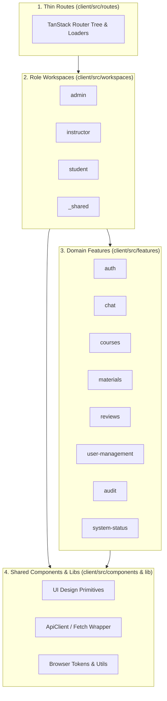
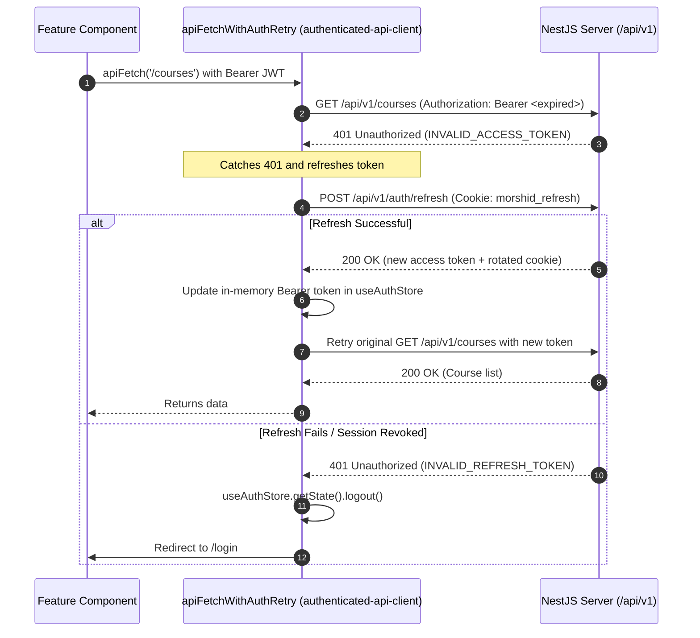
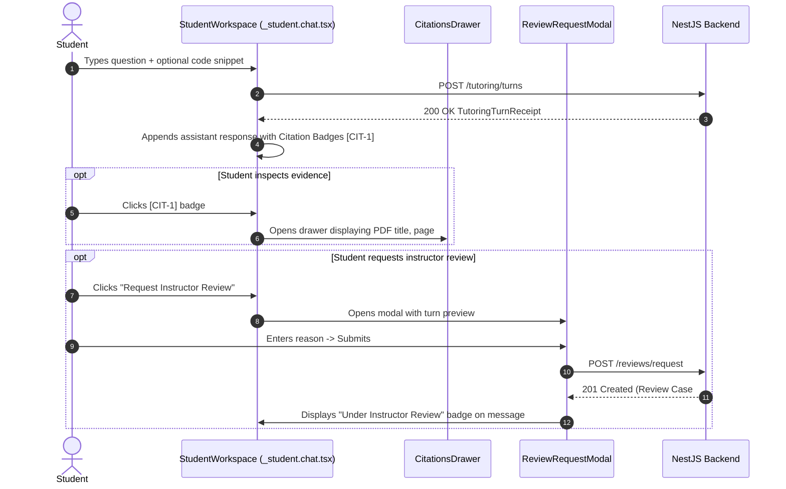

# 04. Frontend architecture and client workflows

The Morshid client is a React 19 single-page application built with Vite, TanStack Router / Start file-based routing, and TanStack Query (React Query v5) for server state.

---

## 1. Frontend mental model and layering

The client codebase ([ADR 0005](file:///home/mahmoud-ahmed/Projects/Morshid/docs/adr/0005-frontend-features-and-workspaces.md)) is organized into four architectural tiers:



### Path aliases

The client configures path aliases in [`client/tsconfig.json`](file:///home/mahmoud-ahmed/Projects/Morshid/client/tsconfig.json):
- `@/*` maps to `client/src/*` (for example, `@/features/auth` or `@/components/ui/button`).
- ESLint prohibits relative cross-feature imports (such as `../../courses`).

---

## 2. Routing, loaders, and role-based access

TanStack Router generates the route tree into [`client/src/routeTree.gen.ts`](file:///home/mahmoud-ahmed/Projects/Morshid/client/src/routeTree.gen.ts).

### Route structure

- **`routes/__root.tsx`**. The root layout component. Injects `QueryClientProvider`, global toaster, and devtools.
- **`routes/index.tsx`**. Public landing page.
- **`routes/login.tsx`**. Unauthenticated login screen with email and password form. Authenticated users are redirected to their role workspace.
- **`routes/health.tsx`**. System diagnostic and server health probe view (`DevelopmentStatusPage`).
- **`routes/_student.tsx`**. Pathless layout protecting student routes. Enforces `user.role === 'STUDENT'` and loads the course list.
  - `routes/_student.chat.tsx`. Socratic chat workspace and active conversation view.
  - `routes/_student.settings.tsx`. Student account settings view.
- **`routes/instructor/`**. Instructor workspace layout (`routes/instructor/route.tsx`). Enforces `user.role === 'INSTRUCTOR'`.
  - `routes/instructor/index.tsx`. Instructor dashboard shell and course roster.
  - `routes/instructor/materials/index.tsx`. Course material manager, upload panel, and processing status.
  - `routes/instructor/review-queue/index.tsx`. Human-in-the-loop review moderation queue.
  - `routes/instructor/review-queue/$reviewCaseId.tsx`. Review case resolution panel.
  - `routes/instructor/settings.tsx`. Instructor account settings.
- **`routes/admin/`**. Admin workspace layout (`routes/admin/route.tsx`). Enforces `user.role === 'ADMIN'`.
  - `routes/admin/index.tsx`. Admin overview dashboard (`AdminDashboardPage`).
  - `routes/admin/users/students.tsx` and `instructors.tsx`. User management, creation dialog, and bulk CSV importer.
  - `routes/admin/courses/index.tsx`. Course creation and management.
  - `routes/admin/materials/index.tsx`. Admin material explorer.
  - `routes/admin/assignments/index.tsx`. Course roster membership manager.
  - `routes/admin/audit/index.tsx`. Tamper-evident audit log explorer.
  - `routes/admin/settings.tsx`. Admin settings.

---

## 3. Domain features and public interfaces

Each domain capability under `client/src/features/` is isolated and exposes an explicit `interface/` barrel:

```
client/src/features/auth/
├── session/                    # Session management and store
│   ├── interface/
│   │   ├── authenticated-api-client.ts # apiFetch with automatic 401 retry
│   │   └── session-store.ts    # Zustand useAuthStore (token, user, status)
│   └── use-session.ts
├── sign-in/                    # SignInForm component and mutations
├── routing/                    # Role protection and redirect helpers
└── index.ts                    # Public barrel
```

### Feature overview

1. **`auth`**. Authentication lifecycle, Zustand `useAuthStore`, and silent token renewal (`authenticated-api-client.ts`).
2. **`chat`**. Socratic chat interface, message histories, topic state progression, citations drawer, and debugging indicators.
3. **`courses`**. Course selection dropdowns, enrollment cards, and course readiness diagnostics.
4. **`materials`**. PDF drag-and-drop uploader, processing status badges (`PROCESSING`, `READY`, `WARNING`, `FAILED`), and chunk explorer.
5. **`reviews`**. Instructor review queue moderation panel, resolution actions (Approve, Edit, Replace), student review request modal, and student notification inbox.
6. **`user-management`**. Admin user tables, single user creation dialog, bulk CSV user importer, password reset triggers, and account disable/reactivate toggles.
7. **`audit`**. Paginated, filterable audit event log explorer with JSON payload inspector.
8. **`system-status`**. Status indicators for PostgreSQL (`pgvector`), Redis, and active AI model gateways.

---

## 4. HTTP client and silent session refresh

[`client/src/features/auth/session/interface/authenticated-api-client.ts`](file:///home/mahmoud-ahmed/Projects/Morshid/client/src/features/auth/session/interface/authenticated-api-client.ts) handles network communication, wrapping the base fetch client in [`client/src/lib/http/http.ts`](file:///home/mahmoud-ahmed/Projects/Morshid/client/src/lib/http/http.ts):



### HTTP client behavior

- **Base URL.** The client prepends `VITE_API_BASE_URL` (defaulting to `http://localhost:4000/api/v1`).
- **Credentials.** It sends `credentials: 'include'` on every request to pass HTTP-only session cookies.
- **Session versions.** It tracks `sessionVersion` to prevent parallel 401 responses from triggering multiple simultaneous refresh requests.
- **Error parsing.** It normalizes NestJS error envelopes into typed `ApiError` instances (`{ code, message, statusCode, errors }`).

---

## 5. State management with TanStack Query

Morshid uses TanStack Query (React Query v5) for server state caching, and standard React hooks (`useState`, `useReducer`, `useContext`) for UI state.

### Namespaced query keys

Hierarchical query keys allow targeted cache invalidation:

```typescript
export const courseQueryKeys = {
  all: ['courses'] as const,
  lists: () => [...courseQueryKeys.all, 'list'] as const,
  detail: (courseId: string) => [...courseQueryKeys.all, 'detail', courseId] as const,
  readiness: (courseId: string) => [...courseQueryKeys.all, 'readiness', courseId] as const,
}
```

### Mutation and invalidation pattern

```typescript
export function useResolveReviewMutation() {
  const queryClient = useQueryClient()
  
  return useMutation({
    mutationFn: (data: ResolveReviewDto) => reviewsApi.resolveReview(data),
    onSuccess: (_, variables) => {
      // Invalidate review queue and specific review detail
      queryClient.invalidateQueries({ queryKey: ['reviews', 'queue'] })
      queryClient.invalidateQueries({ queryKey: ['reviews', 'detail', variables.reviewCaseId] })
    },
  })
}
```

---

## 6. End-to-end UI journeys

### 6.1 Student Socratic tutoring journey



### 6.2 Instructor course ingestion and review moderation journey

1. **Course roster inspection.** The instructor opens `/instructor` to view assigned courses and student enrollment counts.
2. **Material ingestion.**
   - Drop a PDF (up to 10MB) onto `/instructor/courses/$courseId`.
   - The UI polls `GET /materials?courseId=$courseId` to show progress (`PROCESSING` -> `READY`).
   - If the parser encounters warnings (such as scanned pages without text), the page displays a warning banner.
3. **Course readiness.**
   - The UI queries `GET /courses/$courseId/readiness`. If any document is still unindexed or processing, the UI explains why student tutoring is paused for the course.
4. **Review moderation.**
   - Navigate to `/instructor/reviews`.
   - Inspect pending cases (`STUDENT_REQUEST` or `SAFETY_GUARD_FLAG`).
   - Click **Claim** to lock the case for 15 minutes.
   - Resolve the review by choosing **Approve Original**, **Override with Custom Answer**, or **Provide Clarifying Hint**.
   - Submitting the resolution notifies the student in their review inbox.
