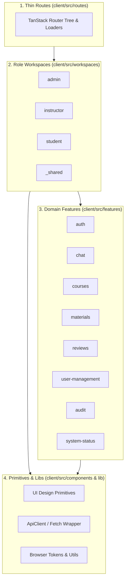
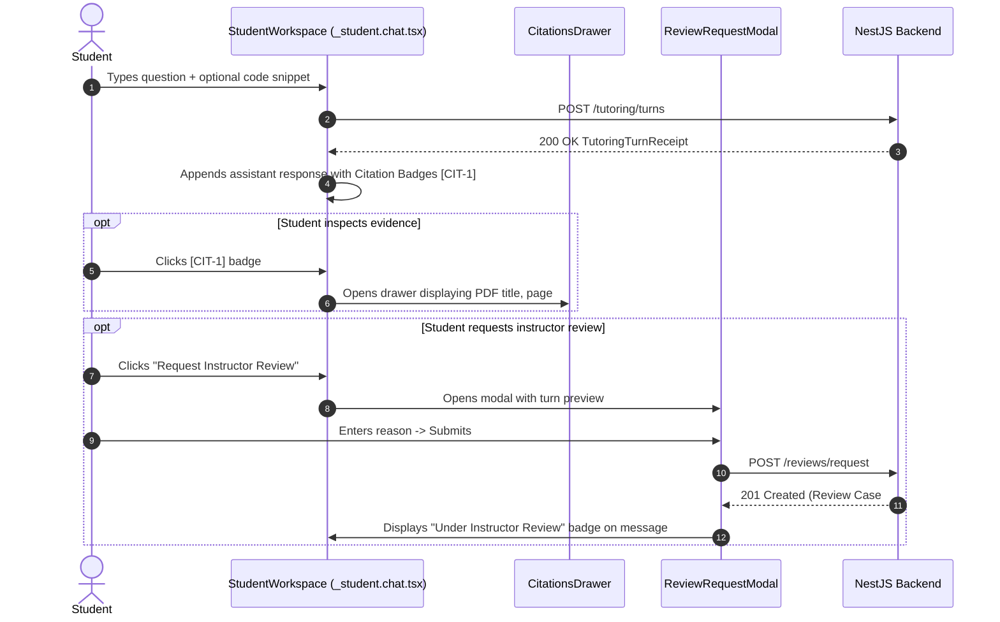

# 04. Frontend Architecture & Client Workflows

The Morshid client is a React 19 Single Page Application built with **Vite**, **TanStack Router / Start** file-based routing, and **TanStack Query (React Query v5)** for server state management.

---

## 1. Frontend Mental Model & Layering

The client codebase ([ADR 0005](file:///home/mahmoud-ahmed/Projects/Morshid/docs/adr/0005-frontend-features-and-workspaces.md)) is organized into four distinct architectural tiers:



### Path Aliases
The client enforces strict path aliases via [`client/tsconfig.json`](file:///home/mahmoud-ahmed/Projects/Morshid/client/tsconfig.json):
- `@/*` maps directly to `client/src/*` (e.g. `@/features/auth`, `@/components/ui/button`).
- Relative cross-feature imports (e.g. `../../courses`) are prohibited by ESLint rules.

---

## 2. Routing, Loaders & Role-Based Access

The routing system is generated by TanStack Router into [`client/src/routeTree.gen.ts`](file:///home/mahmoud-ahmed/Projects/Morshid/client/src/routeTree.gen.ts).

### Route Structure:
- **`routes/__root.tsx`**: The root layout component. Injects `QueryClientProvider`, global toaster, and devtools.
- **`routes/index.tsx`**: Public landing page.
- **`routes/login.tsx`**: Unauthenticated login screen with email/password form (redirects authenticated users to their role workspace).
- **`routes/health.tsx`**: System diagnostic and server health probe view (`DevelopmentStatusPage`).
- **`routes/_student.tsx`**: Pathless layout protecting student routes. Enforces `user.role === 'STUDENT'` and loads course list.
  - `routes/_student.chat.tsx`: Socratic chat workspace and active conversation view.
  - `routes/_student.settings.tsx`: Student account settings view.
- **`routes/instructor/`**: Instructor workspace layout (`routes/instructor/route.tsx`). Enforces `user.role === 'INSTRUCTOR'`.
  - `routes/instructor/index.tsx`: Instructor dashboard shell and course roster.
  - `routes/instructor/materials/index.tsx`: Course material manager, upload panel, and processing status.
  - `routes/instructor/review-queue/index.tsx`: Human-in-the-loop review moderation queue.
  - `routes/instructor/review-queue/$reviewCaseId.tsx`: Detailed review case resolution panel.
  - `routes/instructor/settings.tsx`: Instructor account settings.
- **`routes/admin/`**: Admin workspace layout (`routes/admin/route.tsx`). Enforces `user.role === 'ADMIN'`.
  - `routes/admin/index.tsx`: Admin overview dashboard (`AdminDashboardPage`).
  - `routes/admin/users/students.tsx` & `instructors.tsx`: User management, creation dialog, and bulk CSV importer.
  - `routes/admin/courses/index.tsx`: Course creation and management.
  - `routes/admin/materials/index.tsx`: Admin material explorer.
  - `routes/admin/assignments/index.tsx`: Course roster membership manager.
  - `routes/admin/audit/index.tsx`: Tamper-evident audit log explorer.
  - `routes/admin/settings.tsx`: Admin settings.

---

## 3. Domain Features & Public Interfaces

Every capability under `client/src/features/` is isolated and exposes an explicit `interface/` barrel:

```
client/src/features/auth/
├── session/                    # Session management and store
│   ├── interface/
│   │   ├── authenticated-api-client.ts # apiFetch with automatic 401 retry
│   │   └── session-store.ts    # Zustand useAuthStore (token, user, status)
│   └── use-session.ts
├── sign-in/                    # SignInForm component and mutations
├── routing/                    # Role protection and redirect helpers
└── index.ts                    # Public barrel
```

### Feature Overview:
1. **`auth`**: Authentication lifecycle, Zustand `useAuthStore`, and silent token renewal (`authenticated-api-client.ts`).
2. **`chat`**: Socratic chat interface, message histories, topic state progression, citations drawer, and debugging guidance indicators.
3. **`courses`**: Course selection dropdowns, enrollment cards, and course readiness diagnostics.
4. **`materials`**: PDF drag-and-drop uploader, processing status badges (`PROCESSING`, `READY`, `WARNING`, `FAILED`), and chunk explorer.
5. **`reviews`**: Instructor review queue moderation panel, resolution actions (Approve, Edit, Replace), student review request modal, and student notification inbox.
6. **`user-management`**: Admin user data tables, single user creation dialog, bulk CSV user importer, password reset triggers, and account disable/reactivate toggles.
7. **`audit`**: Paginated, filterable audit event log explorer with JSON payload inspector.
8. **`system-status`**: Status indicators for PostgreSQL (`pgvector`), Redis, and active AI model gateways.

---

## 4. HTTP Client & Silent Session Refresh

Network communication is coordinated by [`client/src/features/auth/session/interface/authenticated-api-client.ts`](file:///home/mahmoud-ahmed/Projects/Morshid/client/src/features/auth/session/interface/authenticated-api-client.ts) built on the base fetch wrapper in [`client/src/lib/http/http.ts`](file:///home/mahmoud-ahmed/Projects/Morshid/client/src/lib/http/http.ts):


### Key HTTP Client Features:
- **Base URL Prepending**: Automatically targets `VITE_API_BASE_URL` (defaulting to `http://localhost:4000/api/v1`).
- **Credentials Handling**: Sets `credentials: 'include'` to pass HTTP-only session cookies.
- **Session Version Tracking**: Concurrency-safe token refreshing tracks `sessionVersion` to avoid stampeding multiple refresh requests on parallel 401 responses.
- **Error Normalization**: Parses NestJS error envelopes into strongly-typed `ApiError` instances (`{ code, message, statusCode, errors }`).

---

## 5. State Management with TanStack Query

Morshid relies purely on **TanStack Query (React Query v5)** for server state caching and React local state (`useState`, `useReducer`, `useContext`) for UI state.

### Namespaced Query Keys:
Query keys are structured hierarchically to enable precise cache invalidation:

```typescript
export const courseQueryKeys = {
  all: ['courses'] as const,
  lists: () => [...courseQueryKeys.all, 'list'] as const,
  detail: (courseId: string) => [...courseQueryKeys.all, 'detail', courseId] as const,
  readiness: (courseId: string) => [...courseQueryKeys.all, 'readiness', courseId] as const,
}
```

### Mutation & Invalidation Pattern:
```typescript
export function useResolveReviewMutation() {
  const queryClient = useQueryClient()
  
  return useMutation({
    mutationFn: (data: ResolveReviewDto) => reviewsApi.resolveReview(data),
    onSuccess: (_, variables) => {
      // Invalidate review queue and specific review detail
      queryClient.invalidateQueries({ queryKey: ['reviews', 'queue'] })
      queryClient.invalidateQueries({ queryKey: ['reviews', 'detail', variables.reviewCaseId] })
    },
  })
}
```

---

## 6. End-to-End User UI Journeys

### 6.1 Student Socratic Tutoring Journey


### 6.2 Instructor Course Ingestion & Review Moderation Journey
1. **Course Creation & Member Enrollment**: Instructor visits `/instructor`, views assigned courses, and inspects enrolled student counts.
2. **Material Ingestion**:
   - Drags and drops PDF file (up to 10MB) on `/instructor/courses/$courseId`.
   - UI polls `GET /materials?courseId=$courseId` showing real-time progress (`PROCESSING` -> `READY`).
   - If warnings occur (e.g. scanned pages without text), displays warning banner.
3. **Course Readiness Check**:
   - The UI evaluates `GET /courses/$courseId/readiness`. If any material is unindexed or processing, displays an informative readiness blocker explaining why student tutoring is paused for this course.
4. **Review Queue Moderation**:
   - Navigates to `/instructor/reviews`.
   - Views pending review cases (`STUDENT_REQUEST` or `SAFETY_GUARD_FLAG`).
   - Clicks **Claim** to acquire a 15-minute moderation lock.
   - Chooses resolution: **Approve Original**, **Override with Custom Answer**, or **Provide Clarifying Hint**.
   - Submitting resolution immediately notifies the student via their Review Inbox.
