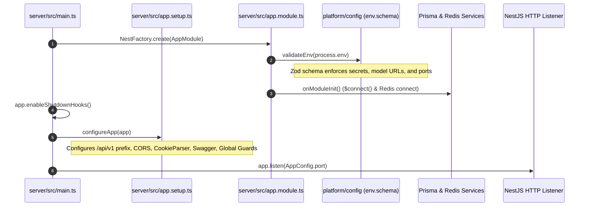
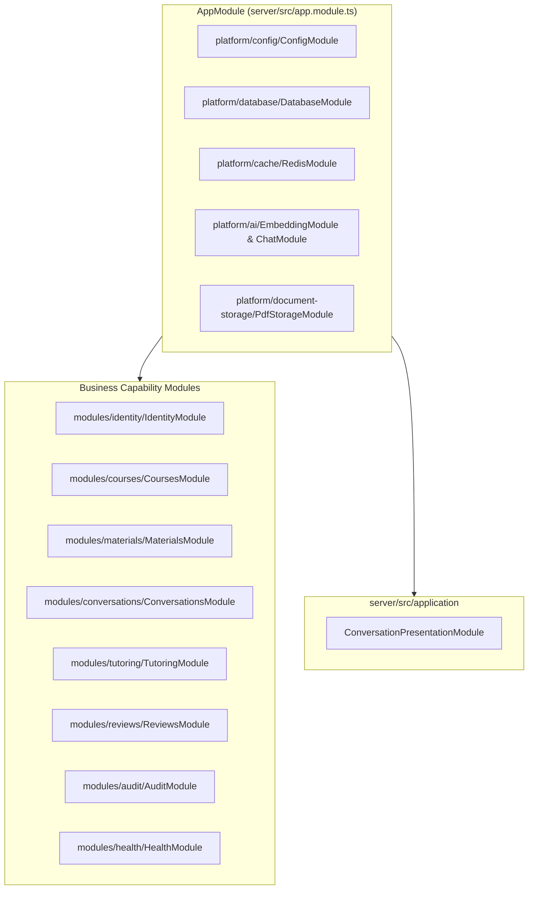

# 05. Backend Architecture, Modules & Request Lifecycle

Morshid's server is a high-performance **NestJS** application structured around **capability-first modules**, **clean platform adapters**, and a strict, unidirectional execution pipeline.

---

## 1. Application Bootstrap & Initialization

The server initialization is divided across three key files:



### 1.1 Bootstrap (`server/src/main.ts`)
- Calls `NestFactory.create(AppModule)`.
- Enables graceful shutdown hooks (`app.enableShutdownHooks()`) to cleanly disconnect PostgreSQL and Redis on `SIGTERM`.
- Reads `PORT` (default `4000`) and `CLIENT_ORIGIN` (default `http://localhost:3000`) via `ConfigService`.
- Configures CORS on the app (`credentials: true`, `origin: clientOrigin`).
- Invokes `configureApp(app)` from `server/src/app.setup.ts`.
- Binds HTTP listener to `0.0.0.0:${port}`.

### 1.2 Setup Configuration (`server/src/app.setup.ts`)
- **Global Route Prefix**: Configures `app.setGlobalPrefix('api/v1')`, excluding `/health/live` and `/health/ready`.
- **OpenAPI / Swagger Spec**: Mounted at `/docs`, `/docs-json`, and `/docs-yaml` (active in `development` and `test` environments). Configured with `access-token` Bearer auth and `refresh-session` cookie auth.

---

## 2. Server Module Architecture

The server encapsulates all product domain behavior inside [`server/src/modules/`](file:///home/mahmoud-ahmed/Projects/Morshid/server/src/modules/):



### Module Responsibilities:
1. **`IdentityModule`**: Authentication (Argon2id, JWT, HMAC refresh cookies), RBAC guards (`@Roles`), account management, and user administration.
2. **`CoursesModule`**: Course management, instructor/student course membership rosters, and course access authorization policies.
3. **`MaterialsModule`**: PDF upload validation, text extraction (`pdfjs-dist`), text chunking, and course evidence querying.
4. **`ConversationsModule`**: Chat session creation, ordered message history management, topic state tracking, and student context window aggregation.
5. **`TutoringModule`**: Socratic teaching runtime, 7-phase execution pipeline, prompt builders, model generation, and 3-stage response approval.
6. **`ReviewsModule`**: Review case intake (student requests and safety triggers), instructor moderation queue, claiming/resolving workflows, and the student review inbox.
7. **`AuditModule`**: Immutable, structured security and business audit event logger (`audit_logs` table).
8. **`HealthModule`**: Health probes evaluating PostgreSQL (`SELECT 1`), Redis (`PING`), and `pgvector` extension readiness.
9. **`ConversationPresentationModule`**: Cross-capability presentation bridge that joins conversation messages with citation evidence and review metadata.

---

## 3. Platform & Common Layers

### Platform Layer ([`server/src/platform/`](file:///home/mahmoud-ahmed/Projects/Morshid/server/src/platform/))
- **`database/`**: Wraps Prisma Client via `PrismaService`. Implements the opaque `DatabaseTransaction` pattern ([ADR 0007](file:///home/mahmoud-ahmed/Projects/Morshid/docs/adr/0007-opaque-database-transaction.md)) and connection health checks.
- **`cache/`**: Wraps Redis via `RedisService`. Handles token-bucket rate limiting and Gemini project pool selection ([ADR 0008](file:///home/mahmoud-ahmed/Projects/Morshid/docs/adr/0008-project-aware-gemini-chat-pool.md)).
- **`document-storage/`**: Pluggable storage abstraction (`PdfStorage`) backed by `LocalPdfStorageAdapter` with UUID file keys, strict mode `0o600`, and atomic syncs.
- **`ai/`**: Upstream AI integrations: `DeterministicEmbeddingProvider`, `GeminiEmbeddingAdapter`, `StructuredChatTransport`, and `GeminiChatProjectPool`.
- **`config/`**: Type-safe configuration management using Zod runtime validation (`env.schema.ts`).

### Common Layer ([`server/src/common/`](file:///home/mahmoud-ahmed/Projects/Morshid/server/src/common/))
- **`http/`**: `ZodValidationPipe`, `createRequestBudget` (deadline and cancellation tracking), request context extractors (`ip`, `userAgent`), and standard OpenAPI error DTOs.
- **`text/`**: Text sanitization and NFKC normalization helpers.

---

## 4. Complete Request Execution Lifecycle

Every incoming HTTP request traverses a well-defined series of guards, pipes, handlers, and filters:

```mermaid
flowchart TD
    Req([Client HTTP Request]) --> Express[Express Server & CORS]
    Express --> Guard1{IdentityGuard}
    
    Guard1 -->|@Public() Endpoint| Guard2
    Guard1 -->|Protected| VerifyJWT[Verify Bearer JWT & Password Version]
    VerifyJWT -->|Invalid / Stale| Err401[401 Unauthorized]
    VerifyJWT -->|Account Disabled| Err403Dis[403 Account Disabled + Audit Log]
    VerifyJWT -->|Valid| AttachUser[Attach request.user = AuthenticatedUser]
    
    AttachUser --> Guard2{RolesGuard}
    Guard2 -->|@Roles(...) matched| Pipes
    Guard2 -->|Role Mismatch| Err403Role[403 Insufficient Role + Fail-Safe Audit]
    
    Pipes[ZodValidationPipe / ParseUUIDPipe]
    Pipes -->|Validation Error| Err400[400 Bad Request]
    Pipes -->|Valid Payload| Ctrl[Controller Route Handler]
    
    Ctrl --> Svc[Application / Domain Service]
    Svc --> Repo[Repository Persistence]
    Repo --> DB[(PostgreSQL Tx / Redis)]
    
    DB --> Svc --> Ctrl
    Ctrl --> FilterCheck{Exception Thrown?}
    
    FilterCheck -->|No Exception| Res200([200/201 HTTP Response])
    FilterCheck -->|ForbiddenException| AuditFilter[ConversationCourseBoundaryAuditFilter]
    AuditFilter --> ReEmit403[Audit Log Recorded + 403 Re-emitted]
    
    FilterCheck -->|Other Exception| NestException[NestJS Standard Error Response]
```

### Pipeline Execution Order:
1. **Express & CORS**: Validates request headers and origins against `CLIENT_ORIGIN`.
2. **`IdentityGuard` (`APP_GUARD`)**:
   - If route is marked `@Public()`, allows passage.
   - Extracts Bearer token from `Authorization` header.
   - Decodes JWT, validates signature, checks unexpired, and verifies `payload.pwd === user.passwordChangedAt`.
   - Rejects disabled accounts with HTTP 403.
   - Attaches `request.user` (`AuthenticatedUser`).
3. **`RolesGuard` (`APP_GUARD`)**:
   - Checks `@Roles(...allowedRoles)`.
   - If user lacks required role, records `ACCESS_RBAC_DENIED` in audit log and throws 403 `insufficientRoleException()`.
4. **Validation Pipes**:
   - `ZodValidationPipe` parses and transforms body/query/params using domain Zod schemas.
   - Throws 400 Bad Request with structured field-level error messages if validation fails.
5. **Controller & Services**:
   - Business logic runs. If multi-entity writes occur, opens an opaque `DatabaseTransaction`.
6. **Exception Filters**:
   - `ConversationCourseBoundaryAuditFilter`: Catches cross-course boundary violations (`ACTIVE_STUDENT_MEMBERSHIP_REQUIRED`) and emits security audit logs.

---

## 5. Standard Error Shapes

All error responses from Morshid follow a uniform JSON structure:

```json
{
  "code": "ACTIVE_STUDENT_MEMBERSHIP_REQUIRED",
  "message": "Student is not enrolled in the specified course",
  "statusCode": 403,
  "timestamp": "2026-08-14T20:18:00.000Z",
  "path": "/api/v1/courses/123/chat-sessions"
}
```

For validation failures (HTTP 400), an `errors` array provides field-specific messages:

```json
{
  "code": "VALIDATION_FAILED",
  "message": "Request payload validation failed",
  "errors": [
    {
      "field": "content",
      "message": "Message content cannot be empty"
    }
  ]
}
```
