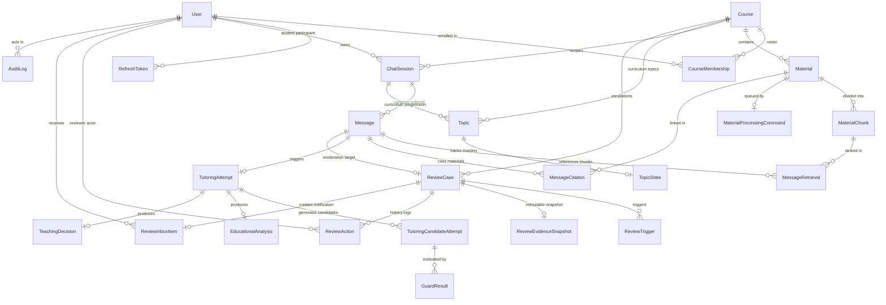

# 07. Database & Persistence Architecture

Morshid's persistence tier is built on **PostgreSQL 18** with the **pgvector 0.8.4** extension, managed via a **multi-file Prisma ORM schema** ([ADR 0004](file:///home/mahmoud-ahmed/Projects/Morshid/docs/adr/0004-clean-slate-prisma-migration.md)) and an **opaque database transaction contract** ([ADR 0007](file:///home/mahmoud-ahmed/Projects/Morshid/docs/adr/0007-opaque-database-transaction.md)).

---

## 1. Multi-File Prisma Schema Layout

Prisma's `prismaSchemaFolder` preview feature organizes models into cohesive domain capabilities under [`server/prisma/`](file:///home/mahmoud-ahmed/Projects/Morshid/server/prisma/):

```
server/prisma/
├── schema.prisma                  # Datasource and generator configuration
├── identity.prisma                # User, RefreshToken, UserRole, UserStatus
├── courses-and-materials.prisma   # Course, CourseMembership, Material, MaterialChunk, MaterialProcessingCommand
├── conversations.prisma           # ChatSession, Message, MessageRetrieval, MessageCitation
├── tutoring.prisma                # Topic, TopicState, TutoringAttempt, TutoringCandidateAttempt, GuardResult, EducationalAnalysis, TeachingDecision
├── reviews.prisma                 # ReviewCase, ReviewTrigger, ReviewEvidenceSnapshot, ReviewAction, IdempotencyRecord, ReviewInboxItem
└── audit.prisma                   # AuditLog
```

---

## 2. Complete Entity-Relationship (ER) Diagram



---

## 3. The Clean-Slate Initial Migration

In compliance with [ADR 0004](file:///home/mahmoud-ahmed/Projects/Morshid/docs/adr/0004-clean-slate-prisma-migration.md), Morshid maintains a single, audited initial migration located in [`server/prisma/migrations/20260811150000_initial/migration.sql`](file:///home/mahmoud-ahmed/Projects/Morshid/server/prisma/migrations/20260811150000_initial/migration.sql).

### 3.1 Custom PostgreSQL Extensions
```sql
CREATE EXTENSION IF NOT EXISTS pgcrypto;
CREATE EXTENSION IF NOT EXISTS citext;
CREATE EXTENSION IF NOT EXISTS vector;
```
- **`pgcrypto`**: Cryptographic functions for hashing and random generation.
- **`citext`**: Case-insensitive text type for unique email matching on the `users` table.
- **`vector`**: pgvector extension providing high-performance cosine similarity distance operators (`<=>`) over 1,536-dimensional embeddings.

### 3.2 Custom PL/pgSQL Triggers & Invariants
1. **`enforce_review_case_target` (`review_cases_target_check`)**:
   - A deferred constraint trigger executing after INSERT or UPDATE on `review_cases`.
   - Strictly enforces that a review case's `target_message_id` references a completed `ASSISTANT` message belonging to a chat session in the identical `course_id`.
2. **`review_cases_terminal_shape_check`**:
   - CHECK constraint guaranteeing that resolved review cases contain non-null published content and resolved timestamps, while rejected cases contain non-null resolution reasons.
3. **ORM Timestamp Management**:
   - The `updated_at` column is maintained deterministically across entities by Prisma's `@updatedAt` decorator.

---

## 4. Database Catalog Semantic Fingerprinting

To prevent accidental drift or silent weakening of constraints (e.g. dropping a `CHECK (chunk_index >= 0)` constraint), the repository verifies the live PostgreSQL schema against a cryptographic hash:

- **Script**: [`scripts/catalog-semantics.mts`](file:///home/mahmoud-ahmed/Projects/Morshid/scripts/catalog-semantics.mts) and [`server/prisma/assert-catalog.mts`](file:///home/mahmoud-ahmed/Projects/Morshid/server/prisma/assert-catalog.mts).
- **Execution**: `npm run db:assert-catalog`.
- **Validation**: Connects to the database and extracts tables, columns, foreign keys, CHECK constraints, unique indexes, and triggers, computing an exact SHA-256 digest (`8ef054a9f7...`). If the live catalog does not match, the CI gate immediately fails.

---

## 5. Opaque Database Transactions (ADR 0007)

To ensure cross-capability atomicity (such as finalizing a tutoring turn, creating message citations, updating student topic state, and writing an audit log in one transaction) without leaking ORM-specific types across architectural boundaries, Morshid uses an **opaque transaction pattern**:

```mermaid
graph LR
    subgraph PlatformLayer["Platform Layer (server/src/platform/database)"]
        Runner["DatabaseTransactionRunner"]
        OpaqueToken["DatabaseTransaction (Opaque Token)"]
        PrismaTx["Prisma.TransactionClient"]
    end

    subgraph ServiceLayer["Product Capabilities"]
        TutoringSvc["TutoringRuntimeApplication"]
        ConversationsSvc["ConversationsTurns"]
        AuditSvc["AuditService"]
    end

    TutoringSvc -->|Calls runner.run()| Runner
    Runner -->|Supplies| OpaqueToken
    TutoringSvc -->|Passes token| ConversationsSvc
    TutoringSvc -->|Passes token| AuditSvc
    ConversationsSvc -->|Unwraps token in Repository| PrismaTx
```

### 5.1 Opaque Transaction Contract
Located in [`server/src/platform/database/database-transaction.ts`](file:///home/mahmoud-ahmed/Projects/Morshid/server/src/platform/database/database-transaction.ts):

```typescript
export type DatabaseTransaction = {
  readonly __databaseTransaction: unique symbol
}

export abstract class DatabaseTransactionRunner {
  abstract run<T>(work: (tx: DatabaseTransaction) => Promise<T>): Promise<T>
}
```

### 5.2 Persistence Unwrapping
Only files ending in `.repository.ts` or located in `server/src/platform/database` are permitted to unwrap `DatabaseTransaction` into the underlying Prisma client:

```typescript
// Inside a repository persistence file:
const prisma = asPrismaTransaction(tx)
await prisma.message.create({ ... })
```

> [!IMPORTANT]
> **Zero Remote I/O in Transactions**:
> Upstream AI model calls (Gemini, Qwen, etc.) and file system writes are **strictly forbidden** inside a database transaction. Transactions are reserved solely for fast, atomic database state transitions.
