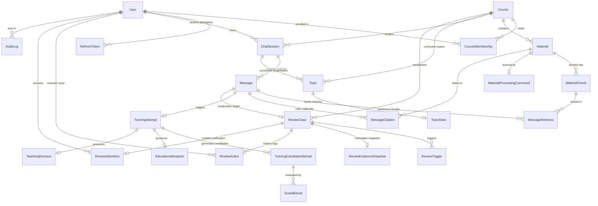

# 07. Database and persistence architecture

Morshid runs on PostgreSQL 18 with the pgvector 0.8.4 extension. Schemas are organized across multiple Prisma files ([ADR 0004](file:///home/mahmoud-ahmed/Projects/Morshid/docs/adr/0004-clean-slate-prisma-migration.md)), and transactions use an opaque token contract ([ADR 0007](file:///home/mahmoud-ahmed/Projects/Morshid/docs/adr/0007-opaque-database-transaction.md)) to avoid leaking ORM types across module boundaries.

---

## 1. Multi-file Prisma schema layout

Prisma's `prismaSchemaFolder` preview feature splits schema definitions by domain under [`server/prisma/`](file:///home/mahmoud-ahmed/Projects/Morshid/server/prisma/):

```
server/prisma/
├── schema.prisma                  # Datasource and generator configuration
├── identity.prisma                # User, RefreshToken, UserRole, UserStatus
├── courses-and-materials.prisma   # Course, CourseMembership, Material, MaterialChunk, MaterialProcessingCommand
├── conversations.prisma           # ChatSession, Message, MessageRetrieval, MessageCitation
├── tutoring.prisma                # Topic, TopicState, TutoringAttempt, TutoringCandidateAttempt, GuardResult, EducationalAnalysis, TeachingDecision
├── reviews.prisma                 # ReviewCase, ReviewTrigger, ReviewEvidenceSnapshot, ReviewAction, IdempotencyRecord, ReviewInboxItem
└── audit.prisma                   # AuditLog
```

---

## 2. Entity-relationship diagram



---

## 3. Clean-slate initial migration

Under [ADR 0004](file:///home/mahmoud-ahmed/Projects/Morshid/docs/adr/0004-clean-slate-prisma-migration.md), Morshid maintains a single audited initial migration in [`server/prisma/migrations/20260811150000_initial/migration.sql`](file:///home/mahmoud-ahmed/Projects/Morshid/server/prisma/migrations/20260811150000_initial/migration.sql).

### 3.1 Custom PostgreSQL extensions

```sql
CREATE EXTENSION IF NOT EXISTS pgcrypto;
CREATE EXTENSION IF NOT EXISTS citext;
CREATE EXTENSION IF NOT EXISTS vector;
```

- `pgcrypto`: hashing and random generation.
- `citext`: case-insensitive text for unique email matching on `users`.
- `vector`: pgvector extension providing the cosine distance operator (`<=>`) over 1,536-dimensional embeddings.

### 3.2 Custom PL/pgSQL triggers and constraints

1. `enforce_review_case_target` (`review_cases_target_check`): A deferred constraint trigger that runs after `INSERT` or `UPDATE` on `review_cases`. It checks that `target_message_id` references a completed `ASSISTANT` message from a chat session in the same course (`course_id`).
2. `review_cases_terminal_shape_check`: A `CHECK` constraint requiring resolved review cases to have non-null published content and resolved timestamps, and rejected cases to have non-null resolution reasons.
3. Timestamp management: Prisma's `@updatedAt` decorator updates `updated_at` columns automatically on mutation.

---

## 4. Database catalog semantic fingerprinting

To catch accidental schema drift or dropped constraints, such as removing a `CHECK (chunk_index >= 0)` constraint, CI validates the live database schema against an expected catalog fingerprint.

- Scripts: [`scripts/catalog-semantics.mts`](file:///home/mahmoud-ahmed/Projects/Morshid/scripts/catalog-semantics.mts) and [`server/prisma/assert-catalog.mts`](file:///home/mahmoud-ahmed/Projects/Morshid/server/prisma/assert-catalog.mts)
- Execution: `npm run db:assert-catalog`
- Validation: Connects to PostgreSQL, extracts tables, columns, foreign keys, `CHECK` constraints, unique indexes, and triggers, and computes a SHA-256 digest (`8ef054a9f7...`). If the live catalog differs, the check fails.

---

## 5. Opaque database transactions (ADR 0007)

When an operation spans multiple capabilities, like finishing a tutoring turn, creating message citations, updating student topic state, and writing an audit log, everything must succeed or fail together. To keep ORM types out of domain services, Morshid uses an opaque transaction token:

```mermaid
graph LR
    subgraph PlatformLayer["Platform Layer (server/src/platform/database)"]
        Runner["DatabaseTransactionRunner"]
        OpaqueToken["DatabaseTransaction (Opaque Token)"]
        PrismaTx["Prisma.TransactionClient"]
    end

    subgraph ServiceLayer["Product Capabilities"]
        TutoringSvc["TutoringRuntimeApplication"]
        ConversationsSvc["ConversationsTurns"]
        AuditSvc["AuditService"]
    end

    TutoringSvc -->|Calls runner.run()| Runner
    Runner -->|Supplies| OpaqueToken
    TutoringSvc -->|Passes token| ConversationsSvc
    TutoringSvc -->|Passes token| AuditSvc
    ConversationsSvc -->|Unwraps token in Repository| PrismaTx
```

### 5.1 Opaque transaction contract

Defined in [`server/src/platform/database/database-transaction.ts`](file:///home/mahmoud-ahmed/Projects/Morshid/server/src/platform/database/database-transaction.ts):

```typescript
export type DatabaseTransaction = {
  readonly __databaseTransaction: unique symbol
}

export abstract class DatabaseTransactionRunner {
  abstract run<T>(work: (tx: DatabaseTransaction) => Promise<T>): Promise<T>
}
```

### 5.2 Persistence unwrapping

Only repository files (`*.repository.ts`) and platform code under `server/src/platform/database` may unwrap `DatabaseTransaction` into the underlying Prisma client:

```typescript
// Inside a repository persistence file:
const prisma = asPrismaTransaction(tx)
await prisma.message.create({ ... })
```

> [!IMPORTANT]
> **No remote I/O inside transactions**
> Never make LLM API calls, embedding requests, or disk writes inside a transaction callback. Run remote operations first, then open a transaction for the database writes.
