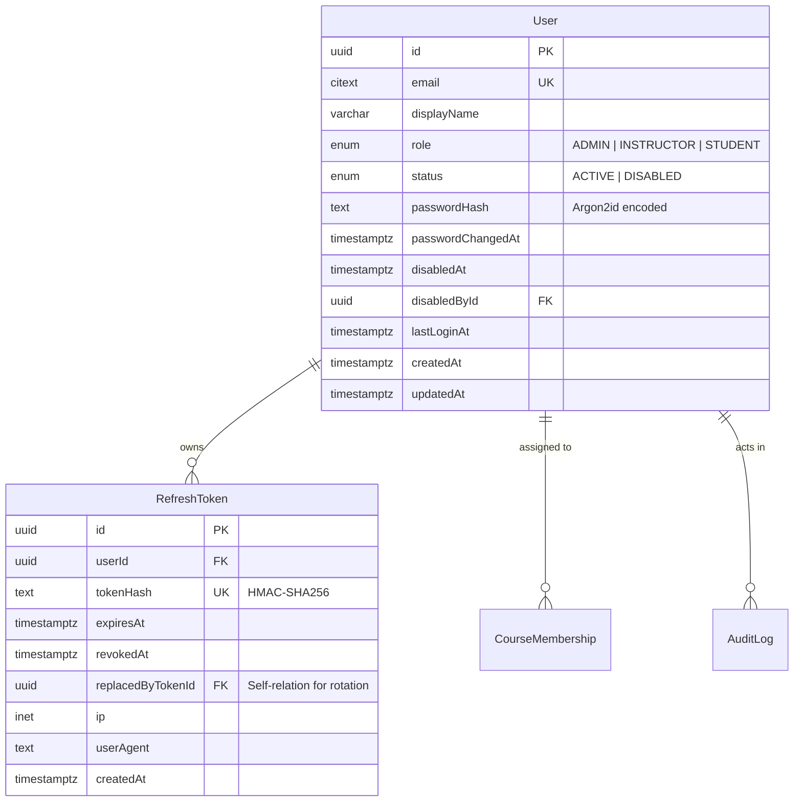
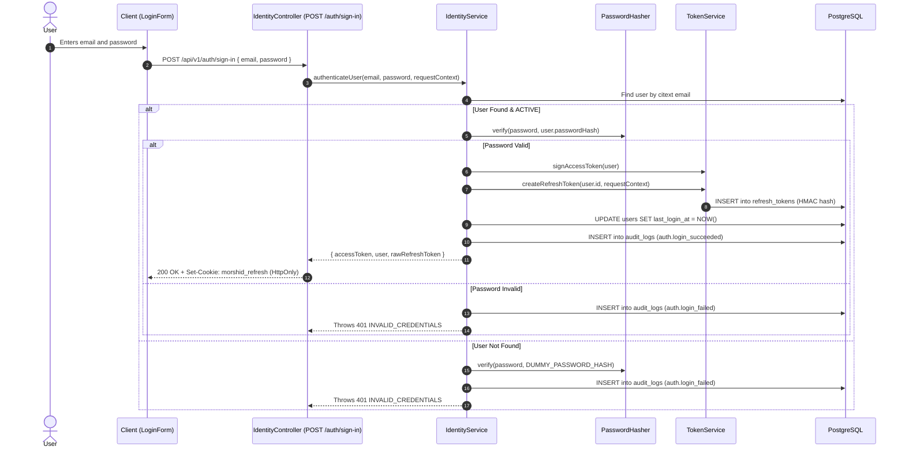
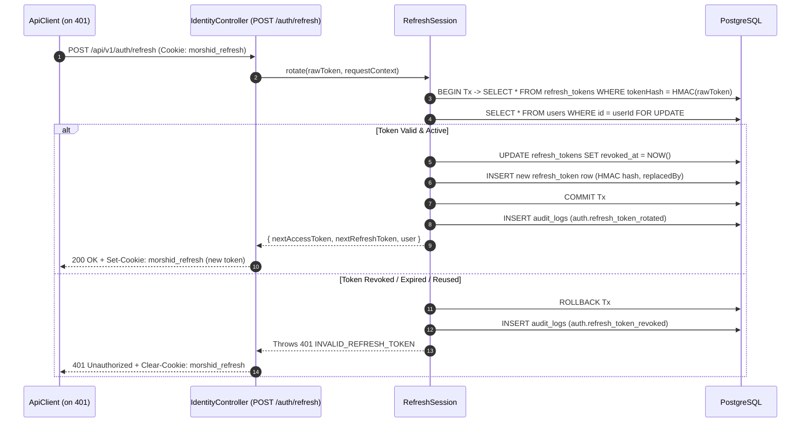

# 08. Identity, authentication, and access control

Morshid handles authentication and access control with Argon2id password hashing, short-lived JWT access tokens, rotating HMAC-SHA256 refresh tokens, role-based access control (RBAC), and database audit logging.

---

## 1. Identity data models

Defined in [`identity.prisma`](file:///home/mahmoud-ahmed/Projects/Morshid/server/prisma/identity.prisma):



---

## 2. Cryptographic mechanisms

### 2.1 Password hashing ([`password-hasher.ts`](file:///home/mahmoud-ahmed/Projects/Morshid/server/src/modules/identity/password-hasher.ts))
- Uses `node:crypto` `argon2Sync('argon2id')`.
- Parameters:
  - Memory cost (`m`): `19,456` KB (~19 MB)
  - Time cost (`t` / passes): `2`
  - Parallelism (`p`): `1`
  - Tag length: `32` bytes
  - Salt length: `16` bytes
- Output format: `argon2id:v1:m=19456,t=2,p=1,keylen=32:<salt_base64url>:<hash_base64url>`.
- Constant-time fallback: when a user is not found during sign-in, the hasher runs verification against `DUMMY_PASSWORD_HASH` with `timingSafeEqual` to prevent timing-based user enumeration.

### 2.2 JWT access tokens ([`access-token.ts`](file:///home/mahmoud-ahmed/Projects/Morshid/server/src/modules/identity/access-token.ts))
- The server signs tokens with `@nestjs/jwt` using `AUTH_ACCESS_TOKEN_SECRET`.
- Lifetime defaults to 900 seconds (15 minutes), configured by `AUTH_ACCESS_TOKEN_TTL_SECONDS`.
- Payload structure:
  ```typescript
  export interface SignedAccessTokenPayload {
    sub: string // User UUID
    typ: 'access'
    pwd: string // user.passwordChangedAt.toISOString()
  }
  ```
- Instant invalidation: `IdentityGuard` verifies that `payload.pwd === user.passwordChangedAt.toISOString()`. When a user changes or resets their password, existing JWT access tokens fail this check immediately without waiting for expiration.

### 2.3 Refresh tokens and single-use rotation ([`refresh-session.ts`](file:///home/mahmoud-ahmed/Projects/Morshid/server/src/modules/identity/refresh-session.ts))
- 256 bits of entropy generated by `randomBytes(32).toString('base64url')`.
- The database never stores raw refresh tokens. It stores an HMAC-SHA256 hash computed with `AUTH_REFRESH_TOKEN_HASH_SECRET`.
- Delivered through the `morshid_refresh` cookie with:
  - `httpOnly: true`
  - `path: '/api/v1/auth'` (restricted to auth endpoints)
  - `sameSite: 'lax'`
  - `secure: process.env.NODE_ENV === 'production'`
- Rotation steps:
  1. Open a database transaction and acquire a row lock on the user (`SELECT id FROM users WHERE id = $1 FOR UPDATE`).
  2. Verify the token is unexpired, unrevoked, and created after `user.passwordChangedAt`.
  3. Mark the current token `revoked_at = NOW()`.
  4. Insert a new `RefreshToken` record linking `replacedByTokenId`.
  5. Commit the transaction, return the new token, and set the updated cookie.

---

## 3. End-to-end authentication flows

### 3.1 Sign-in flow


### 3.2 Refresh token rotation flow


---

## 4. Role-based access control (RBAC)

Morshid registers two global guards in [`identity.module.ts`](file:///home/mahmoud-ahmed/Projects/Morshid/server/src/modules/identity/identity.module.ts):

```typescript
{ provide: APP_GUARD, useExisting: IdentityGuard },
{ provide: APP_GUARD, useExisting: RolesGuard },
```

### 4.1 Decorators

- **`@Public()`** ([`identity.public.ts`](file:///home/mahmoud-ahmed/Projects/Morshid/server/src/modules/identity/identity.public.ts)). Bypasses authentication for public endpoints (`/auth/sign-in`, `/auth/refresh`, `/health/*`).
- **`@Roles(...roles: UserRole[])`** ([`identity.roles.ts`](file:///home/mahmoud-ahmed/Projects/Morshid/server/src/modules/identity/identity.roles.ts)). Restricts the handler to specific roles (`ADMIN`, `INSTRUCTOR`, `STUDENT`).

### 4.2 Guard evaluation pipeline

```mermaid
flowchart TD
    Req[Incoming Route Request] --> G1{IdentityGuard}
    G1 -->|Has @Public()| AllowAnon[Allow Unauthenticated]
    G1 -->|No @Public()| ExtractToken[Extract Bearer JWT from Authorization]
    
    ExtractToken -->|Missing / Malformed| Err401A[401 INVALID_ACCESS_TOKEN]
    ExtractToken -->|Signature Invalid / Expired| Err401B[401 INVALID_ACCESS_TOKEN]
    ExtractToken --> VerifyUser[Load User from DB & Verify pwd Claim]
    
    VerifyUser -->|pwd Mismatch (Password Reset)| Err401C[401 INVALID_ACCESS_TOKEN]
    VerifyUser -->|user.status == DISABLED| Err403A[403 ACCOUNT_DISABLED + Audit Log]
    VerifyUser -->|Valid User| SetReqUser[request.user = AuthenticatedUser]
    
    SetReqUser --> G2{RolesGuard}
    G2 -->|No @Roles Metadata| Allow[Allow Execution]
    G2 -->|@Roles(...roles) Defined| CheckRole{request.user.role IN allowedRoles?}
    
    CheckRole -->|Yes| Allow
    CheckRole -->|No| AuditDenial[AccessAuditService.recordRbacDenied]
    AuditDenial --> Err403B[403 INSUFFICIENT_ROLE]
```

### 4.3 Fail-safe access auditing

All RBAC denials record an `access.rbac_denied` entry in `audit_logs` via `AccessAuditService`. A `try...catch` block wraps audit logging so database errors during audit recording never convert an authorization denial (403) into a 500 server error.

---

## 5. User administration rules

User administration endpoints (`/api/v1/admin/users`) enforce five safety rules:

1. **Self-disable protection.** Administrators cannot disable their own accounts (`USER_ADMINISTRATION_CANNOT_DISABLE_SELF`, returns 403).
2. **Last active admin protection.** Administrators cannot disable the last remaining active admin (`USER_ADMINISTRATION_CANNOT_DISABLE_LAST_ACTIVE_ADMIN`, returns 409).
3. **Admin role immutability.** The system rejects role changes for existing `ADMIN` users (`USER_ADMINISTRATION_CANNOT_CHANGE_ADMIN_ROLE`, returns 403).
4. **Active course membership constraint.** A user's role cannot change while they hold active course memberships (`USER_ADMINISTRATION_ROLE_CHANGE_HAS_ACTIVE_MEMBERSHIPS`, returns 409).
5. **Instant session revocation.** When an admin disables a user or resets their password, the same database transaction revokes all active refresh tokens for that user.
