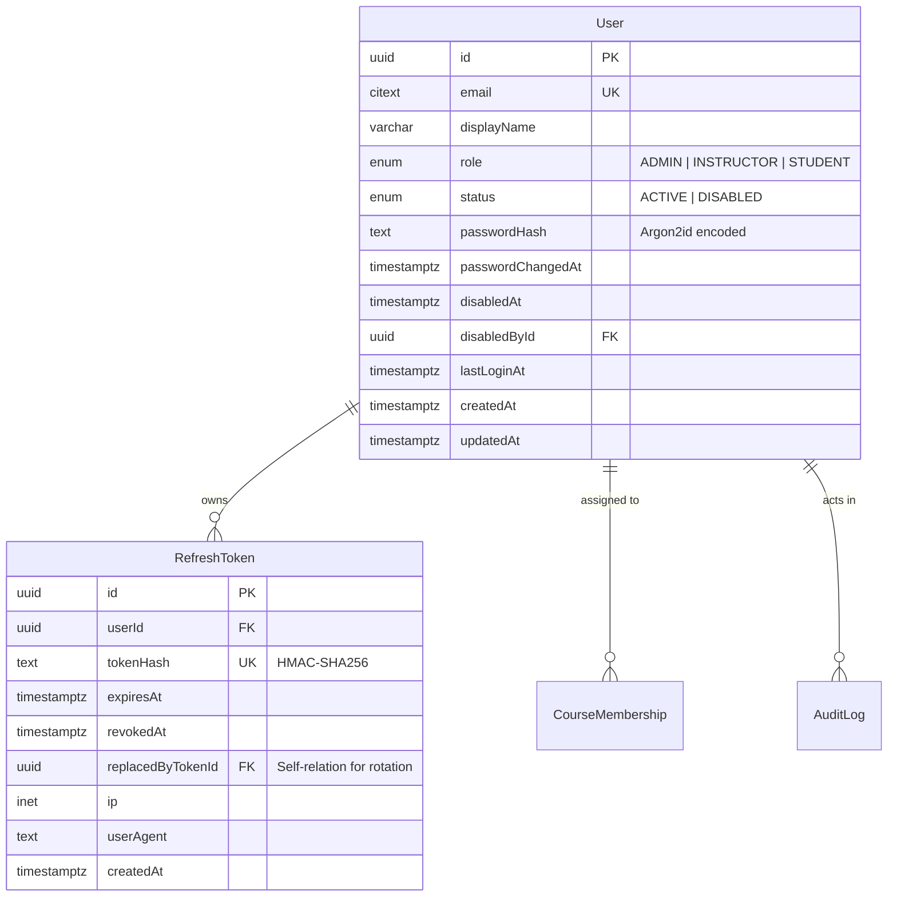
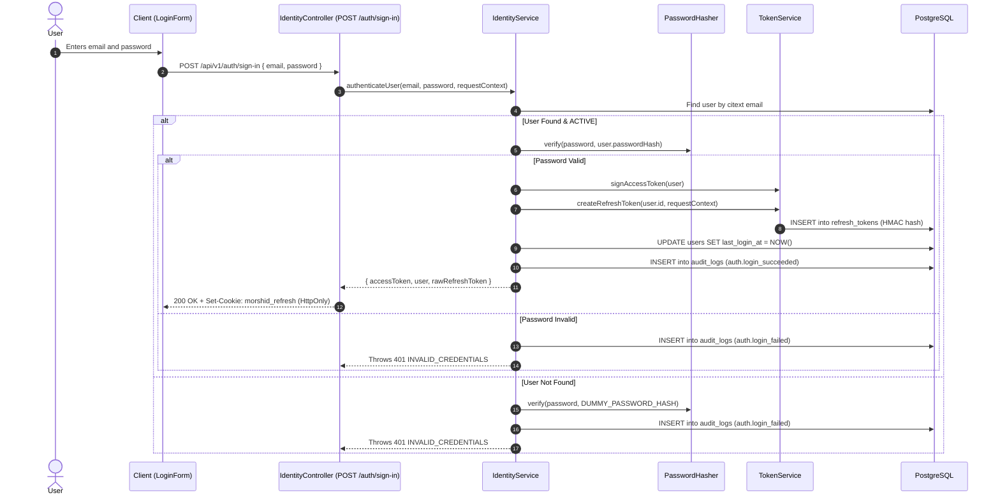
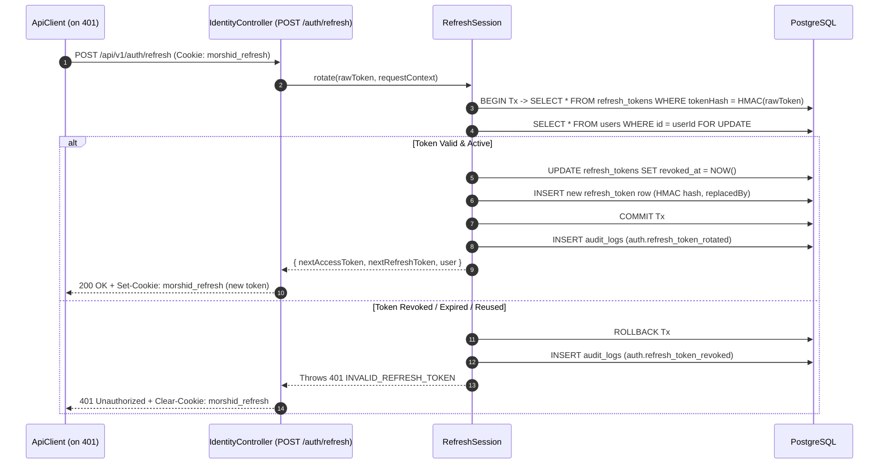

# 08. Identity, Authentication & Access Control

Morshid implements a defense-in-depth security model featuring **Argon2id password hashing**, **short-lived JWT access tokens**, **rotating HMAC-SHA256 refresh tokens**, **role-based access control (RBAC)**, and **fail-safe access auditing**.

---

## 1. Identity Data Models

Defined in [`server/prisma/identity.prisma`](file:///home/mahmoud-ahmed/Projects/Morshid/server/prisma/identity.prisma):



---

## 2. Cryptographic Primitives

### 2.1 Password Hashing ([`password-hasher.ts`](file:///home/mahmoud-ahmed/Projects/Morshid/server/src/modules/identity/password-hasher.ts))
- Uses Node.js native crypto's `argon2Sync('argon2id')`.
- Parameters:
  - **Memory cost (`m`)**: `19,456` KB (~19 MB)
  - **Time cost (`t` / passes)**: `2`
  - **Parallelism (`p`)**: `1`
  - **Tag length**: `32` bytes
  - **Salt length**: `16` bytes
- Output format: `argon2id:v1:m=19456,t=2,p=1,keylen=32:<salt_base64url>:<hash_base64url>`.
- **Constant-Time Fallback**: If a user is not found during sign-in, verification is executed against `DUMMY_PASSWORD_HASH` using `timingSafeEqual` to prevent timing-based user enumeration attacks.

### 2.2 JWT Access Tokens ([`access-token.ts`](file:///home/mahmoud-ahmed/Projects/Morshid/server/src/modules/identity/access-token.ts))
- Generated using `@nestjs/jwt` with `AUTH_ACCESS_TOKEN_SECRET`.
- **TTL**: Configured via `AUTH_ACCESS_TOKEN_TTL_SECONDS` (default: 900 seconds / 15 minutes).
- **Payload & Password Invalidation**:
  ```typescript
  export interface SignedAccessTokenPayload {
    sub: string // User UUID
    typ: 'access'
    pwd: string // user.passwordChangedAt.toISOString()
  }
  ```
  During authentication, `IdentityGuard` verifies that `payload.pwd === user.passwordChangedAt.toISOString()`. If a user's password is changed or reset, all outstanding JWT access tokens are instantly invalidated without waiting for expiration.

### 2.3 Refresh Tokens & Single-Use Rotation ([`refresh-session.ts`](file:///home/mahmoud-ahmed/Projects/Morshid/server/src/modules/identity/refresh-session.ts))
- **Token Entropy**: 256 bits (`randomBytes(32).toString('base64url')`).
- **Database Storage**: The raw token is **never stored**. The database stores an HMAC-SHA256 hash computed with `AUTH_REFRESH_TOKEN_HASH_SECRET`.
- **Cookie Security**: Delivered via the `morshid_refresh` cookie:
  - `httpOnly: true`
  - `path: '/api/v1/auth'` (restricted strictly to auth routes)
  - `sameSite: 'lax'`
  - `secure: process.env.NODE_ENV === 'production'`
- **Rotation Protocol**:
  1. Opens a database transaction and acquires a row lock on the user: `SELECT id FROM users WHERE id = $1 FOR UPDATE`.
  2. Verifies the token is unexpired, unrevoked, and created after `user.passwordChangedAt`.
  3. Atomically marks current token `revoked_at = NOW()`.
  4. Inserts a new `RefreshToken` record and links `replacedByTokenId`.
  5. Returns the new token and sets the updated cookie.

---

## 3. End-to-End Authentication Flows

### 3.1 Sign-In Flow


### 3.2 Refresh Token Rotation Flow


---

## 4. Role-Based Access Control (RBAC) Mechanics

Morshid uses two globally registered guards in [`server/src/modules/identity/identity.module.ts`](file:///home/mahmoud-ahmed/Projects/Morshid/server/src/modules/identity/identity.module.ts):

```typescript
{ provide: APP_GUARD, useExisting: IdentityGuard },
{ provide: APP_GUARD, useExisting: RolesGuard },
```

### 4.1 Decorators:
- **`@Public()`** ([`identity.public.ts`](file:///home/mahmoud-ahmed/Projects/Morshid/server/src/modules/identity/identity.public.ts)): Bypasses authentication for public endpoints (`/auth/sign-in`, `/auth/refresh`, `/health/*`).
- **`@Roles(...roles: UserRole[])`** ([`identity.roles.ts`](file:///home/mahmoud-ahmed/Projects/Morshid/server/src/modules/identity/identity.roles.ts)): Restricts handler to specific roles (`ADMIN`, `INSTRUCTOR`, `STUDENT`).

### 4.2 Guard Evaluation Pipeline:

```mermaid
flowchart TD
    Req[Incoming Route Request] --> G1{IdentityGuard}
    G1 -->|Has @Public()| AllowAnon[Allow Unauthenticated]
    G1 -->|No @Public()| ExtractToken[Extract Bearer JWT from Authorization]
    
    ExtractToken -->|Missing / Malformed| Err401A[401 INVALID_ACCESS_TOKEN]
    ExtractToken -->|Signature Invalid / Expired| Err401B[401 INVALID_ACCESS_TOKEN]
    ExtractToken --> VerifyUser[Load User from DB & Verify pwd Claim]
    
    VerifyUser -->|pwd Mismatch (Password Reset)| Err401C[401 INVALID_ACCESS_TOKEN]
    VerifyUser -->|user.status == DISABLED| Err403A[403 ACCOUNT_DISABLED + Audit Log]
    VerifyUser -->|Valid User| SetReqUser[request.user = AuthenticatedUser]
    
    SetReqUser --> G2{RolesGuard}
    G2 -->|No @Roles Metadata| Allow[Allow Execution]
    G2 -->|@Roles(...roles) Defined| CheckRole{request.user.role IN allowedRoles?}
    
    CheckRole -->|Yes| Allow
    CheckRole -->|No| AuditDenial[AccessAuditService.recordRbacDenied (Fail-Safe)]
    AuditDenial --> Err403B[403 INSUFFICIENT_ROLE]
```

### 4.3 Fail-Safe Access Auditing
All RBAC denials record an `access.rbac_denied` entry in the `audit_logs` table via `AccessAuditService`. Audit logging is wrapped in a fail-safe `try...catch` block so that any transient database error during audit recording will **never** accidentally convert an authorization denial (403) into a 500 server error.

---

## 5. User Administration & Safety Invariants

The User Administration subsystem (`/api/v1/admin/users`) enforces critical business safeguards:

1. **Self-Disable Protection**: An administrator cannot disable their own account (`USER_ADMINISTRATION_CANNOT_DISABLE_SELF` -> 403).
2. **Last Active Admin Invariant**: An administrator cannot disable the last remaining active admin in the system (`USER_ADMINISTRATION_CANNOT_DISABLE_LAST_ACTIVE_ADMIN` -> 409).
3. **Admin Role Immutability**: The role of an existing `ADMIN` user cannot be modified (`USER_ADMINISTRATION_CANNOT_CHANGE_ADMIN_ROLE` -> 403).
4. **Course Membership Constraint**: A user's role cannot be modified if they currently hold active course memberships (`USER_ADMINISTRATION_ROLE_CHANGE_HAS_ACTIVE_MEMBERSHIPS` -> 409).
5. **Instant Session Revocation**: When an admin disables a user or resets their password, all active refresh tokens for that user are revoked in the same atomic database transaction.
