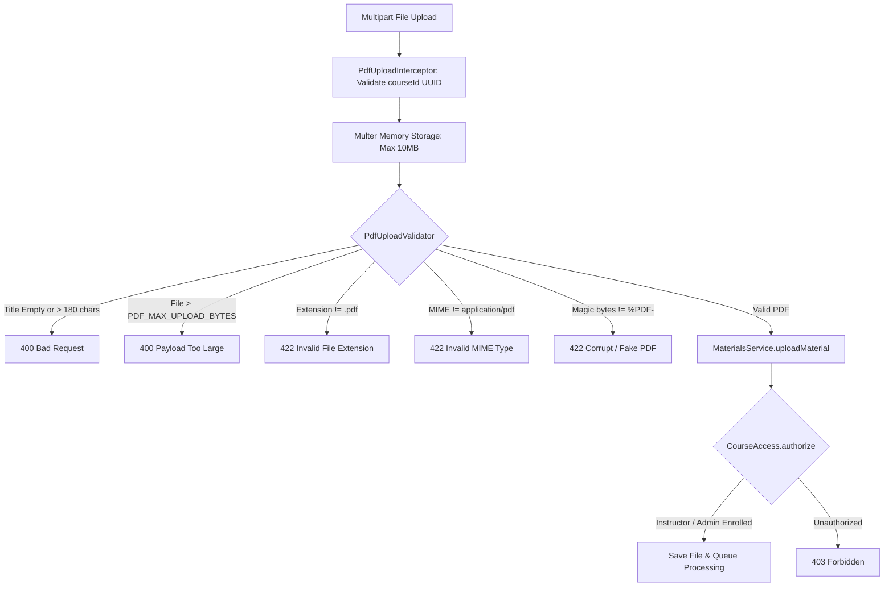
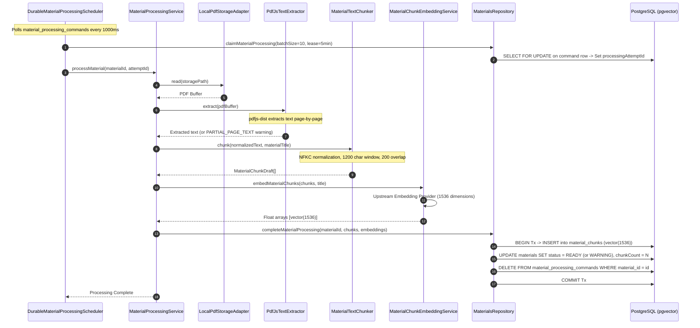
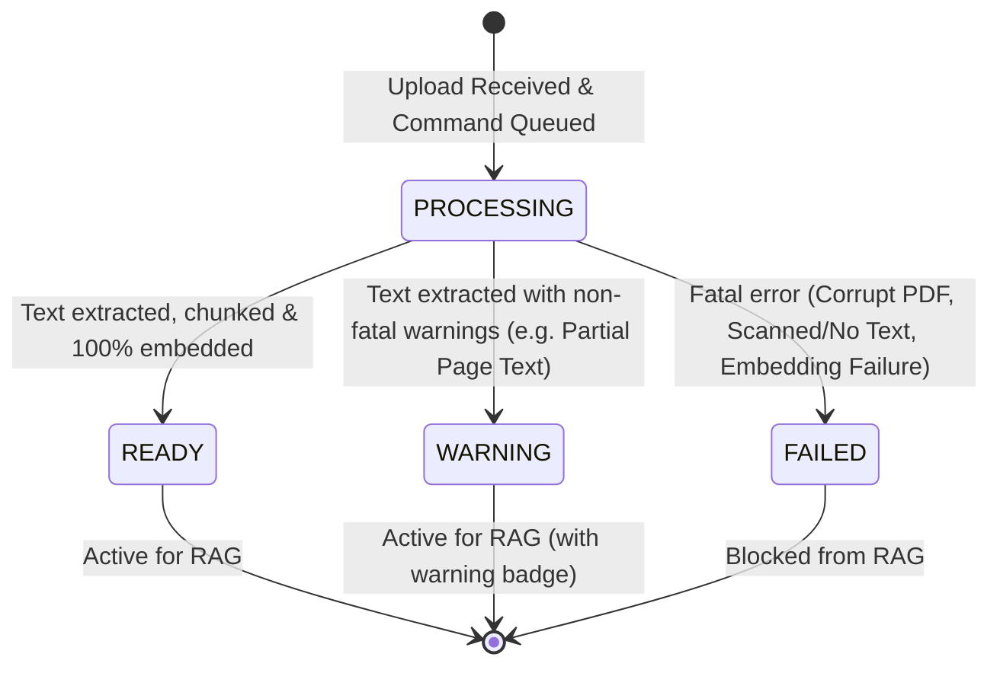

# 09. Materials Ingestion, Processing & Document Storage

Morshid ingests course reference documents (PDFs), extracts and normalizes textual content, segments text into semantically cohesive overlapping chunks, generates 1,536-dimensional vector embeddings, and persists them in PostgreSQL with `pgvector`.

---

## 1. Document Storage Platform (`server/src/platform/document-storage/`)

Document storage is abstracted behind the [`PdfStorage`](file:///home/mahmoud-ahmed/Projects/Morshid/server/src/platform/document-storage/pdf-storage.ts) interface:

```typescript
export const PDF_STORAGE = Symbol('PdfStorage')
export const MAX_PDF_OBJECT_BYTES = 100 * 1024 * 1024 // 100MB Hard Operational Ceiling

export interface PdfStorage {
  create(contents: Buffer): Promise<string>
  read(storagePath: string): Promise<Buffer>
  exists(storagePath: string): Promise<boolean>
  delete(storagePath: string): Promise<void>
}
```

### Local Storage Implementation ([`LocalPdfStorageAdapter`](file:///home/mahmoud-ahmed/Projects/Morshid/server/src/platform/document-storage/local-pdf-storage.adapter.ts))
- **Path Storage**: Files are saved in `PDF_STORAGE_PATH` (default: `storage/pdfs/`).
- **Filename Format**: UUID v4 filenames matching `/^[0-9a-f]{8}-[0-9a-f]{4}-[0-9a-f]{4}-[0-9a-f]{4}-[0-9a-f]{12}\.pdf$/i` (e.g. `d3b07384-d113-40a2-9e29-873b8a3e9c12.pdf`).
- **POSIX Safety & Permissions**:
  - Opened with `O_WRONLY | O_CREAT | O_EXCL | O_NOFOLLOW`.
  - Mode set to `0o600` (read/write restricted strictly to the process owner).
  - Explicitly invokes `handle.sync()` before returning to guarantee filesystem durability.
  - Verifies canonical path resolution (`fs.realpath`) to prevent directory traversal attacks.

---

## 2. Ingestion & Upload Validation

Uploads are received at `POST /api/v1/courses/:courseId/materials` and validated through a multi-stage filter:



### Validation Constraints ([`pdf-upload.validator.ts`](file:///home/mahmoud-ahmed/Projects/Morshid/server/src/modules/materials/upload/pdf-upload.validator.ts)):
- **Supported Formats**: Single PDF documents only. (Zip archives, raw Markdown, and scanned image containers are rejected).
- **Magic Bytes Signature**: Validates that `buffer.subarray(0, 5)` equals `Buffer.from('%PDF-')`.
- **Payload Ceiling**: Defaults to 10 MB (`10,485,760` bytes), configurable up to 100 MB via `PDF_MAX_UPLOAD_BYTES`.

---

## 3. End-to-End Processing Pipeline

The ingestion pipeline converts a stored PDF into searchable, vector-indexed chunks:



---

## 4. Text Extraction & Chunking Strategy

### 4.1 Text Extraction ([`pdf-text-extractor.ts`](file:///home/mahmoud-ahmed/Projects/Morshid/server/src/modules/materials/processing/pdf-text-extractor.ts))
- Uses `pdfjs-dist/legacy/build/pdf.mjs`.
- Iterates page-by-page extracting raw text items.
- Detects empty or scanned pages: if `0 < pagesWithoutText < pageCount`, flags the material with a `PARTIAL_PAGE_TEXT` warning.
- Throws `NO_EXTRACTABLE_TEXT` if zero text is found across all pages (scanned image PDFs without OCR are not supported).

### 4.2 Text Normalization & Chunking ([`material-text-chunker.ts`](file:///home/mahmoud-ahmed/Projects/Morshid/server/src/modules/materials/processing/material-text-chunker.ts))
- **Normalization**:
  - Applies Unicode NFKC normalization: `text.normalize('NFKC')`.
  - Strips NUL bytes (`\u0000`) and carriage returns (`\r\n` -> `\n`, `\r` -> `\n`).
  - Replaces repeated inline whitespace with single spaces (`[\t\f\v ]+` -> `' '`).
  - Collapses excessive line breaks (`\n{3,}` -> `\n\n`).
- **Sliding Window Chunking**:
  - **Target Chunk Size**: `1,200` characters (`MATERIAL_CHUNK_TARGET_CHARACTERS`).
  - **Overlap Size**: `200` characters (`MATERIAL_CHUNK_OVERLAP_CHARACTERS`).
  - **Boundary Heuristic**: Searches for natural semantic break points (`\n\n`, `\n`, or space `' '`) within the window range `[start + 600, start + 1200]`.
  - Advances window: `nextStart = boundaryIndex - 200`.

---

## 5. Material Lifecycle States

Materials transition through the following states in the `materials` table:



### Lifecycle Enums & Meanings:
- **`PROCESSING`**: Document is saved on disk; waiting in `material_processing_commands` queue or actively being parsed/embedded.
- **`READY`**: Extracted text length > 0, chunks generated, embeddings persisted, zero warnings. Active for Socratic tutoring.
- **`WARNING`**: Extracted text length > 0 and embeddings persisted, but non-fatal issues occurred (e.g. some pages contained images without extractable text). Still eligible for retrieval.
- **`FAILED`**: Ingestion terminated. The `error_message` column contains actionable diagnostics (e.g. `"No extractable text was found. Scanned PDFs are not supported."`, `"PDF is password protected."`, or `"Storage read failed."`).
