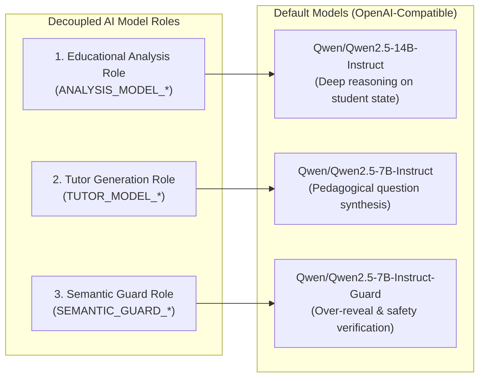
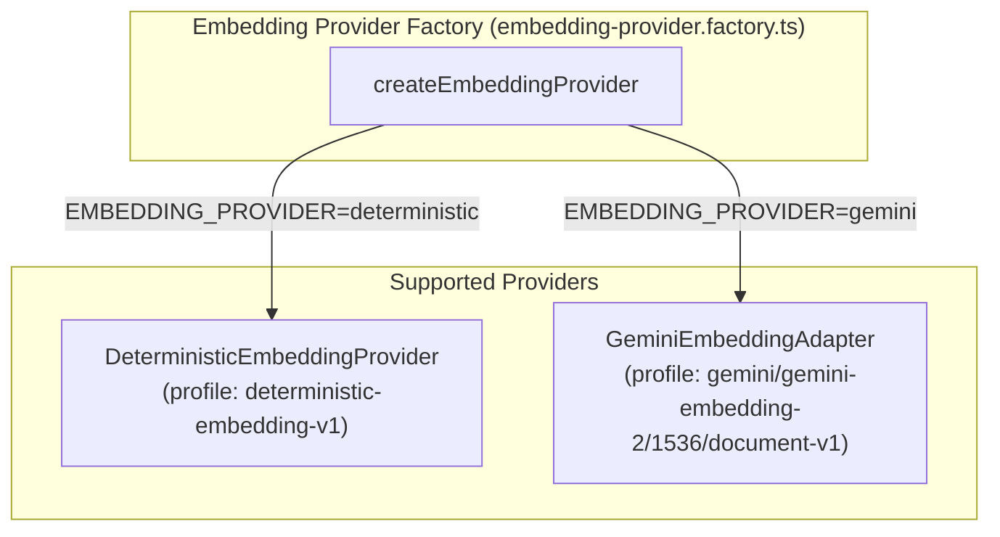
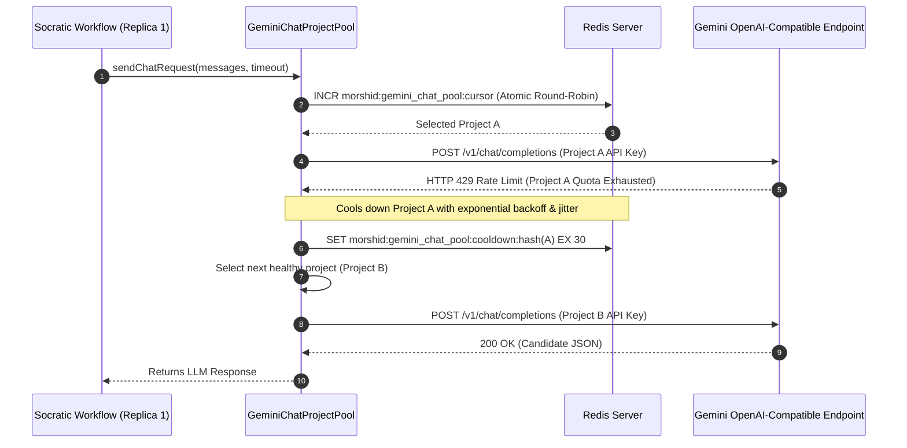

# 10. AI Platform, Embeddings & Gemini Project Pool

Morshid's AI Platform isolates embedding generation, structured LLM transport, and multi-model role delegation behind clean platform adapters in [`server/src/platform/ai/`](file:///home/mahmoud-ahmed/Projects/Morshid/server/src/platform/ai/).

---

## 1. Multi-Model Role Specialization

To maintain strict pedagogical boundaries, Morshid separates LLM responsibilities into three distinct, decoupled model roles:

### Role Configurations:
1. **Educational Analysis Role**: Analyzes student comprehension, identifies misconception categories, estimates student effort, and recommends pedagogical strategies.
2. **Tutor Generation Role**: Synthesizes Socratic probing questions and hints grounded in retrieved course evidence without leaking direct answers.
3. **Semantic Guard Role**: An independent evaluator that checks the candidate response for solution over-reveal, code execution claims, and policy violations.

---

## 2. Vector Embeddings Platform

Morshid standardizes on **1,536-dimensional vector embeddings** stored in PostgreSQL using `pgvector` (`vector(1536)`).

### 2.1 Deterministic Provider ([`deterministic-embedding.provider.ts`](file:///home/mahmoud-ahmed/Projects/Morshid/server/src/platform/ai/embedding/deterministic-embedding.provider.ts))
- **Profile Name**: `deterministic-embedding-v1`
- **Mechanism**: Computes deterministic, normalized 1,536-dimensional float vectors from SHA-256 digests of input text.
- **Use Case**: Used in local development, automated CI gates, and Playwright acceptance suites to run completely offline without API keys or external network dependencies.

### 2.2 Google Gemini Provider ([`gemini-embedding.adapter.ts`](file:///home/mahmoud-ahmed/Projects/Morshid/server/src/platform/ai/embedding/providers/gemini/gemini-embedding.adapter.ts))
- **Profile Name**: `gemini/gemini-embedding-2/1536/document-v1`
- **API Version**: Google GenAI REST API `v1beta` via `@google/genai`.
- **Dimensions**: Output dimension explicitly pinned to `1,536`.
- **Task Types**:
  - Documents (Ingestion): `retrieval document` task type with material title folded into the chunk payload.
  - Queries (Runtime): `question answering` task type.
- **Batching**: Automatically batches document chunk embedding requests in groups of 32 (`GEMINI_EMBEDDING_BATCH_SIZE`).
- **Quota Guard ([`gemini-quota.service.ts`](file:///home/mahmoud-ahmed/Projects/Morshid/server/src/platform/ai/gemini/gemini-quota.service.ts))**: Redis-backed token-bucket rate limiter enforcing per-minute, per-hour, per-day, and 30-day request/token ceilings.

---

## 3. Project-Aware Gemini Chat Pool (ADR 0008)

When calling Gemini models through the shared OpenAI-compatible transport, single-project API keys often experience HTTP 429 rate limits in high-concurrency multi-replica environments.

In compliance with [ADR 0008](file:///home/mahmoud-ahmed/Projects/Morshid/docs/adr/0008-project-aware-gemini-chat-pool.md), Morshid manages a **Redis-backed pool of Google Cloud quota projects**:

### Key Pool Mechanics ([`gemini-chat-project-pool.ts`](file:///home/mahmoud-ahmed/Projects/Morshid/server/src/platform/ai/upstream/gemini-chat-project-pool.ts)):
1. **Multi-Project Configuration**: Configured via `GEMINI_CHAT_PROJECTS_JSON` (array of `{ id: string, apiKey: string }` objects representing distinct Google Cloud projects).
2. **Cross-Replica Coordination**: Replicas use atomic Redis counters (`INCR`) to distribute load evenly across projects.
3. **HTTP 429 Cooldown**: When a 429 is received from Google, the project is marked unavailable in Redis for a calculated cooldown duration (with random jitter). All other API replicas immediately stop routing traffic to that project.
4. **Transparent Request Retries**: The pool automatically retries the request using the next available healthy project within the active `RequestBudget` deadline.
5. **Fail-Closed Security**: Redis stores only salted SHA-256 digests of project IDs; raw API keys reside strictly in ephemeral process memory.

---

## 4. Structured Chat Transport ([`structured-chat.transport.ts`](file:///home/mahmoud-ahmed/Projects/Morshid/server/src/platform/ai/upstream/structured-chat.transport.ts))

All LLM communications share a unified transport layer supporting:
- **Strict Schema Enforcement**: Injects JSON response formatting directives (`response_format: { type: "json_object" }`).
- **Deadline Budgets**: Binds outbound fetch requests to NestJS `RequestBudget` abort signals.
- **SSRF Protection**: Validates and sanitizes base URLs against private network restrictions.
