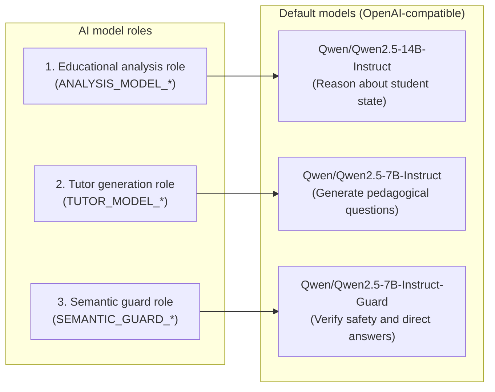
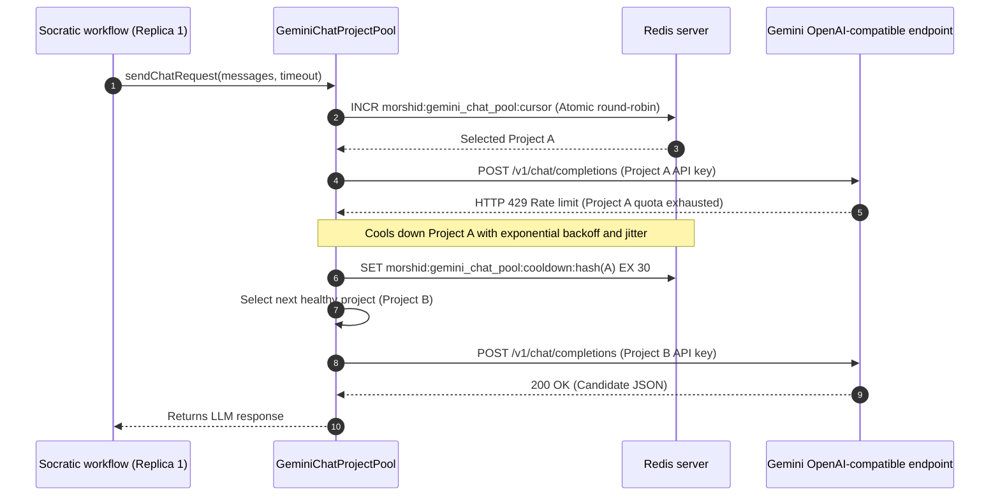

# 10. AI platform, embeddings, and Gemini project pool

Morshid organizes embedding generation, structured LLM transport, and model delegation behind platform adapters in [`server/src/platform/ai/`](file:///home/mahmoud-ahmed/Projects/Morshid/server/src/platform/ai/).

---

## 1. Multi-model role specialization

Morshid splits LLM work across three model roles to keep pedagogical responsibilities separated:

### Role configurations

1. **Educational analysis role.** Analyzes student comprehension, identifies misconception categories, estimates effort, and suggests teaching strategies.
2. **Tutor generation role.** Generates Socratic questions and hints grounded in retrieved course material without giving direct answers.
3. **Semantic guard role.** Evaluates candidate responses for direct solutions, code execution claims, and policy violations.

---

## 2. Vector embeddings platform

Morshid stores 1,536-dimensional vectors in PostgreSQL using `pgvector` (`vector(1536)`).

### 2.1 Deterministic provider ([`deterministic-embedding.provider.ts`](file:///home/mahmoud-ahmed/Projects/Morshid/server/src/platform/ai/embedding/deterministic-embedding.provider.ts))

- **Profile name.** `deterministic-embedding-v1`
- **Mechanism.** Computes deterministic, normalized 1,536-dimensional float vectors from SHA-256 digests of input text.
- **Use case.** Runs offline in local development, CI gates, and Playwright tests without external API keys or network calls.

### 2.2 Google Gemini provider ([`gemini-embedding.adapter.ts`](file:///home/mahmoud-ahmed/Projects/Morshid/server/src/platform/ai/embedding/providers/gemini/gemini-embedding.adapter.ts))

- **Profile name.** `gemini/gemini-embedding-2/1536/document-v1`
- **API version.** Google GenAI REST API `v1beta` via `@google/genai`.
- **Dimensions.** Fixed at `1536`.
- **Task types.**
  - **Documents (ingestion).** `retrieval document` task type with material title included in the chunk payload.
  - **Queries (runtime).** `question answering` task type.
- **Batching.** Groups document chunk embedding requests in batches of 32 (`GEMINI_EMBEDDING_BATCH_SIZE`).
- **Quota guard.** [`gemini-quota.service.ts`](file:///home/mahmoud-ahmed/Projects/Morshid/server/src/platform/ai/gemini/gemini-quota.service.ts) uses a Redis token bucket to enforce rate limits per minute, hour, day, and 30-day window.

---

## 3. Project-aware Gemini chat pool (ADR 0008)

When calling Gemini through an OpenAI-compatible endpoint, a single project API key hits HTTP 429 rate limits under multi-replica load.

Following [ADR 0008](file:///home/mahmoud-ahmed/Projects/Morshid/docs/adr/0008-project-aware-gemini-chat-pool.md), Morshid balances traffic across a Redis-backed pool of Google Cloud quota projects:

### Pool mechanics ([`gemini-chat-project-pool.ts`](file:///home/mahmoud-ahmed/Projects/Morshid/server/src/platform/ai/upstream/gemini-chat-project-pool.ts))

1. **Configuration.** `GEMINI_CHAT_PROJECTS_JSON` defines an array of `{ id: string, apiKey: string }` objects representing distinct Google Cloud projects.
2. **Cross-replica coordination.** Replicas use atomic Redis counters (`INCR`) to distribute load across projects.
3. **HTTP 429 cooldown.** When Google returns a 429, the pool marks the project unavailable in Redis with exponential backoff and jitter. Other replicas read this status and avoid the project.
4. **Retries.** The pool retries requests against the next healthy project within the active `RequestBudget` deadline.
5. **Key storage.** Redis stores only salted SHA-256 digests of project IDs. Raw API keys remain in process memory.

---

## 4. Structured chat transport ([`structured-chat.transport.ts`](file:///home/mahmoud-ahmed/Projects/Morshid/server/src/platform/ai/upstream/structured-chat.transport.ts))

All LLM requests pass through [`structured-chat.transport.ts`](file:///home/mahmoud-ahmed/Projects/Morshid/server/src/platform/ai/upstream/structured-chat.transport.ts), which handles:
- **Schema enforcement.** Injects JSON response formatting directives (`response_format: { type: 'json_object' }`).
- **Deadline budgets.** Connects outbound fetch requests to NestJS `RequestBudget` abort signals.
- **SSRF protection.** Blocks private network addresses before making outbound requests.
