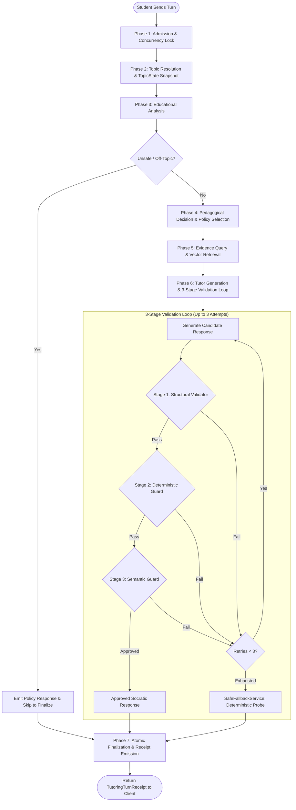

# 11. Tutoring engine and Socratic runtime

The tutoring subsystem implements Morshid's Socratic teaching workflow. Per [ADR 0002](file:///home/mahmoud-ahmed/Projects/Morshid/docs/adr/0002-one-tutoring-runtime-and-attempt.md), it exposes one entry point: `TutoringRuntime.run(command): Promise<TutoringTurnReceipt>`.

---

## 1. Seven-phase Socratic runtime pipeline

The runtime processes each student message through seven phases:



---

## 2. Phase-by-phase breakdown

### Phase 1: Turn admission and row locking
- Files: [`tutoring-turn.repository.ts`](file:///home/mahmoud-ahmed/Projects/Morshid/server/src/modules/tutoring/attempt/tutoring-turn.repository.ts) (`beginTurn`) and [`prisma-conversation-turns.ts`](file:///home/mahmoud-ahmed/Projects/Morshid/server/src/modules/conversations/prisma-conversation-turns.ts) (`admit`).
- Concurrency locks. Acquires a PostgreSQL `SELECT ... FOR UPDATE` row lock on `chat_sessions` and `course_memberships`.
- Idempotency. Checks `clientMessageId`. If the session already processed the turn, it returns the existing receipt immediately.
- Turn allocation. Inserts the student `Message` row (`status: COMPLETED`) and allocates a pending assistant `Message` row (`status: PENDING`, `responseToMessageId: studentMessage.id`).
- Attempt tracking. Creates a `tutoring_attempts` record with status `RECEIVED` and a 5-minute lease (`leaseExpiresAt`).

### Phase 2: Topic resolution and `TopicState` snapshot
- Files: [`topic.service.ts`](file:///home/mahmoud-ahmed/Projects/Morshid/server/src/modules/tutoring/socratic-workflow/topic/topic.service.ts) and [`topic-state.service.ts`](file:///home/mahmoud-ahmed/Projects/Morshid/server/src/modules/tutoring/socratic-workflow/topic/topic-state.service.ts).
- Topic mapping. Maps the turn to a curriculum `Topic` node or falls back to `TopicType.UNCLASSIFIED`.
- State snapshot. Loads the student's `TopicState` record with attempt counts, current guidance level (1 to 4), recorded misconceptions, and mastery level.

### Phase 3: Educational analysis
- Files: [`educational-analysis.service.ts`](file:///home/mahmoud-ahmed/Projects/Morshid/server/src/modules/tutoring/socratic-workflow/analysis/educational-analysis.service.ts) and [`educational-analysis.prompt.ts`](file:///home/mahmoud-ahmed/Projects/Morshid/server/src/modules/tutoring/socratic-workflow/analysis/educational-analysis.prompt.ts).
- Model: `ANALYSIS_MODEL_*` (`Qwen/Qwen2.5-14B-Instruct`).
- Untrusted context wrapper:
  ```text
  <<<BEGIN_MORSHID_UNTRUSTED_ANALYSIS_CONTEXT_V1>>>
  {"studentMessage":..., "selectedHistory":..., "activeTopic":..., "topicState":...}
  <<<END_MORSHID_UNTRUSTED_ANALYSIS_CONTEXT_V1>>>
  ```
- Output schema (`EducationalAnalysisResult`):
  - `requestKind`: `CONCEPTUAL | PROBLEM_LIKE | ATTEMPT_DIAGNOSIS | CODE_DIAGNOSIS | AMBIGUOUS | OFF_TOPIC | UNSAFE`
  - `studentState`: `UNKNOWN | NO_PRIOR_KNOWLEDGE | PARTIAL_UNDERSTANDING | MISCONCEPTION | DEBUGGING_ISSUE | NEAR_SOLUTION`
  - `effortEvidence`: Assesses student reasoning and whether prior hints were applied.
  - `misconceptions`: Identified misconception codes and confidence scores.
  - `recommendedStrategy` and `recommendedGuidanceLevel` (1 to 4).

### Phase 4: Teaching policy selection
- Files: [`teaching-policy.selector.ts`](file:///home/mahmoud-ahmed/Projects/Morshid/server/src/modules/tutoring/socratic-workflow/teaching-decision/teaching-policy.selector.ts).
- Strategy mapping:
  - `NO_PRIOR_KNOWLEDGE` -> `GUIDED_EXPLANATION`
  - `PARTIAL_UNDERSTANDING` or `NEAR_SOLUTION` -> `SOCRATIC_QUESTIONING`
  - `MISCONCEPTION` -> `MISCONCEPTION_REPAIR`
  - `DEBUGGING_ISSUE` -> `DEBUGGING_GUIDANCE`
- Fixed guard policy (`fixedGuardPolicy`):
  ```typescript
  export const fixedGuardPolicy = {
    preventDirectAnswer: true,
    preventFinalResult: true,
    preventCompleteSolution: true,
    preventSubmissionReadyCode: true,
    preventProtectedCodeLeakage: true,
    requireStudentReasoning: true,
    requireGrounding: true,
    enforceCitationSupport: true,
    maximumDisclosedSteps: 1,
  }
  ```

### Phase 5: Evidence query and vector retrieval
- Files: [`retrieval-query.builder.ts`](file:///home/mahmoud-ahmed/Projects/Morshid/server/src/modules/tutoring/socratic-workflow/evidence-query/retrieval-query.builder.ts) and [`materials-course-evidence.ts`](file:///home/mahmoud-ahmed/Projects/Morshid/server/src/modules/materials/evidence/materials-course-evidence.ts).
- Readiness check. Verifies that all candidate materials in the course are indexed in the active vector space.
- Vector search. Runs a pgvector `<=>` distance scan, filters by `RETRIEVAL_MIN_SIMILARITY` (0.62), and selects the top 5 chunks.

### Phase 6: Tutor candidate generation and three-stage validation
- Files: [`tutor-generation.service.ts`](file:///home/mahmoud-ahmed/Projects/Morshid/server/src/modules/tutoring/socratic-workflow/generation/tutor-generation.service.ts) and [`response-approval.service.ts`](file:///home/mahmoud-ahmed/Projects/Morshid/server/src/modules/tutoring/socratic-workflow/response-approval/response-approval.service.ts).
- Prompt boundaries:
  - `<<<TRUSTED_BACKEND_POLICY>>>`: Instructions, reveal policy, and disclosure limits.
  - `<<<UNTRUSTED_CONVERSATION_CONTENT>>>`: Recent conversation history.
  - `<<<UNTRUSTED_RETRIEVED_CONTENT>>>`: Ranked course chunks with assigned citation IDs (`CIT-1`, `CIT-2`).
- Validation stages:
  1. Structural validation ([`structural-response.validator.ts`](file:///home/mahmoud-ahmed/Projects/Morshid/server/src/modules/tutoring/socratic-workflow/response-approval/structural-response.validator.ts)). Enforces the JSON schema, ensures a non-empty response, and checks that citations match the allowlist.
  2. Deterministic guard ([`deterministic-guard.service.ts`](file:///home/mahmoud-ahmed/Projects/Morshid/server/src/modules/tutoring/socratic-workflow/response-approval/deterministic-guard.service.ts)). Uses regular expressions to catch direct solutions, full function definitions, executable code blocks, or excessive step disclosures.
  3. Semantic guard ([`semantic-guard.service.ts`](file:///home/mahmoud-ahmed/Projects/Morshid/server/src/modules/tutoring/socratic-workflow/response-approval/semantic-guard.service.ts)). Runs `SEMANTIC_GUARD_MODEL_*` to check for subtle answer leakage or policy violations.
- Safe fallback ([`safe-fallback.service.ts`](file:///home/mahmoud-ahmed/Projects/Morshid/server/src/modules/tutoring/socratic-workflow/response-approval/safe-fallback.service.ts)). If all 3 generation attempts fail validation, builds a deterministic probing question matching the selected strategy.

### Phase 7: Atomic finalization
- Files: [`tutoring-turn.repository.ts`](file:///home/mahmoud-ahmed/Projects/Morshid/server/src/modules/tutoring/attempt/tutoring-turn.repository.ts) and [`prisma-conversation-turns.ts`](file:///home/mahmoud-ahmed/Projects/Morshid/server/src/modules/conversations/prisma-conversation-turns.ts).
- Database transaction ([ADR 0007](file:///home/mahmoud-ahmed/Projects/Morshid/docs/adr/0007-opaque-database-transaction.md)):
  1. Updates assistant `Message` (`status: COMPLETED`, content, citations).
  2. Updates student `Message` with detected `topicId` and `requestKind`.
  3. Writes `TopicState` using optimistic concurrency control (`WHERE topic_id = id AND version = expectedVersion`).
  4. Inserts `MessageRetrieval` and `MessageCitation` records.
  5. Inserts `TutoringCandidateAttempt` and `GuardResult` records for auditing.
  6. Sets `TutoringAttempt.status = COMPLETED` and clears the lease.
  7. Writes an `audit_logs` record.
- Receipt returned. Returns `TutoringTurnReceipt` containing the saved messages and citations to the caller.
