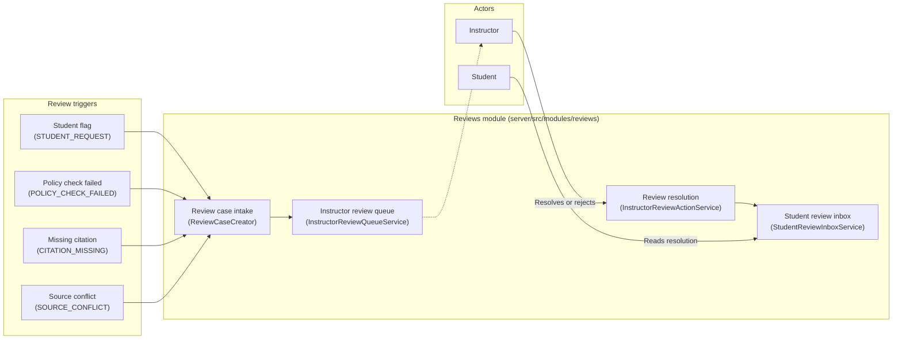
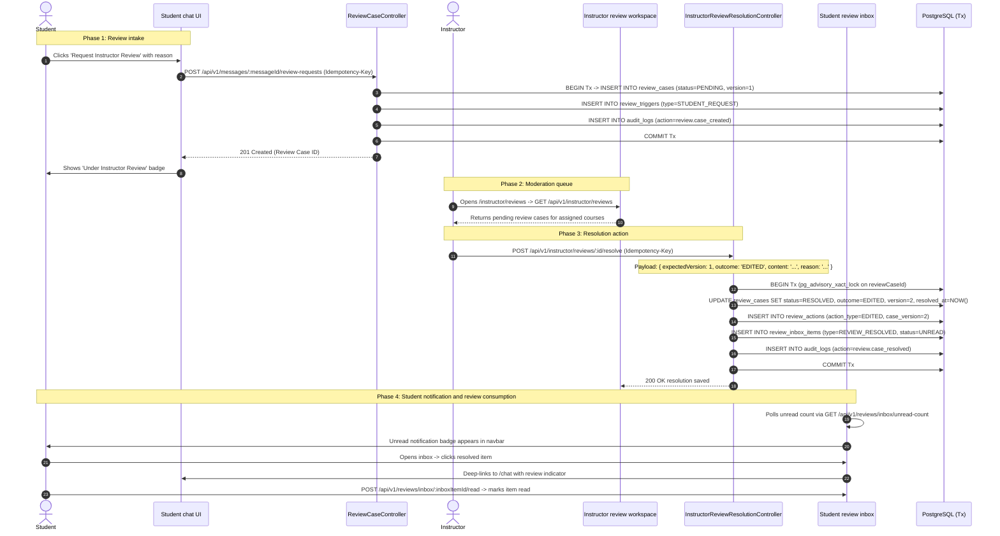

# 13. Reviews and human-in-the-loop workflow

The reviews subsystem handles human oversight, moderation queues, automated safety escalation, and instructor feedback delivery. Per [ADR 0003](file:///home/mahmoud-ahmed/Projects/Morshid/docs/adr/0003-reviews-owned-student-inbox.md), the `reviews` module owns review case intake, instructor queue workflows, resolution actions, and the student review inbox in one domain.

---

## 1. System architecture and lifecycle

---

## 2. Data model and enums

Defined in [`server/prisma/reviews.prisma`](file:///home/mahmoud-ahmed/Projects/Morshid/server/prisma/reviews.prisma).

### 2.1 Enums

- `ReviewTriggerType`:
  - `STUDENT_REQUEST`. Student requested review on a specific chat turn.
  - `POLICY_CHECK_FAILED`. Safety or teaching policy check failed.
  - `CITATION_MISSING`. Assistant turn produced assertions without supporting citations.
  - `SOURCE_CONFLICT`. Retrieved chunks contained conflicting claims.
  - `FINAL_ANSWER_RISK`. Assistant response risked leaking direct solutions.
  - `GENERAL_NOT_FOUND`. Retrieval found no relevant course material chunks.
- `ReviewStatus`:
  - `PENDING`. Waiting in the instructor moderation queue.
  - `IN_REVIEW`. Currently claimed or viewed by an instructor.
  - `RESOLVED`. Instructor approved, edited, or replaced the guidance.
  - `REJECTED`. Instructor rejected the student review request.
- `StudentFlagReason`:
  - `INCORRECT`. Student flagged the response as factually wrong.
  - `CONFUSING`. Student flagged the explanation as unclear.
  - `UNHELPFUL`. Student flagged the guidance as unhelpful.
  - `COURSE_MISMATCH`. Content did not match the course syllabus.
  - `TOO_MUCH_ANSWER`. Content gave away the solution directly.
  - `OTHER`. Student entered a custom reason.
- `ReviewOutcome`:
  - `APPROVED`. Instructor confirmed the original Socratic response was accurate.
  - `EDITED`. Instructor modified the response text.
  - `REPLACED`. Instructor wrote a new explanation.
  - `REQUEST_REJECTED`. Instructor rejected the review request.

---

## 3. End-to-end review lifecycle trace

---

## 4. Concurrency, locking, and draft persistence

To support multiple instructors reviewing cases without data loss or race conditions:

1. **Transactional advisory locks.** During mutation, [`PrismaInstructorReviewActionRepository`](file:///home/mahmoud-ahmed/Projects/Morshid/server/src/modules/reviews/instructor-resolution/instructor-review-action.repository.ts) acquires a PostgreSQL transaction-level advisory lock on the idempotency scope key, then on the review case ID (`pg_advisory_xact_lock`). This serializes concurrent resolutions for the same case.
2. **Optimistic version locking.** Every resolution or rejection payload passes `expectedVersion: number`. If another instructor resolves the case first, the version counter increments, the conditional update matches zero rows, and the API returns `STALE_REVIEW_VERSION` (HTTP 409 Conflict).
3. **Idempotency keys.** The API requires an `Idempotency-Key` header (1 to 200 characters). Successful resolutions record a SHA-256 fingerprint in `idempotency_records` with a 7-day retention period. Retried requests with matching fingerprints return the original response without re-executing database mutations.
4. **Tab-isolated draft persistence.** The instructor workspace saves in-progress drafts to browser `sessionStorage` keyed by case ID (`morshid:review-draft:<reviewCaseId>`). This isolates draft content across browser tabs when an instructor works on multiple review cases in parallel.
