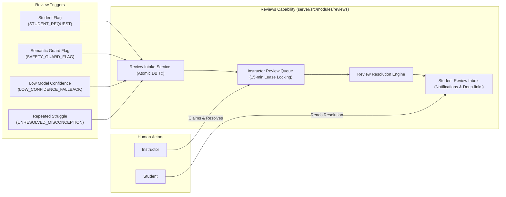
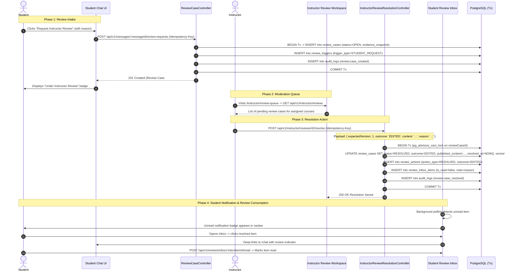

# 13. Reviews & Human-in-the-Loop (HITL) Workflow

The Reviews subsystem provides human oversight, moderation queues, automated safety escalation, and direct instructor feedback delivery. Governed by [ADR 0003](file:///home/mahmoud-ahmed/Projects/Morshid/docs/adr/0003-reviews-owned-student-inbox.md), the `Reviews` module owns review case intake, instructor workflows, and the **Student Review Inbox** in a single atomic domain.

---

## 1. Reviews Mental Model & Architecture

---

## 2. Review Data Model & Enums

Defined in [`server/prisma/reviews.prisma`](file:///home/mahmoud-ahmed/Projects/Morshid/server/prisma/reviews.prisma):

### 2.1 Enums:
- **`ReviewTriggerType`**:
  - `STUDENT_REQUEST`: Student explicitly requested review on a specific chat turn.
  - `POLICY_CHECK_FAILED`: Automated safety or teaching policy violation detected.
  - `CITATION_MISSING`: Turn produced assertions without supporting citations.
  - `SOURCE_CONFLICT`: Retrieved chunks contained conflicting claims.
  - `FINAL_ANSWER_RISK`: Potential solution leak detected.
  - `GENERAL_NOT_FOUND`: Retrieval produced no relevant course material chunks.
- **`ReviewCaseStatus`**:
  - `OPEN`: Waiting in the instructor moderation queue.
  - `RESOLVED`: Instructor approved, edited, or replaced the guidance.
  - `DISMISSED`: Review request was rejected with reason.
- **`ReviewOutcome`**:
  - `APPROVED`: Instructor confirmed the original Socratic response was accurate and appropriate.
  - `EDITED`: Instructor edited the response text.
  - `REPLACED`: Instructor provided a completely rewritten explanation.
  - `REQUEST_REJECTED`: Instructor rejected the student's review request.

---

## 3. End-to-End Review Lifecycle Trace

---

## 4. Concurrency, Leases & Optimistic Locking

To support multiple instructors reviewing tickets concurrently without colliding:

1. **Moderation Leases**:
   - Claiming a ticket (`POST /reviews/:id/claim`) grants an exclusive 15-minute lease (`claimedById`, `leaseExpiresAt`).
   - If an instructor abandons a ticket without resolving it, the lease expires and the ticket automatically returns to the `PENDING` queue for other instructors to claim.
2. **Optimistic Version Locking**:
   - Every mutation payload requires `expectedVersion: number`.
   - If another instructor claims or resolves the ticket in the interim, the database mutation fails with `STALE_REVIEW_VERSION` (HTTP 409 Conflict), preventing overwrites.
3. **Tab-Isolated Draft Persistence**:
   - The instructor workspace persists resolution drafts in browser `sessionStorage` keyed by review case ID (`morshid:review-draft:<reviewCaseId>`), preventing cross-tab pollution when working on multiple cases simultaneously.
