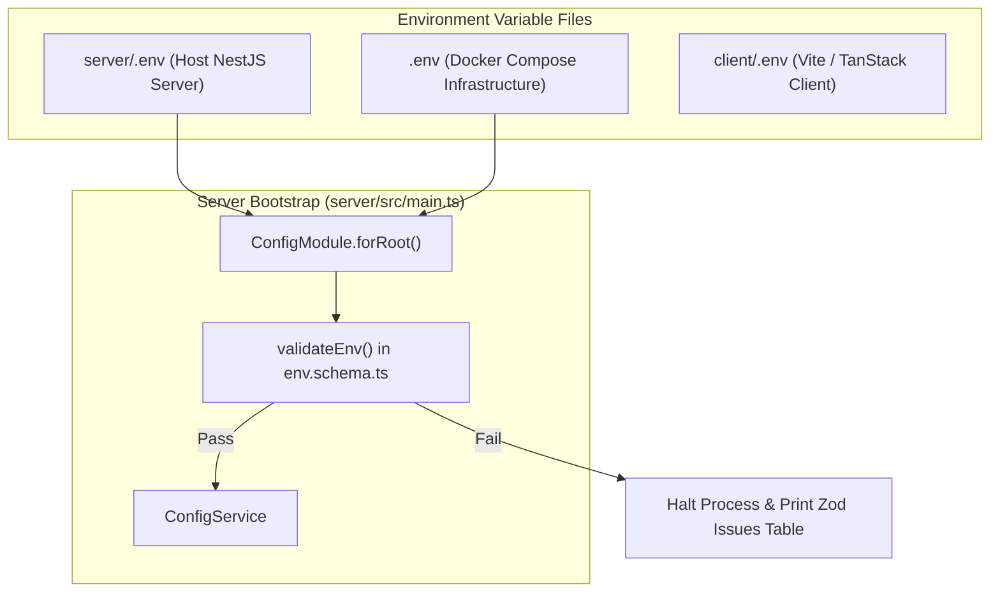
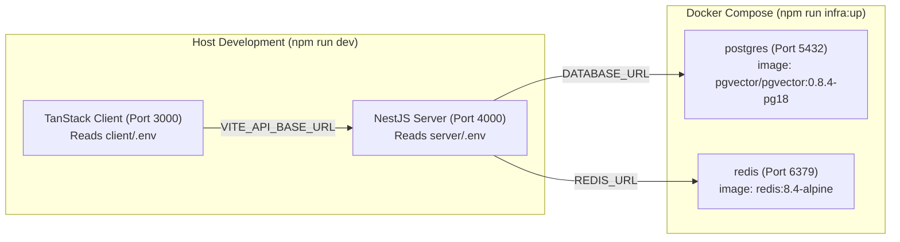

# 14. Configuration, Environment Variables & External Services

Morshid enforces fail-fast configuration validation on startup using **Zod schemas**. Invalid or missing environment variables halt process boot immediately with detailed, human-readable error diagnostics.

---

## 1. Configuration Architecture & Loading Precedence

Configuration is evaluated at process initialization in [`server/src/platform/config/env.schema.ts`](file:///home/mahmoud-ahmed/Projects/Morshid/server/src/platform/config/env.schema.ts):

---

## 2. Environment Variables Reference

### 2.1 Core Server & Infrastructure
| Variable Name | Type & Validation | Default Value | Description |
|---|---|---|---|
| `NODE_ENV` | `'development' \| 'test' \| 'production'` | `'development'` | Runtime environment. In `production`, stricter rules apply (e.g. Gemini embedding is forbidden). |
| `PORT` | Integer `1`–`65535` | `4000` | HTTP port the NestJS API server binds to. |
| `CLIENT_ORIGIN` | Valid URL | `'http://localhost:3000'` | Allowed CORS origin for browser client requests. |
| `DATABASE_URL` | PostgreSQL URL (`postgresql://...`) | *Required* | Connection string for PostgreSQL 18 database with `pgvector`. |
| `REDIS_URL` | Redis URL (`redis://...`) | *Required* | Connection string for Redis cache, rate limiting, and Gemini pool. |

### 2.2 Security & Authentication Secrets
| Variable Name | Type & Validation | Default Value | Security Constraints |
|---|---|---|---|
| `AUTH_ACCESS_TOKEN_SECRET` | String ($\ge 32$ characters) | *Required* | Must be random; cannot start with `replace-with`. |
| `AUTH_REFRESH_TOKEN_HASH_SECRET` | String ($\ge 32$ characters) | *Required* | Must be random; **must not match** `AUTH_ACCESS_TOKEN_SECRET`. |
| `AUTH_ACCESS_TOKEN_TTL_SECONDS` | Positive Integer | `900` (15m) | Lifetime of signed JWT access tokens. |
| `AUTH_REFRESH_TOKEN_TTL_DAYS` | Positive Integer | `7` | Lifetime of rotating HTTP-only refresh tokens. |

### 2.3 Document Storage & RAG Policy
| Variable Name | Type & Validation | Default Value | Description |
|---|---|---|---|
| `PDF_STORAGE_PATH` | Non-empty String | `'../storage/pdfs'` | Local filesystem directory where uploaded PDFs are stored. In `production`, must be an absolute path. |
| `PDF_MAX_UPLOAD_BYTES` | Integer ($\le 100$ MB) | `10485760` (10 MB) | Operational ceiling for individual PDF material uploads. |
| `RETRIEVAL_TOP_K` | Positive Integer | `5` | Maximum number of candidate chunks returned by vector search. |
| `RETRIEVAL_MIN_SIMILARITY` | Float `0.0`–`1.0` | `0.62` | Cosine similarity threshold for RAG grounding (`1 - distance >= 0.62`). |

### 2.4 AI Model Roles & Providers
| Variable Name | Type & Validation | Default Value | Description |
|---|---|---|---|
| `EMBEDDING_PROVIDER` | `'deterministic' \| 'gemini'` | `'deterministic'` | Active vector embedding adapter. `gemini` is rejected in `NODE_ENV=production`. |
| `GEMINI_CHAT_PROJECTS_JSON` | JSON Array of `{ id, apiKey }` | `'[]'` | Multi-project pool for Gemini chat rate limit distribution ([ADR 0008](file:///home/mahmoud-ahmed/Projects/Morshid/docs/adr/0008-project-aware-gemini-chat-pool.md)). |
| `TUTORING_REQUEST_TIMEOUT_MS` | Positive Integer | `120000` (2m) | Request deadline budget for a single tutoring turn. |
| `ANALYSIS_MODEL_PROVIDER` | `'openai-compatible' \| 'deterministic'` | `'deterministic'` (in schema) / `'openai-compatible'` (in compose) | Provider for Educational Analysis role. |
| `ANALYSIS_MODEL_BASE_URL` | Valid URL | `'http://localhost:8000/v1'` | OpenAI-compatible gateway base URL for Analysis model. |
| `ANALYSIS_MODEL_NAME` | Non-empty String | `'Qwen/Qwen2.5-14B-Instruct'` | Model identifier for Analysis model. |
| `ANALYSIS_MODEL_API_KEY` | String | `''` (Optional if using Gemini pool) | Bearer token for Analysis gateway. |
| `TUTOR_MODEL_PROVIDER` | `'openai-compatible' \| 'deterministic'` | `'deterministic'` (in schema) / `'openai-compatible'` (in compose) | Provider for Tutor Generation role. |
| `TUTOR_MODEL_BASE_URL` | Valid URL | `'http://localhost:8000/v1'` | OpenAI-compatible gateway base URL for Tutor model. |
| `TUTOR_MODEL_NAME` | Non-empty String | `'Qwen/Qwen2.5-7B-Instruct'` | Model identifier for Tutor generation model. |
| `SEMANTIC_GUARD_PROVIDER` | `'openai-compatible' \| 'deterministic'` | `'deterministic'` (in schema) / `'openai-compatible'` (in compose) | Provider for Semantic Guard role. |
| `SEMANTIC_GUARD_BASE_URL` | Valid URL | `'http://localhost:8000/v1'` | OpenAI-compatible gateway base URL for Guard model. |
| `SEMANTIC_GUARD_MODEL_NAME`| Non-empty String | `'Qwen/Qwen2.5-7B-Instruct-Guard'` | Model identifier for Semantic Guard model. |

### 2.5 Client Environment Variables (`client/.env`)
| Variable Name | Type | Default Value | Description |
|---|---|---|---|
| `VITE_API_BASE_URL` | Valid URL | `'http://localhost:4000'` | Base URL of the NestJS API server consumed by the browser client. |

---

## 3. Docker Compose vs. Local Host Configuration

Morshid maintains clean separation between infrastructure services and host-run processes:

- **`npm run infra:up`**: Starts only PostgreSQL and Redis containers using root `.env` ports and passwords.
- **`npm run dev`**: Runs the NestJS server and TanStack Start client directly on the host machine with hot-module reloading and fast TypeScript compilation.
- **Docker Compose Full App Profile (`--profile app`)**: Builds and runs the migration runner and NestJS server in Docker containers for deployment-like testing.
