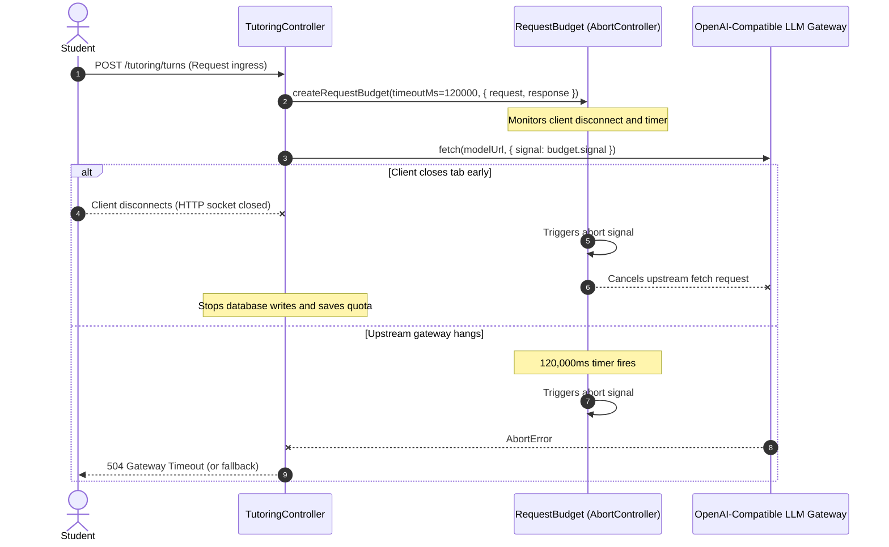
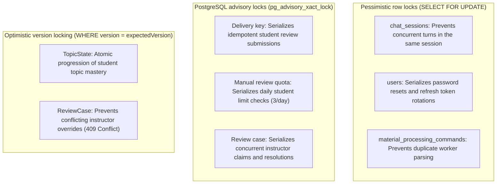

# 15. Error handling, resilience, and failure modes

Morshid handles upstream model outages, concurrency races, network drops, and rate limits without exposing raw exceptions to users.

---

## 1. Request budgets and distributed deadlines

All long-running or model-dependent calls use a centralized request budget defined in [`request-deadline.ts`](file:///home/mahmoud-ahmed/Projects/Morshid/server/src/common/http/request-deadline.ts).



### Key deadline APIs

- **`createRequestBudget(timeoutMs, sources)`**. Links timeouts, incoming HTTP request close and abort events, and outgoing response streams.
- **`assertRequestBudget(budget, minimumMs = 100)`**. Throws `RequestBudgetExceededError` if the remaining time is too short to run the next pipeline stage.

---

## 2. Concurrency control and database locking

The system uses three database locking strategies:



---

## 3. Idempotency and replay protection

### 3.1 Socratic tutoring turns

- Every turn requires a client-generated UUID in `clientMessageId`.
- When a client resends a payload with an existing `clientMessageId`:
  - If `content` matches, the server returns the existing `TutoringTurnReceipt` immediately without re-running models or embeddings.
  - If `content` differs, the server rejects the request with `idempotency_conflict` (HTTP 409).

### 3.2 Review requests and resolutions

The [`idempotency_records`](file:///home/mahmoud-ahmed/Projects/Morshid/server/prisma/reviews.prisma) table tracks deduplication keys with different expirations:
- Student flags use `Idempotency-Key` headers stored with a 24-hour expiration.
- Instructor moderation actions use `Idempotency-Key` headers stored with a 7-day expiration.

---

## 4. Graceful degradation and safe fallbacks

When model generation fails, guardrails trigger, or validation retries run out, the pipeline falls back to deterministic tutoring prompts:

```mermaid
flowchart TD
    Candidate[Tutor candidate generated] --> GuardCheck{Passes 3-stage guardrails?}
    
    GuardCheck -->|Approved| Normal[Deliver Socratic response]
    
    GuardCheck -->|Rejected & Retries < 3| Regenerate[Regenerate with guard feedback]
    Regenerate --> Candidate
    
    GuardCheck -->|Rejected & Retries == 3| Fallback[SafeFallbackService.create(decision)]
    Fallback --> ProbingQuestion[Generate deterministic Socratic question]
    ProbingQuestion --> SaveTurn["Persist turn with guidanceLabel: 'SAFE_FALLBACK'"]
    SaveTurn --> QueueHITL[Queue turn in instructor review queue (ADR 0003)]
    QueueHITL --> ReturnReceipt[Return 200 OK receipt to student]
```

### Deterministic probing questions

If external AI models are unreachable, [`SafeFallbackService`](file:///home/mahmoud-ahmed/Projects/Morshid/server/src/modules/tutoring/socratic-workflow/response-approval/safe-fallback.service.ts) generates curriculum-aligned Socratic questions based on the active teaching strategy:
- **`TRACE_EXECUTION`**. "Let us narrow it to one trace step. What value changes first, and what did you expect it to become?"
- **`ISOLATE_MISCONCEPTION`**. "Let us check the core rule here. In your own words, what should happen at this step?"
- **`SIMPLIFY_PROBLEM`**. "Let us try a smaller example first. What would this produce with an input of size 1?"

---

## 5. Fail-safe access auditing

[`AccessAuditService`](file:///home/mahmoud-ahmed/Projects/Morshid/server/src/modules/identity/access-audit.service.ts) wraps audit log writes in a try-catch block to prevent secondary logging failures from interfering with the main request:

```typescript
try {
  await this.auditService.recordEvent({
    action: 'access.rbac_denied',
    actorUserId: actor.id,
    targetType: 'system',
    metadata: { route, allowedRoles, attemptedRole: actor.role },
  })
} catch (error) {
  // Log error locally, but never throw.
  this.logger.error('Failed to persist RBAC audit event', error)
}
```

This prevents a transient database failure during audit logging from turning an authorization refusal (HTTP 403) into a 500 internal server error.
