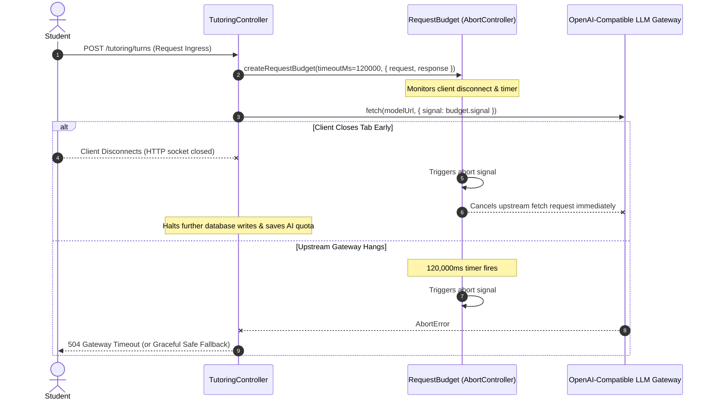
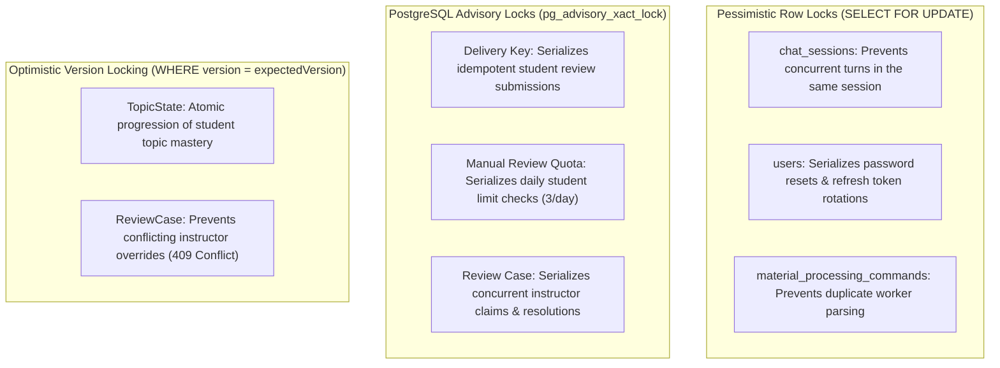

# 15. Error Handling, Resilience & Failure Modes

Morshid is architected with defensive resilience mechanisms to handle upstream model downtime, concurrency race conditions, network dropouts, and rate limit exhaustion gracefully without leaking exceptions to users.

---

## 1. Request Budgets & Distributed Deadlines

All long-running or AI-dependent operations bind to a centralized request budget ([`request-deadline.ts`](file:///home/mahmoud-ahmed/Projects/Morshid/server/src/common/http/request-deadline.ts)):



### Key Deadline APIs:
- **`createRequestBudget(timeoutMs, sources)`**: Links timeout timers, incoming HTTP request `close`/`aborted` events, and outgoing response streams.
- **`assertRequestBudget(budget, minimumMs = 100)`**: Throws `RequestBudgetExceededError` if remaining time is insufficient to safely execute the next pipeline stage.

---

## 2. Concurrency Control & Database Locking

Morshid combines **pessimistic row locking**, **PostgreSQL transaction advisory locks**, and **optimistic version checking**:



---

## 3. Idempotency & Replay Protection

### 3.1 Socratic Tutoring Turns
- Every turn requires a client-generated UUID: `clientMessageId`.
- If network drops and the client re-sends the payload with the same `clientMessageId`:
  - If `content` matches: returns the existing `TutoringTurnReceipt` immediately without re-invoking LLMs or re-embedding queries.
  - If `content` differs: rejects with `idempotency_conflict` (HTTP 409).

### 3.2 Review Requests & Resolutions
- Managed via the [`idempotency_records`](file:///home/mahmoud-ahmed/Projects/Morshid/server/prisma/reviews.prisma) table:
  - Student flags use `Idempotency-Key` headers stored with a **24-hour expiration**.
  - Instructor moderation actions use `Idempotency-Key` headers stored with a **7-day expiration**.

---

## 4. Graceful Degradation & Safe Fallbacks

When LLM generation fails, guardrails trigger, or upstream validation retries are exhausted, the system degrades safely:

```mermaid
flowchart TD
    Candidate[Tutor Candidate Generated] --> GuardCheck{Passes 3-Stage Guardrails?}
    
    GuardCheck -->|Approved| Normal[Deliver Assistant Socratic Response]
    
    GuardCheck -->|Rejected & Retries < 3| Regenerate[Regenerate with Guard Feedback]
    Regenerate --> Candidate
    
    GuardCheck -->|Rejected & Retries == 3| Fallback[SafeFallbackService.create(decision)]
    Fallback --> ProbingQuestion[Generate Deterministic Socratic Probing Question]
    ProbingQuestion --> SaveTurn[Persist Turn with guidanceLabel: 'SAFE_FALLBACK']
    SaveTurn --> QueueHITL[Queue Turn in Instructor Review Queue (ADR 0003)]
    QueueHITL --> ReturnReceipt[Return 200 OK Receipt to Student]
```

### Deterministic Probing Questions ([`safe-fallback.service.ts`](file:///home/mahmoud-ahmed/Projects/Morshid/server/src/modules/tutoring/socratic-workflow/response-approval/safe-fallback.service.ts)):
Even if external AI models are entirely unreachable, `SafeFallbackService` synthesizes curriculum-appropriate Socratic prompts based on the student's active teaching strategy:
- **`TRACE_EXECUTION`**: *"Let us narrow it to one trace step. What value changes first, and what did you expect it to become?"*
- **`ISOLATE_MISCONCEPTION`**: *"Let us check the core rule here. In your own words, what should happen at this step?"*
- **`SIMPLIFY_PROBLEM`**: *"Let us try a smaller example first. What would this produce with an input of size 1?"*

---

## 5. Fail-Safe Access Auditing

To maintain system integrity, [`AccessAuditService`](file:///home/mahmoud-ahmed/Projects/Morshid/server/src/modules/identity/access-audit.service.ts) wraps audit log writes in fail-safe isolation:

```typescript
try {
  await this.auditService.recordEvent({
    action: 'access.rbac_denied',
    actorUserId: actor.id,
    targetType: 'system',
    metadata: { route, allowedRoles, attemptedRole: actor.role },
  })
} catch (error) {
  // Log error locally, but NEVER throw.
  this.logger.error('Failed to persist RBAC audit event', error)
}
```

This guarantees that a transient database failure while recording an audit log will **never swallow or alter** an authorization refusal (HTTP 403) into an unexpected 500 internal server error.
