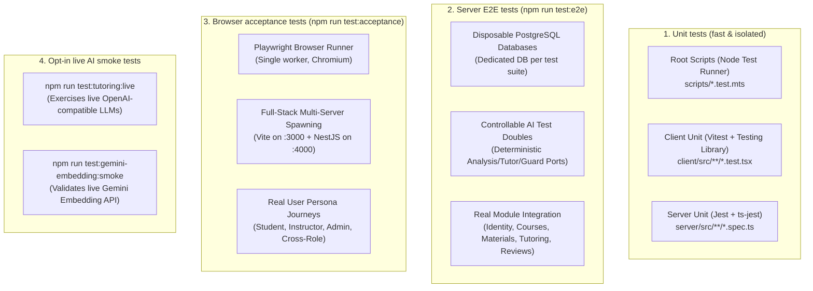
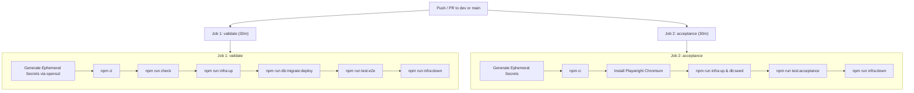

# 16. Testing strategy and quality assurance

Morshid tests behavior and contracts across unit tests, disposable database E2E tests, browser acceptance journeys, and architecture checks.

---

## 1. The `npm run check` quality gate

Before committing or merging a PR, run the quality gate. It must pass with zero warnings:

```bash
npm run check
```

```mermaid
flowchart TD
    Start([npm run check]) --> S1[1. prettier . --check]
    S1 --> S2[2. eslint with --max-warnings=0 (Root, Client, Server)]
    S2 --> S3[3. tsc --noEmit (Root, Client, Server)]
    S3 --> S4[4. depcruise (Client & Server Architecture)]
    S4 --> S5[5. node scripts/verify-generated-ownership.mts]
    S5 --> S6[6. Unit Tests (Root, Client Vitest, Server Jest)]
    S6 --> S7[7. Production Builds (client vite build & server nest build)]
    S7 --> Pass([Pass: ready to commit])
```

---

## 2. Test suite breakdown



---

## 3. Server end-to-end tests (`npm run test:e2e`)

Server E2E tests in [`server/test/`](file:///home/mahmoud-ahmed/Projects/Morshid/server/test/) run complete HTTP workflows against a real PostgreSQL instance.

### 3.1 Disposable database strategy ([`disposable-database.ts`](file:///home/mahmoud-ahmed/Projects/Morshid/server/test/support/disposable-database.ts))

To isolate test suites and avoid global database cleanup:
1. Creates a unique UUID-based database name (`CREATE DATABASE "e2e_${uuid}"`).
2. Runs raw SQL migrations directly from `server/prisma/migrations/`.
3. Seeds baseline data.
4. Executes the test suite.
5. Terminates active connections in `afterAll` and drops the temporary database with `DROP DATABASE "e2e_${uuid}" WITH (FORCE)`.

### 3.2 Controllable AI test doubles ([`socratic-e2e-providers.ts`](file:///home/mahmoud-ahmed/Projects/Morshid/server/test/support/socratic-e2e-providers.ts))

E2E tests swap network AI adapters for deterministic test ports:
- `ControllableAnalysisModelPort` sets the returned `studentState` (such as `MISCONCEPTION` or `DEBUGGING_ISSUE`) and effort evidence.
- `ControllableTutorModelPort` returns structured JSON responses with custom citation IDs.
- `ControllableSemanticGuardPort` simulates guard outcomes, including approvals, over-reveal policy rejections, and transport failures.

---

## 4. Browser acceptance tests (`npm run test:acceptance`)

Acceptance tests run via Playwright against the full stack.

- Configuration lives in [`playwright.config.ts`](file:///home/mahmoud-ahmed/Projects/Morshid/playwright.config.ts).
- Playwright starts NestJS on port 4000 (with deterministic test AI providers) and Vite on port 3000, then waits for `/health/live` before running test journeys.

### Acceptance journeys ([`tests/acceptance/`](file:///home/mahmoud-ahmed/Projects/Morshid/tests/acceptance/))

1. **`student/student-session-workspace.spec.ts`**: Student signs in, selects a course, asks Socratic questions, opens citation drawer excerpts, and steps through hint levels.
2. **`student/student-debugging-guidance.spec.ts`**: Student submits broken code and verifies that the tutor provides conceptual debugging guidance without leaking full code solutions.
3. **`instructor/instructor-review-workspace.spec.ts`**: Instructor inspects pending student reviews, claims tickets, overrides AI guidance, and publishes resolutions.
4. **`admin/admin-shell-and-account-management.spec.ts`**: Admin creates users, modifies roles, disables accounts, and verifies immutable audit logs.
5. **`cross-role/role-boundaries.spec.ts`**: Checks that students cannot access instructor routes, unassigned students cannot query unenrolled courses, and instructors cannot access admin settings.

---

## 5. CI/CD pipeline

The workflow is defined in [`.github/workflows/ci.yml`](file:///home/mahmoud-ahmed/Projects/Morshid/.github/workflows/ci.yml):



- Each job generates random 32-byte hex secrets (`openssl rand -hex 32`) instead of hardcoding credentials in CI.
- When a new commit is pushed, CI cancels active runs on the same branch (`cancel-in-progress: true`).

