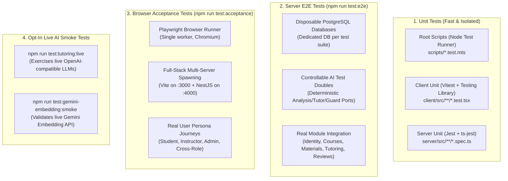
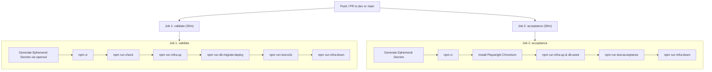

# 16. Testing Strategy & Quality Assurance

Morshid adheres to a strict, multi-tiered testing strategy. Behavior and contracts are tested end-to-end across unit tests, disposable database E2E tests, browser journey acceptance tests, and continuous architectural verification.

---

## 1. The Canonical `npm run check` Quality Gate

Before any commit or PR merge, the complete quality gate must pass without warnings:

```bash
npm run check
```

```mermaid
flowchart TD
    Start([npm run check]) --> S1[1. prettier . --check]
    S1 --> S2[2. eslint with --max-warnings=0 (Root, Client, Server)]
    S2 --> S3[3. tsc --noEmit (Root, Client, Server)]
    S3 --> S4[4. depcruise (Client & Server Architecture)]
    S4 --> S5[5. node scripts/verify-generated-ownership.mts]
    S5 --> S6[6. Unit Tests (Root, Client Vitest, Server Jest)]
    S6 --> S7[7. Production Builds (client vite build & server nest build)]
    S7 --> Pass([Green Gate: Ready to Commit])
```

---

## 2. Test Suite Breakdown



---

## 3. Server End-to-End Testing (`npm run test:e2e`)

Located in [`server/test/`](file:///home/mahmoud-ahmed/Projects/Morshid/server/test/), server E2E tests validate complete HTTP workflows against a real PostgreSQL instance.

### 3.1 Disposable Database Strategy ([`disposable-database.ts`](file:///home/mahmoud-ahmed/Projects/Morshid/server/test/support/disposable-database.ts))
To prevent test pollution and eliminate the need for global test cleanup:
1. Each test suite generates a unique UUID-based database name (`CREATE DATABASE "e2e_${uuid}"`).
2. Executes raw SQL migration files directly from `server/prisma/migrations/`.
3. Seeds baseline data.
4. Executes test cases.
5. In `afterAll`, forces disconnection and drops the temporary database (`DROP DATABASE "e2e_${uuid}" WITH (FORCE)`).

### 3.2 Controllable AI Test Doubles ([`socratic-e2e-providers.ts`](file:///home/mahmoud-ahmed/Projects/Morshid/server/test/support/socratic-e2e-providers.ts))
E2E tests replace network AI adapters with controllable test ports:
- **`ControllableAnalysisModelPort`**: Allows tests to dictate the exact `studentState` (e.g. `MISCONCEPTION`, `DEBUGGING_ISSUE`) and effort evidence returned.
- **`ControllableTutorModelPort`**: Emits structurally valid candidate JSON with custom citation IDs.
- **`ControllableSemanticGuardPort`**: Simulates approvals, policy over-reveal rejections, or transport failures.

---

## 4. Browser Acceptance Testing (`npm run test:acceptance`)

Playwright acceptance tests simulate realistic user interactions across the entire stack:

- **Config**: [`playwright.config.ts`](file:///home/mahmoud-ahmed/Projects/Morshid/playwright.config.ts).
- **Automated Lifecycle**: Spawns the NestJS server on port 4000 (configured with deterministic AI providers) and the Vite client on port 3000, waiting for `/health/live` before executing journeys.

### Key Browser Journeys ([`tests/acceptance/`](file:///home/mahmoud-ahmed/Projects/Morshid/tests/acceptance/)):
1. **`student/student-session-workspace.spec.ts`**: Student signs in, selects course, asks Socratic questions, inspects citation drawer excerpts, and verifies hint progression.
2. **`student/student-debugging-guidance.spec.ts`**: Student submits broken code snippets and verifies that the tutor provides conceptual debugging guidance without leaking working code solutions.
3. **`instructor/instructor-review-workspace.spec.ts`**: Instructor inspects pending student reviews, claims tickets, overrides AI guidance, and publishes resolutions.
4. **`admin/admin-shell-and-account-management.spec.ts`**: Admin creates users, modifies roles, disables accounts, and verifies immutable audit logs.
5. **`cross-role/role-boundaries.spec.ts`**: Verifies that students cannot access instructor routes, unassigned students cannot query un-enrolled courses, and instructors cannot access admin settings.

---

## 5. CI/CD Pipeline Configuration

Defined in [`.github/workflows/ci.yml`](file:///home/mahmoud-ahmed/Projects/Morshid/.github/workflows/ci.yml):



- **Ephemeral Secrets**: Ephemeral 32-byte hex secrets are generated dynamically on every CI run via `openssl rand -hex 32` to guarantee zero credential leakage.
- **Strict Concurrency**: Active runs on the same branch are automatically cancelled on new pushes (`cancel-in-progress: true`).
