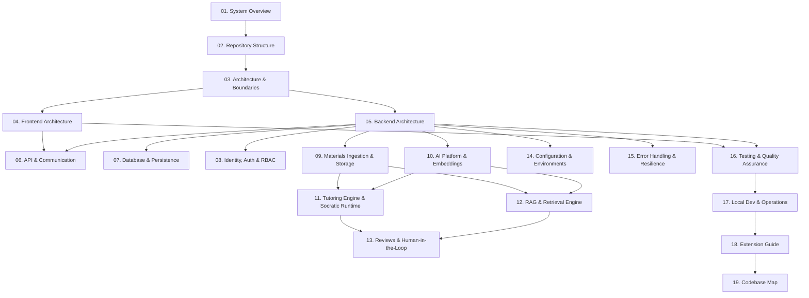

# Morshid Developer Guide

Welcome to the **Morshid** developer documentation. This guide is designed for engineers onboarding onto the codebase or implementing new capabilities. It provides a complete, architectural, and code-verified tour of the system based directly on the active codebase implementation.

---

## 🗺️ Recommended Reading Order

To build an effective mental model of Morshid, we recommend reading the documentation in the following sequence:



### Part I: Foundation & Architecture
1. [01. System Overview](01-system-overview.md): System purpose, core pedagogical principles, user personas, and high-level architectural topology.
2. [02. Repository Structure](02-repository-structure.md): Monorepo workspace organization, npm workspaces (`client`, `server`), scripts, and configuration manifests.
3. [03. Architecture & Boundaries](03-architecture-and-boundaries.md): Architectural decision records (ADRs 0001–0008), layer restrictions, interface seams, and `depcruise` rules.

### Part II: Client & Server Core
4. [04. Frontend Architecture](04-frontend-architecture.md): TanStack Start & React 19 SPA, thin routes, domain features, role workspaces, and TanStack Query state caching.
5. [05. Backend Architecture](05-backend-architecture.md): NestJS modular design, application lifecycle, global guards, validation pipes, interceptors, and filters.
6. [06. API & Communication](06-api-and-communication.md): REST conventions, endpoint catalog, OpenAPI schemas, Zod validation, and structured error envelopes.
7. [07. Database & Persistence](07-database-and-persistence.md): Multi-file Prisma schema, PostgreSQL 18 with `pgvector`, clean-slate initial migration, custom triggers, and opaque transactions (ADR 0007).
8. [08. Identity, Auth & Access Control](08-identity-auth-and-access-control.md): Argon2id hashing, JWT access tokens, rotating HMAC refresh cookies, RBAC (`@Roles`), user management, and fail-safe access auditing.

### Part III: Ingestion, AI & Tutoring Subsystems
9. [09. Materials Ingestion & Storage](09-materials-ingestion-and-storage.md): PDF upload validation, local document storage, text extraction (`pdfjs-dist`), chunking (1200/200 characters), and processing queues.
10. [10. AI Platform & Embeddings](10-ai-platform-and-embeddings.md): Vector embeddings (`deterministic`, `gemini-embedding-2`), token-bucket quota guards, OpenAI-compatible transport, and Redis-backed Gemini project pool (ADR 0008).
11. [11. Tutoring Engine & Socratic Runtime](11-tutoring-engine-and-socratic-runtime.md): The 7-phase Socratic workflow, topic resolution, educational analysis, pedagogical decisions, prompt boundaries, 3-stage validation, and safe fallbacks.
12. [12. RAG & Evidence Retrieval](12-rag-and-evidence-retrieval.md): Course readiness check, cosine similarity scans (`<=>` on `vector(1536)`), citation provenance, and source conflict detection.
13. [13. Reviews & Human-in-the-Loop](13-reviews-and-human-in-the-loop.md): Review triggers, atomic review intake (ADR 0003), instructor review queue, resolution actions, and student notification inbox.

### Part IV: Operations, Quality & Extension
14. [14. Configuration & Environments](14-configuration-and-environments.md): Environment schemas, Zod boot validation, secrets handling, and Docker Compose configurations.
15. [15. Error Handling & Resilience](15-error-handling-and-resilience.md): Request deadline budgets, transaction timeouts, concurrency locks, idempotency keys, and graceful degradation.
16. [16. Testing & Quality Assurance](16-testing-and-quality-assurance.md): The `npm run check` pipeline, unit tests, disposable database E2E tests, Playwright browser journeys, and catalog semantic assertions.
17. [17. Local Development & Operations](17-local-development-and-operations.md): Setup walkthrough, docker containers, seed credentials, demo reset scripts, and database operations.
18. [18. Extension Guide](18-extension-guide.md): Practical recipes for adding endpoints, database models, client features, and AI guardrails.
19. [19. Codebase Map](19-codebase-map.md): Comprehensive inventory of key entrypoints, modules, services, repositories, and interfaces.

---

## ⚡ Quick Reference: Daily Commands

```bash
# 1. Start Infrastructure (PostgreSQL + pgvector & Redis)
npm run infra:up

# 2. Start Client & Server concurrently
npm run dev

# 3. Run the Canonical Quality Gate before committing
npm run check

# 4. Run Server E2E Tests (with automated disposable databases)
npm run test:e2e

# 5. Run Browser Acceptance Journeys (Playwright)
npm run test:acceptance
```

---

## 🔑 Default Seed Credentials

When using `npm run db:seed` or `npm run demo:fresh-seed`, all seed accounts use the password: **`MorshidDemoP0!`**

| Account Email | Role | Accessible Context |
|---|---|---|
| `admin@morshid.demo` | `ADMIN` | Full system governance, user management, audit logs |
| `instructor@morshid.demo` | `INSTRUCTOR` | Course management, PDF upload, review moderation queue |
| `student1@morshid.demo` | `STUDENT` | Socratic tutoring chat, citations, review requests |
| `student2@morshid.demo` | `STUDENT` | Socratic tutoring chat, citations, review requests |
| `student3@morshid.demo` | `STUDENT` | Socratic tutoring chat, citations, review requests |
