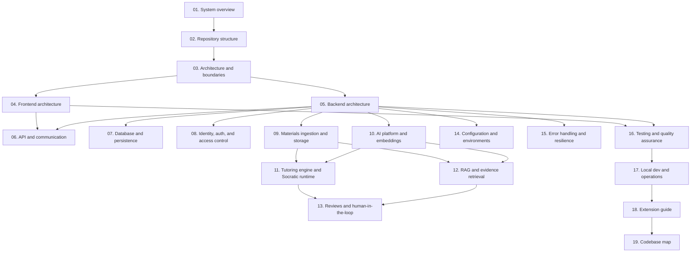

# Morshid developer guide

This guide is for engineers onboarding onto Morshid or adding new features. It describes the system architecture and implementation details verified against the codebase.

---

## Recommended reading order

Read the documentation in this order:



### Part 1: Foundation and architecture
1. [01. System Overview](01-system-overview.md): System purpose, core pedagogical principles, user personas, and high-level architecture.
2. [02. Repository Structure](02-repository-structure.md): Monorepo workspace layout, npm workspaces (`client`, `server`), scripts, and configuration files.
3. [03. Architecture & Boundaries](03-architecture-and-boundaries.md): Architecture decision records (ADRs 0001 to 0008), layer boundaries, interfaces, and `depcruise` rules.

### Part 2: Client and server core
4. [04. Frontend Architecture](04-frontend-architecture.md): TanStack Start and React 19 SPA, thin routes, domain features, role workspaces, and TanStack Query caching.
5. [05. Backend Architecture](05-backend-architecture.md): NestJS module structure, application lifecycle, global guards, validation pipes, interceptors, and filters.
6. [06. API & Communication](06-api-and-communication.md): REST conventions, endpoint catalog, OpenAPI schemas, Zod validation, and error response formats.
7. [07. Database & Persistence](07-database-and-persistence.md): Multi-file Prisma schema, PostgreSQL 18 with `pgvector`, initial migration, custom triggers, and opaque transactions (ADR 0007).
8. [08. Identity, Auth & Access Control](08-identity-auth-and-access-control.md): Argon2id hashing, JWT access tokens, rotating HMAC refresh cookies, role-based access (`@Roles`), user management, and access auditing.

### Part 3: Ingestion, AI, and tutoring subsystems
9. [09. Materials Ingestion & Storage](09-materials-ingestion-and-storage.md): PDF upload validation, local document storage, text extraction with `pdfjs-dist`, chunking (1200/200 characters), and processing queues.
10. [10. AI Platform & Embeddings](10-ai-platform-and-embeddings.md): Vector embeddings (`deterministic`, `gemini-embedding-2`), token-bucket quota guards, OpenAI-compatible transport, and Redis-backed Gemini project pool (ADR 0008).
11. [11. Tutoring Engine & Socratic Runtime](11-tutoring-engine-and-socratic-runtime.md): The 7-phase Socratic workflow, topic resolution, educational analysis, pedagogical decisions, prompt boundaries, 3-stage validation, and fallbacks.
12. [12. RAG & Evidence Retrieval](12-rag-and-evidence-retrieval.md): Course readiness check, cosine similarity search (`<=>` on `vector(1536)`), citation provenance, and source conflict detection.
13. [13. Reviews & Human-in-the-Loop](13-reviews-and-human-in-the-loop.md): Review triggers, review intake (ADR 0003), instructor review queue, resolution actions, and student notification inbox.

### Part 4: Operations, quality, and extension
14. [14. Configuration & Environments](14-configuration-and-environments.md): Environment schemas, Zod boot validation, secrets handling, and Docker Compose configuration.
15. [15. Error Handling & Resilience](15-error-handling-and-resilience.md): Request deadline budgets, transaction timeouts, concurrency locks, idempotency keys, and error recovery.
16. [16. Testing & Quality Assurance](16-testing-and-quality-assurance.md): The `npm run check` pipeline, unit tests, disposable database E2E tests, Playwright acceptance tests, and catalog semantic assertions.
17. [17. Local Development & Operations](17-local-development-and-operations.md): Setup guide, Docker containers, seed credentials, demo reset scripts, and database operations.
18. [18. Extension Guide](18-extension-guide.md): Guides for adding endpoints, database models, client features, and AI guardrails.
19. [19. Codebase Map](19-codebase-map.md): Inventory of entry points, modules, services, repositories, and interfaces.

---

## Quick reference: daily commands

```bash
# 1. Start infrastructure (PostgreSQL + pgvector and Redis)
npm run infra:up

# 2. Start client and server concurrently
npm run dev

# 3. Run checks before committing
npm run check

# 4. Run server E2E tests with disposable databases
npm run test:e2e

# 5. Run browser acceptance tests with Playwright
npm run test:acceptance
```

---

## Default seed credentials

Seed accounts created by `npm run db:seed` or `npm run demo:fresh-seed` use the password `MorshidDemoP0!`.

| Account email | Role | Accessible context |
|---|---|---|
| `admin@morshid.demo` | `ADMIN` | System administration, user management, audit logs |
| `instructor@morshid.demo` | `INSTRUCTOR` | Course management, PDF uploads, review moderation queue |
| `student1@morshid.demo` | `STUDENT` | Socratic tutoring chat, citations, review requests |
| `student2@morshid.demo` | `STUDENT` | Socratic tutoring chat, citations, review requests |
| `student3@morshid.demo` | `STUDENT` | Socratic tutoring chat, citations, review requests |
