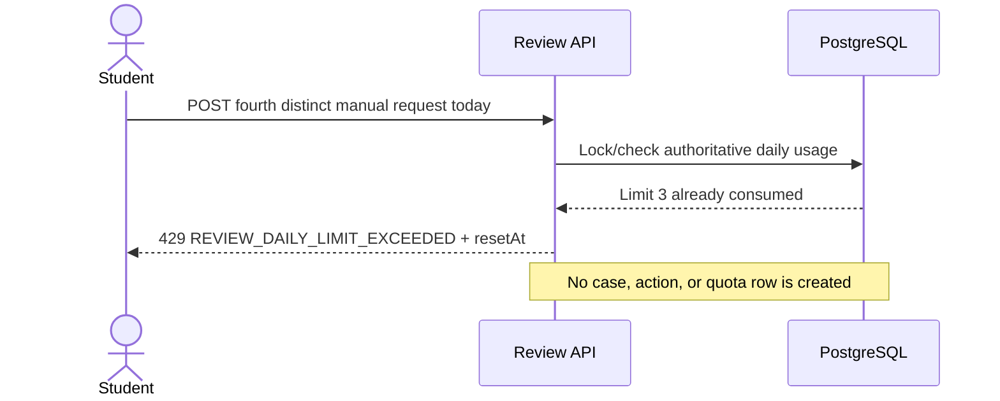
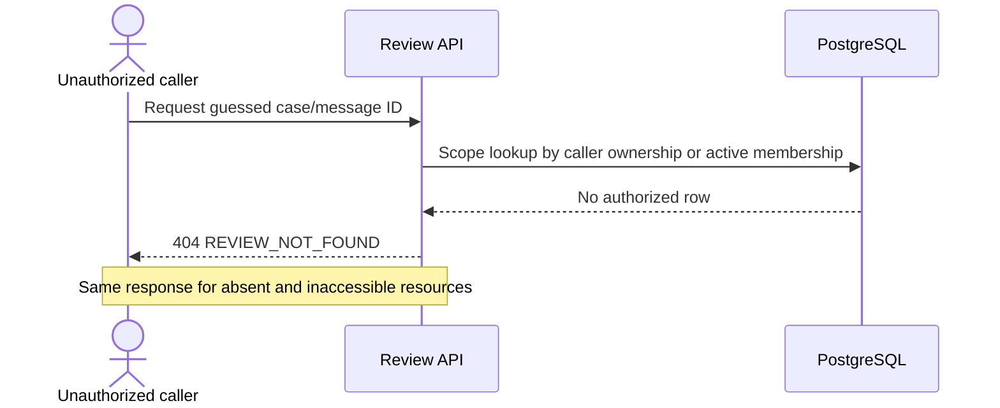
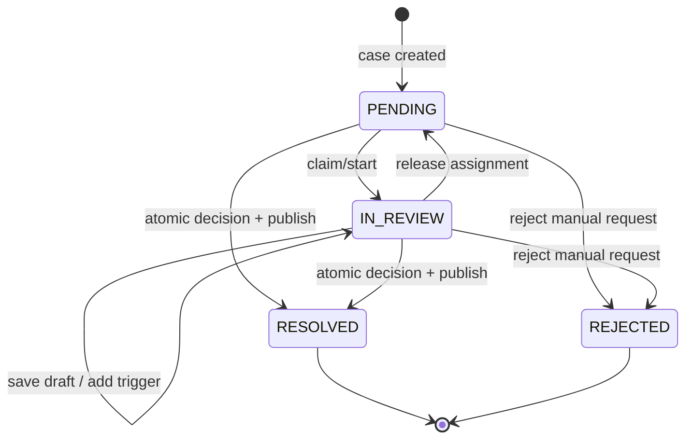

# Instructor Review and Student Resolution Loop

| Field | Value |
|---|---|
| Product | Morshid educational AI platform |
| Delivery target | Sprint 3, P0 |
| Status | Final implementation specification |
| Scope | Manual and system-triggered review of an existing assistant response |
| Out of scope | Implementation code, reviewed-answer retrieval, email/push delivery, WebSockets, general Instructor chat browsing |
| Source of truth | Current repository Prisma schema and the P0 decisions in `docs/morshid-decisions.md` |

> Historical specification: this document predates the approved whole-workspace
> refactor and is retained as design evidence. Its generic Notification model
> and route examples are superseded by the Reviews-owned `ReviewInboxItem`
> capability documented in the approved architecture plan and implemented in
> `server/src/modules/reviews/student-inbox/`.

> This specification extends the existing `User`, `Course`, `CourseMembership`, `ChatSession`, `Message`, `MessageRetrieval`, `MessageCitation`, and `AuditLog` entities. It does not redesign them. All requirements and invariants in this document are mandatory for the Sprint 3 implementation.

## 1. Overview

Morshid can produce guidance that is uncertain, unsupported, conflicting, confusing, or perceived by a Student as incorrect. A Student needs a narrow escalation path that does not expose the rest of a private chat. An Instructor needs enough immutable evidence to assess what was originally shown, a work queue scoped to courses they teach, and a controlled way to publish a resolution. The Student then needs to see the resolution beside the original response and through an in-app notification.

Manual Review is the human accountability boundary around AI guidance. It is not chat moderation and does not let Instructors browse Student conversations. A review exists only for a flagged assistant `Message`, captures a bounded evidence snapshot, records an append-only action trail, and publishes at most one current Student-visible outcome.

In the chat flow, the original assistant message remains immutable forever and visible. Requesting review changes only the associated review status badge. Resolving or rejecting a case renders a separate Review-domain card beneath the original response; it never rewrites `Message.content`, inserts reviewed content into the chat transcript, or creates another `Message`. Delivery uses ordinary REST reads and TanStack Query polling—no WebSockets or SSE.

### Final design at a glance

- One `ReviewCase` per assistant message, regardless of whether the first trigger is manual or automatic.
- Separate append-only `ReviewAction`, frozen `ReviewEvidenceSnapshot`, and user-facing `Notification` tables.
- `ReviewCase.status` represents workflow; `ReviewCase.outcome` represents the final decision.
- Instructor edits are private drafts until an explicit resolve operation atomically publishes the outcome.
- Published resolution content belongs to `ReviewCase` and is rendered as a separate review card; it is never stored as a normal chat `Message`.
- Quota is enforced from accepted manual creation rows under a PostgreSQL transaction-scoped advisory lock. Redis caches counts only and is never authoritative.
- Original chat messages, evidence snapshots, published outcomes, and action history are not edited in place.

## 2. Functional Requirements

### Student

1. An authenticated, active Student can request review only for a completed assistant response in their own non-deleted chat session and active course membership.
2. The request accepts a nullable reason. A supplied reason is trimmed plain text of at most 200 characters. Empty-after-trim is stored as null.
3. The Student sees pending, in-review, resolved, or rejected status beside the flagged response.
4. Beneath the unchanged original AI response and its status badge, the Student sees a separate review card containing the published Instructor resolution or rejection explanation, resolution time, and an “Instructor reviewed” label. The Student UI and DTOs do not expose Instructor identity; the record retains identity internally.
5. The Student can retrieve only their own cases and outcomes, not Instructor identity, internal notes, evidence, drafts, or action history.
6. The Student cannot withdraw, edit, reopen, or create another case for the same response in P0.
7. If an automatic case already exists for the response, the Student request adds one `STUDENT_REQUEST` trigger to that case and consumes one daily quota unit. Repeated requests return the existing trigger and consume no additional quota.

### Instructor

1. An active Instructor sees cases only for courses in which they have an active Instructor membership.
2. The queue supports status, trigger/type, and date filters, stable cursor pagination, and a pending count.
3. Review detail is limited to Student identity, course, trigger/reason, flagged Student message, assistant response, frozen citations/retrieval evidence, and at most one previous and one next message.
4. An Instructor can claim/open a pending case, save a private draft, approve the original, prepare edited or replacement resolution content, reject a manual request with a required reason, and resolve. “Edit” and “replace” describe the Review-domain outcome; neither operation mutates the original assistant message.
5. The original assistant response is always retained. No Instructor action mutates it.
6. Action history is visible to authorized Instructors and Admins; private notes and intermediate drafts are not visible to Students.
7. All active Instructors in the course can view the case. Claim assigns exclusive mutation ownership. Another Instructor receives `409 REVIEW_ALREADY_ASSIGNED`; the assignee or an Admin must release the case before another Instructor claims it.

### System

1. The system validates the target is an assistant response, is completed, and belongs to a Student-owned session in the same course.
2. Creation freezes the permitted evidence in the same database transaction as the case.
3. Policy checks create automatic cases through the same domain operation using an automatic trigger and a deterministic source-event key.
4. State-changing operations enforce expected version or state to prevent lost updates.
5. Resolution atomically writes the final Review-domain outcome on `ReviewCase`, final action, one notification, and audit record. It never creates or updates a chat message.

### Notifications and polling

- A Student notification is created when a case is resolved or rejected, not for draft edits or claim/open actions.
- Student Chat polls assistant-message review summaries every 15 seconds while the chat page is visible and refreshes immediately on window focus.
- Notifications poll unread notifications every 15 seconds.
- The Instructor Queue polls the pending review count every 15 seconds.
- Background polling runs every 60 seconds. All polling uses exponential backoff after errors.
- Notifications support unread/read state. “Dismiss” hides an item but does not delete the review outcome.

### Audit, quota, privacy, history, and immutability

- Security- and outcome-relevant events generate `AuditLog` records; domain history is separately retained in `ReviewAction`.
- Each Student can create at most three manual review triggers per `Africa/Cairo` calendar day. The API returns the next Cairo midnight as `resetAt`.
- Duplicate requests for the same message return the existing case and do not consume quota.
- A newly accepted manual trigger attached to an automatic case consumes quota. A duplicate trigger does not.
- Quota denial returns the inline `429` response and does not create a notification.
- Idempotency keys make retries return the original result; the message-level uniqueness constraint closes races across different keys.
- Original messages and evidence are immutable. Final outcomes are append-only for P0; correction requires a future explicit supersede/reopen workflow.

## 3. Non-Functional Requirements

| Area | Requirement |
|---|---|
| Performance | Queue/count and unread-count reads p95 under 300 ms at P0 load; create/resolve writes p95 under 500 ms excluding network; all lists paginated. |
| Privacy | No endpoint returns unflagged conversation content beyond the frozen context window. Authorization is checked before lookup responses are distinguished. |
| Security | Server-side authentication, global role and active-account checks, active membership/resource checks, input bounds, output DTO allowlists, and no trust in client-supplied course or Student IDs. |
| Scalability | API nodes are stateless; PostgreSQL is authoritative; indexes serve queue and polling reads; Redis caches counts and rate-limit data but never decides final acceptance. |
| Integrity | Foreign keys, unique constraints, check constraints, transactions, row locking/version checks, and immutable evidence enforce invariants under concurrency. |
| Auditability | Every accepted request and terminal decision is attributable, timestamped, and linked to case/course/actor without copying sensitive content into generic audit metadata. |
| Availability | Notification creation is transactional with resolution. Poll retries tolerate transient failures and never create duplicate outcomes. |
| Retention | Cases, triggers, snapshots, actions, drafts, and notifications are retained for 90 days after the course ends and then removed by the controlled retention job. The job anonymizes retained audit identifiers according to the existing audit policy. Active cases are never deleted by cascade. |
| Extensibility | Trigger and evidence-source fields accommodate automatic review, policy detectors, and new outcomes without changing existing chat entities. |

## 4. End-to-End Workflow

### 4.1 Manual request through resolution

```mermaid
sequenceDiagram
    autonumber
    actor S as Student
    participant UI as React / TanStack Query
    participant API as NestJS Review API
    participant DB as PostgreSQL / ReviewCase
    actor I as Instructor

    Note over S,UI: Original AI Message is already rendered
    S->>UI: Request review with nullable reason
    UI->>API: POST review request + Idempotency-Key
    API->>DB: Validate ownership, target, duplicate, quota
    API->>DB: Create case + trigger + frozen evidence + audit
    DB-->>API: Pending case
    API-->>UI: 201 case status
    UI-->>S: Change badge to Awaiting Instructor Review
    I->>UI: Open review queue
    UI->>API: GET owned-course queue
    API-->>UI: Limited queue rows
    I->>UI: Open case
    UI->>API: GET review detail
    API-->>UI: Frozen exchange, evidence, history
    I->>UI: Claim and save private Instructor draft
    UI->>API: POST claim; PUT draft with version
    API->>DB: Append actions; update current draft/version
    I->>UI: Resolve with final action and reason
    UI->>API: POST resolve + Idempotency-Key + version
    API->>DB: Atomic ReviewCase outcome + action + notification + audit
    Note over API,DB: No Message is created or updated
    API-->>UI: Resolved case
    UI->>API: Poll unread notifications (15s)
    API-->>UI: New unread notification
    UI-->>S: Show bell update
    S->>UI: Refresh/open original chat
    UI->>API: Poll chat review summaries (15s / focus refresh)
    API-->>UI: Original AI message + reviewSummary
    UI->>API: GET published review content
    API-->>UI: Review-domain published outcome
    UI-->>S: Original AI Message + Resolved badge + Review Card
```

### 4.2 Duplicate request

```mermaid
sequenceDiagram
    actor S as Student
    participant API as Review API
    participant DB as PostgreSQL / ReviewCase
    S->>API: POST same message and same/different key
    API->>DB: Find or insert under unique message constraint
    alt Existing case
        DB-->>API: Existing case
        API-->>S: 200 existing case; quota unchanged
    else Concurrent insert loses race
        DB-->>API: Unique violation
        API->>DB: Read winning case
        API-->>S: 200 existing case; quota unchanged
    else First valid request
        DB-->>API: New case
        API-->>S: 201 new case
    end
```

### 4.3 Quota exceeded



### 4.4 Unauthorized or concealed resource



### 4.5 Future automatically created review

```mermaid
sequenceDiagram
    participant P as Policy / AI pipeline
    participant API as Review domain service
    participant DB as PostgreSQL / ReviewCase
    actor I as Instructor
    actor S as Student
    P->>API: Create automatic case(sourceEventKey, detector evidence)
    API->>DB: Upsert trigger; create case/snapshot if absent
    DB-->>API: Pending case
    Note over P,DB: No Student quota consumed
    I->>API: Review and resolve
    API->>DB: Atomic ReviewCase outcome + notification + audit
    Note over API,DB: No chat Message is created or changed
    S->>API: Poll review summary / notifications
    API-->>S: Original AI Message + Review Card data
```

## 5. Domain Model

| Object | Responsibility | Student-visible? |
|---|---|---|
| `ReviewCase` | Aggregate root and source of truth for review of one assistant message. Stores status, outcome, private draft, published resolution content, assignee, terminal metadata, and concurrency version. Published content remains in this domain and never becomes a `Message`. | Status and published outcome subset only. |
| `ReviewTrigger` | Records why and by whom a case was raised. Separating triggers permits a future manual request to attach to an existing automatic case without losing provenance. | Student's own manual reason and a safe trigger label; detector detail is private. |
| `ReviewEvidenceSnapshot` | Immutable, bounded JSON snapshot of the exchange and evidence as seen at creation. | Not directly; safe portions render through review/chat DTOs. |
| `ReviewAction` | Append-only domain history of claims, drafts, decisions, and closure; captures actor and before/after workflow facts. | Terminal action summary only in P0. |
| `Notification` | Durable in-app delivery record for a user, linked to a case and carrying no copied review content. | Yes, to its recipient. |
| `AuditLog` (existing) | Cross-domain security/compliance record for access attempts and material mutations. It complements rather than replaces `ReviewAction`. | No. |

P0 does not use a separate `ReviewOutcome` table. A case has one immutable published outcome, so terminal fields on `ReviewCase` avoid a join while `ReviewAction` preserves the event. Published resolution content is Review-domain data, never a normal chat `Message`. Reopening and multiple publications are outside Sprint 3 scope; a later feature must use versioned `ReviewOutcomeRevision` rows and must not mutate the first outcome.

## 6. ERD

```mermaid
erDiagram
    USER ||--o{ CHAT_SESSION : owns
    USER ||--o{ COURSE_MEMBERSHIP : has
    COURSE ||--o{ COURSE_MEMBERSHIP : grants
    COURSE ||--o{ CHAT_SESSION : contains
    CHAT_SESSION ||--o{ MESSAGE : contains
    MESSAGE ||--o| REVIEW_CASE : is_target_of
    COURSE ||--o{ REVIEW_CASE : scopes
    USER ||--o{ REVIEW_CASE : requested_or_assigned
    REVIEW_CASE ||--|{ REVIEW_TRIGGER : has
    USER ||--o{ REVIEW_TRIGGER : creates
    REVIEW_CASE ||--|| REVIEW_EVIDENCE_SNAPSHOT : freezes
    REVIEW_CASE ||--|{ REVIEW_ACTION : records
    USER ||--o{ REVIEW_ACTION : performs
    REVIEW_CASE ||--o{ NOTIFICATION : produces
    USER ||--o{ NOTIFICATION : receives
    USER ||--o{ AUDIT_LOG : acts
    COURSE ||--o{ AUDIT_LOG : scopes

    REVIEW_CASE {
      uuid id PK
      uuid target_message_id FK_UK
      uuid course_id FK
      enum status
      enum outcome nullable
      uuid requested_by_user_id FK_nullable
      uuid assigned_instructor_id FK_nullable
      text draft_content nullable
      text published_content nullable
      text resolution_reason nullable
      int version
      timestamptz created_at
      timestamptz resolved_at nullable
    }
    REVIEW_TRIGGER {
      uuid id PK
      uuid review_case_id FK
      enum trigger
      uuid actor_user_id FK_nullable
      text reason nullable
      string source_event_key nullable
      json detector_metadata
      timestamptz created_at
    }
    REVIEW_EVIDENCE_SNAPSHOT {
      uuid review_case_id PK_FK
      int schema_version
      json evidence
      timestamptz captured_at
    }
    REVIEW_ACTION {
      uuid id PK
      uuid review_case_id FK
      uuid actor_user_id FK_nullable
      enum action_type
      enum from_status
      enum to_status
      text content nullable
      text reason nullable
      int case_version
      timestamptz created_at
    }
    NOTIFICATION {
      uuid id PK
      uuid recipient_user_id FK
      uuid review_case_id FK_nullable
      enum type
      enum status
      timestamptz read_at nullable
      timestamptz dismissed_at nullable
      timestamptz created_at
    }
```

## 7. Prisma Design

This section specifies relational shape, not Prisma syntax.

### 7.1 `review_cases`

| Item | Specification and rationale |
|---|---|
| Purpose | Authoritative current state for review of one assistant message and storage of its private draft and separately published Instructor resolution. It does not replace or create a `Message`. |
| Primary key | UUID `id`, non-guessable but never treated as authorization. |
| Foreign keys | `target_message_id` → `messages` Restrict; `course_id` → `courses` Restrict; `requested_by_user_id`, `assigned_instructor_id`, `resolved_by_user_id` → `users` Set Null. Course is denormalized deliberately for secure/indexed queue scoping and must be derived from the message session. |
| Core columns | `status`, nullable `outcome`, nullable `draft_content`, nullable `published_content`, nullable `resolution_reason`, nullable assignment/resolution actor and timestamps, `version`, `created_at`, `updated_at`. |
| Unique constraints | `target_message_id` unique, guaranteeing one aggregate per response. |
| Indexes | `(course_id, status, created_at DESC, id DESC)` queue; `(assigned_instructor_id, status, updated_at DESC)` assigned work; `(requested_by_user_id, created_at DESC)` Student history. |
| Soft delete | No. A review is an accountability record. Retention uses an explicit controlled purge/anonymization policy, not ad hoc soft deletion. |
| Cascade strategy | Message and course deletion are restricted while the case exists. User deletion sets actor references null. Review snapshots and actions do not copy actor display names or email addresses. |
| Field rationale | Workflow fields make reads cheap; draft is private mutable working state visible only to authorized Instructors/Admins; published Review-domain fields become Student-visible and immutable only at the terminal transition; `version` supports optimistic concurrency. Neither field is copied into `messages`. |

### 7.2 `review_triggers`

| Item | Specification and rationale |
|---|---|
| Purpose | Preserve every independent reason a case entered or remained in the queue. |
| Primary key | UUID `id`. |
| Foreign keys | Case Restrict/Cascade only during authorized retention purge; actor user Set Null. |
| Columns | `trigger`, `reason`, `source_event_key`, bounded `detector_metadata`, `created_at`. |
| Unique constraints | PostgreSQL partial unique index on `(actor_user_id, review_case_id)` where trigger is `STUDENT_REQUEST`; PostgreSQL partial unique index on non-null `source_event_key` for automatic triggers. |
| Indexes | `(review_case_id, created_at)`; `(trigger, created_at)` for queue filtering/operations. |
| Soft delete | No. |
| Why separate | Multiple provenance records do not distort the case lifecycle and enable detector evolution. |

### 7.3 `review_evidence_snapshots`

| Item | Specification and rationale |
|---|---|
| Purpose | Freeze only the review-authorized context at case creation. |
| Primary/foreign key | `review_case_id` is both PK and FK, enforcing exactly one snapshot per case. |
| Columns | `schema_version`, JSONB `evidence`, `captured_at`, and `content_hash` for integrity verification. |
| Constraints/indexes | JSON object/type checks and supported positive schema version; no JSON search index in P0 because evidence is read by case, not searched. |
| Soft delete/cascade | No independent delete; removed only with a policy-authorized case purge. |

### 7.4 `review_actions`

| Item | Specification and rationale |
|---|---|
| Purpose | Append-only history and attribution. |
| Primary key | UUID `id`. |
| Foreign keys | Case Restrict/policy cascade; actor user Set Null. |
| Columns | `action_type`, `from_status`, `to_status`, nullable bounded `content`/`reason`, `case_version`, safe JSON `metadata`, `created_at`. |
| Unique constraints | `(review_case_id, case_version)` ensures one committed action per aggregate version. `operation_id` is unique and enforces action idempotency. |
| Indexes | `(review_case_id, created_at, id)`; `(actor_user_id, created_at DESC)`. |
| Soft delete | No; corrections are compensating actions. |

### 7.5 `notifications`

| Item | Specification and rationale |
|---|---|
| Purpose | Durable recipient-specific in-app delivery state. |
| Primary key | UUID `id`. |
| Foreign keys | Recipient user Restrict; review case Restrict. The controlled retention transaction deletes case notifications before deleting the case. |
| Columns | `type`, `status`, JSONB presentation `metadata` limited to `messageId` and `reviewCaseId`, `read_at`, `dismissed_at`, `created_at`, and `updated_at`. Content is derived from the authorized case at read time. |
| Unique constraints | PostgreSQL partial unique index on `(recipient_user_id, review_case_id)` where `review_case_id IS NOT NULL` enforces exactly one terminal review notification per recipient and case. |
| Indexes | Partial `(recipient_user_id, created_at DESC, id DESC) WHERE dismissed_at IS NULL`; partial unread count on recipient where status is unread. |
| Soft delete | Dismissal is presentation state, not deletion. |

### 7.6 Idempotency storage

Add a generic `idempotency_records` table keyed by `(actor_user_id, operation_scope, key)` with request fingerprint, resource ID, response status, and expiry. The Review feature uses this shared infrastructure for create, claim, release, resolve, and reject operations. The table never contains response bodies or Student content.

## 8. Enumerations

### `ReviewStatus`

| Value | Used when |
|---|---|
| `PENDING` | Case exists and is available to the course Instructor queue. |
| `IN_REVIEW` | An Instructor has claimed the case. The assignee has exclusive mutation access; all owned-course Instructors retain read access. Updates require version checks. |
| `RESOLVED` | A final approve/edit/replace outcome has been published. |
| `REJECTED` | A manual request was declined with a Student-visible reason; no replacement guidance is published. |

### `ReviewTrigger`

| Value | Used when |
|---|---|
| `STUDENT_REQUEST` | Student explicitly requests review. Counts toward quota. |
| `MISSING_EVIDENCE` | Correctness-sensitive/assignment-like response used insufficient course evidence. |
| `CONFLICTING_SOURCES` | Retrieved sources materially conflict. |
| `FINAL_ANSWER_LEAKAGE` | Policy check suspects prohibited final-answer disclosure. |
| `CITATION_POLICY_FAILURE` | Required citation or guidance label is absent/invalid. |
| `UNSAFE_CONTENT` | Safety/policy detector requests human assessment. |
| `LOW_CONFIDENCE` | A calibrated confidence threshold triggers automatic review. |
| `HALLUCINATION_RISK` | A grounding detector finds unsupported claims. |
| `PROMPT_INJECTION_RISK` | A detector identifies instruction-manipulation risk. |
| `OTHER_POLICY` | A policy trigger not represented by another value. `detector_metadata` must contain a non-empty stable policy code and detector version. |

### `ReviewActionType`

| Value | Used when |
|---|---|
| `CREATED` | Aggregate is created, by Student or system. |
| `TRIGGER_ADDED` | A later distinct trigger attaches to an existing case. |
| `CLAIMED` | Instructor changes `PENDING` to `IN_REVIEW` or takes assignment. |
| `DRAFT_SAVED` | A private working revision is explicitly saved or produced by the 5-second debounced autosave. The action stores the saved revision under the review retention policy. |
| `APPROVED` | Instructor confirms original guidance and publishes it as reviewed. |
| `EDITED` | Instructor publishes a bounded correction in the separate review card; the original assistant message remains unchanged. |
| `REPLACED` | Instructor publishes materially new resolution guidance in the separate review card; it supersedes the original only as advice and never replaces the stored or rendered original message. |
| `REJECTED` | Instructor declines a Student request with reason. |

### `NotificationType`

| Value | Used when |
|---|---|
| `REVIEW_RESOLVED` | Final approved, edited, or replaced outcome is published. |
| `REVIEW_REJECTED` | Manual request is rejected. |
| `USAGE_LIMIT_REACHED` | The chat usage service creates one notification when a Student first reaches the 30-request daily chat limit. Review quota denials never create this notification. |

### `NotificationStatus`

| Value | Used when |
|---|---|
| `UNREAD` | Created and not acknowledged. |
| `READ` | Recipient opened or explicitly marked it read. |
| `DISMISSED` | Hidden from the active notification list; review remains accessible in chat/history. |

### `ReviewOutcome`

| Value | Meaning |
|---|---|
| `APPROVED` | Original assistant content is confirmed and published with reviewed labeling. |
| `EDITED` | The separate published review card contains a limited correction; original `Message.content` is unchanged. |
| `REPLACED` | The separate published review card contains materially new guidance; the original message remains visible and unchanged. |
| `REQUEST_REJECTED` | Manual escalation is declined with an explanation. |

`status` and `outcome` are intentionally separate: “resolved” answers where the work is in its lifecycle; “edited” answers what the decision was.

## 9. State Machine



| Transition | Allowed actor | Conditions |
|---|---|---|
| Pending → In review | Owned-course Instructor/Admin | Current version matches; active membership. |
| In review → Pending | Assignee/Admin | Release retains the private draft and clears the assignee. |
| Pending/In review → Resolved | Owned-course Instructor/Admin | Outcome is approve/edit/replace; required content/reason valid; notification succeeds in transaction. |
| Pending/In review → Rejected | Owned-course Instructor/Admin | Every trigger on the case is `STUDENT_REQUEST`; rejection reason is 1–500 trimmed characters. A mixed manual/automatic case must be resolved and cannot be rejected. |

Forbidden in P0: any terminal-to-active transition, `REJECTED` for automatic-only cases, terminal-to-terminal changes, editing published content, Student-driven state transitions other than initial creation, and resolving a stale version. These restrictions prevent silent history rewriting. Reopening is outside Sprint 3 scope; a later reopen feature must create an explicit revision or successor case.

## 10. Snapshot Design

A snapshot is the immutable, review-authorized representation of the relevant exchange and grounding evidence at the moment the case is created. It exists because live messages, material availability, citations, membership, and adjacent chat context can change or be deleted. The snapshot ensures the Instructor judges the evidence shown at creation time and enables later audits to reconstruct the decision.

### Freeze

- Snapshot schema version and capture time.
- Target assistant message ID, content, completion time, guidance label, request kind, and model/provider/prompt-version identifiers. Raw provider request and response payloads are excluded.
- The response's Student prompt (`responseToMessage`) and at most one preceding and one following message available at capture time, with role/content/time and stable IDs.
- Citation order, material ID, safe title/version/topic metadata, and the short excerpt actually presented or retrieved.
- Retrieved chunk ID, rank, score, and bounded snippet used in generation.
- Safe policy/detector facts: rule identifier, detector version, threshold/result, not hidden prompts or chain-of-thought.
- Course ID and Student ID for integrity. Display names are resolved under current authorization and are not copied into the snapshot.

### Do not copy

- Whole chat sessions, unrelated messages, full source documents/chunks, embeddings, passwords/tokens, system prompts, raw model chain-of-thought, network identifiers, or generic audit metadata.
- Mutable authorization facts as proof of current access; every read still checks current role/membership.
- Unbounded provider payloads or detector logs.

The preceding and following context entries are the immediately adjacent messages in the same session at capture time. A `SYSTEM` message or a message outside the target session is omitted without searching farther for a replacement.

Snapshots use versioned, bounded JSONB and are parsed through version-specific serializers. New fields are additive; old snapshots remain readable. Serialized evidence has a hard 128 KiB limit. The serializer always preserves the target Student prompt, target assistant response, identifiers, trigger facts, and citation metadata. It truncates adjacent-message content and evidence excerpts to the remaining budget and records each truncation in snapshot metadata. Case creation fails with `REVIEW_SNAPSHOT_TOO_LARGE` only when the mandatory fields alone exceed 128 KiB.

## 11. Action History Design

`ReviewAction` explains how the case reached its current projection. Each row stores case, actor (nullable only for system actions), action type, from/to status, resulting case version, timestamp, bounded action-specific reason/content, operation ID, and safe metadata such as trigger/detector code. It does not store authentication secrets, full HTTP bodies, or unrelated chat content.

Current state is optimized for queue and chat reads. History is append-only evidence. The current row can say “Resolved / Edited”; actions show creation, claim, draft saves, and who published the edit.

Required behavior:

- Every explicit draft save and every 5-second debounced autosave that changes content creates one `DRAFT_SAVED` action. Unchanged autosaves are no-ops, and keystrokes never create actions directly.
- Approve/edit/replace/reject and terminal publication always create an action in the same transaction.
- A combined resolve request creates exactly one terminal action: `APPROVED`, `EDITED`, or `REPLACED`. There is no separate `RESOLVED` action or two-step publication workflow.
- Students see a curated terminal summary, never the internal action feed or drafts. Instructors and Admins see the full history for authorized cases.

## 12. Notification Design

When resolve or reject commits, the same transaction creates exactly one recipient notification. The notification references the case and original assistant message and contains only presentation-safe routing metadata; the API hydrates title/body from an authorization-checked case. It navigates the Student to the original assistant message, where the separate review card is rendered underneath. This prevents stale duplicated Student content and simplifies corrections/retention.

The Student polls unread notifications every 15 seconds. The visible chat independently polls lightweight assistant-message review summaries every 15 seconds and refreshes immediately on window focus; background polling runs every 60 seconds. Mark-read is idempotent and sets `read_at` once. Dismiss changes status and `dismissed_at`; it never removes the review card from the original message. Selecting a notification navigates to the original assistant message; the client marks it read only after the chat and review card load successfully.

Notification transitions are `UNREAD → READ`, `UNREAD → DISMISSED`, and `READ → DISMISSED`. Repeating mark-read or dismiss returns the existing state without changing timestamps. A dismissed notification cannot return to unread or read.

Automatic review uses the same terminal notification types. Automatic case creation does not create a Student notification. Instructor queue count is derived from review cases and is not modeled as one notification per case.

The transactional notification row is the outbox source for later email/push delivery workers. P0 polling reads the row directly and does not use a message broker.

## 13. Privacy Model

| Principal | Permitted | Explicitly forbidden |
|---|---|---|
| Student | Create/read case for assistant messages in own active course chat; read safe status/outcome; manage own notifications. | Other Students' cases, evidence snapshots, internal notes/drafts/actions, arbitrary course queue. |
| Instructor | List/read/update cases whose `course_id` has their active Instructor membership; view only frozen limited context. | Browse unflagged chats, access cases in other courses, expand context using message IDs from a snapshot. |
| Admin | Operational access to cases and audit/history under an explicit Admin policy and audited reason. | Routine content browsing without a support/security purpose; bypass logging. |
| System actor | Create automatic trigger/case using a trusted internal identity. | User-facing API impersonation or quota mutation. |

Authorization uses a scoped query, not “load then check.” Student queries join case → target message → session and constrain `student_id`; Instructor queries constrain active course membership and role. Client-supplied `courseId`, `studentId`, actor, or status is never authoritative.

For guessed, absent, deleted, or cross-course IDs, authenticated callers receive the same `404 REVIEW_NOT_FOUND`. Unauthenticated callers receive `401`. An authenticated role that cannot use a route receives `403` before any resource lookup. Queue/detail DTOs are allowlists. Material storage paths, full chunks, provider diagnostics, policy prompts, and private draft history are excluded. Every Admin detail read requires a non-empty support reason of 1–500 characters and creates an audit record.

## 14. API Contracts

All routes are REST under `/api/v1`. UUIDs use canonical form. Timestamps are UTC ISO 8601. List responses use opaque cursor pagination. Mutations accept `Idempotency-Key` where stated and return a stable `error.code`. Admin detail requests include an `X-Access-Reason` header containing 1–500 trimmed characters. Swagger documents role and ownership constraints, examples, maximum lengths, terminal enum semantics, `404` concealment behavior, idempotency headers, and the Admin access-reason header.

### 14.1 Request manual review

| Item | Contract |
|---|---|
| Method/route | `POST /api/v1/messages/{messageId}/review-requests` |
| Purpose | Create or return the single review case for the Student's assistant response. |
| AuthZ | Active Student; target belongs to own active-membership session and is a completed assistant response. |
| Request | Header `Idempotency-Key`; body `{ reason: string | null }`. A string is trimmed and limited to 200 characters; empty-after-trim is normalized to null. |
| Response | `201` `{ caseId, messageId, status, trigger, requestedAt, reviewSummary }`; `200` with the same shape and replay indicator for duplicate. `reviewSummary` uses the chat summary contract below. |
| Errors | `400 INVALID_REASON/TARGET_NOT_REVIEWABLE`; concealed `404`; `409 IDEMPOTENCY_KEY_REUSED`; `429 REVIEW_DAILY_LIMIT_EXCEEDED` with `limit`, `remaining`, `resetAt`. |
| Idempotency | Same key + fingerprint replays. Existing message case wins even with a new key and consumes no additional quota. |

### 14.2 Read Student review summary/history

| Item | Contract |
|---|---|
| Method/route | `GET /api/v1/student/reviews?status=&cursor=&limit=` and `GET /api/v1/student/reviews/{caseId}` |
| Purpose | List own cases or load safe Review-domain outcome detail. Chat message APIs attach the summary below to each applicable assistant message. |
| AuthZ | Active Student and own session. |
| Response | Chat APIs expose `reviewSummary { status, outcome, resolvedAt, hasNotification, reviewCaseId }` on the original assistant message. `outcome` and `resolvedAt` are null in active states. `hasNotification` is true when the case has a terminal notification, regardless of read state. The review endpoint returns case/message IDs, that summary, safe trigger/reason, published review content or rejection reason, and timestamps. It excludes Instructor identity, drafts, evidence, and internal actions. Published content is a review object, never a `Message`. |
| Errors/idempotency | `400` invalid filters/cursor; concealed `404`; GET is naturally idempotent and cache-private. |

### 14.3 Instructor queue and count

| Item | Contract |
|---|---|
| Method/route | `GET /api/v1/instructor/reviews?courseId=&status=&trigger=&from=&to=&cursor=&limit=`; `GET /api/v1/instructor/reviews/count?courseId=&status=PENDING,IN_REVIEW` |
| Purpose | Paginated owned-course work queue and polling badge. |
| AuthZ | Active Instructor/Admin; each requested course must be authorized. Omitted course means all actively taught courses. |
| Response | Minimal cards: case ID, course label, safe Student label, status, trigger summary, assignee, created/updated time; count endpoint returns count plus server time. |
| Errors | `400` invalid filter; concealed `404` for an unauthorized specified course. |

### 14.4 Instructor review detail

| Item | Contract |
|---|---|
| Method/route | `GET /api/v1/instructor/reviews/{caseId}` |
| Purpose | Load frozen bounded evidence and action history. |
| AuthZ | Active Instructor membership in case course or authorized Admin. |
| Response | Current case/version, Student/course, triggers, target exchange, one-before/one-after context, citations/snippets, current draft, assignment, and Instructor-visible history. |
| Errors | Concealed `404`; `410 EVIDENCE_UNAVAILABLE` only if the authorized case exists but a retention event removed evidence. |

### 14.5 Claim or release

| Item | Contract |
|---|---|
| Method/route | `POST /api/v1/instructor/reviews/{caseId}/claim`; `POST .../{caseId}/release` |
| Request | Header `Idempotency-Key`; claim body `{ expectedVersion }`; release body `{ expectedVersion, reason }` with a required trimmed internal reason of 1–500 characters. |
| Response | `200` current case/version/assignee/status. |
| Errors | Concealed `404`; `409 REVIEW_ALREADY_ASSIGNED`, `STALE_REVIEW_VERSION`, or `INVALID_TRANSITION`. |
| Idempotency | Exact replay returns the original transition. Claiming an already-self-assigned active case returns the current successful state without changing its version. |

### 14.6 Save Instructor draft

| Item | Contract |
|---|---|
| Method/route | `PUT /api/v1/instructor/reviews/{caseId}/draft` |
| Request | `{ expectedVersion, content, editMode: EDIT | REPLACE, internalNote: string | null }`; content uses the assistant-message output limit; a supplied internal note is trimmed to 1–1,000 characters and empty-after-trim is normalized to null. |
| Response | `200` new version and saved timestamp. |
| Errors | `400`; concealed `404`; `409 STALE_REVIEW_VERSION/TERMINAL_REVIEW`; `413`. |
| Idempotency | PUT of the same content and expected resulting state is a no-op; otherwise version controls retries. Do not use this endpoint to publish. |

### 14.7 Resolve

| Item | Contract |
|---|---|
| Method/route | `POST /api/v1/instructor/reviews/{caseId}/resolve` |
| Request | Header `Idempotency-Key`; `{ expectedVersion, outcome: APPROVED | EDITED | REPLACED, content: string | null, reason: string | null }`. `APPROVED` requires null request content; the server copies the immutable original assistant content into `ReviewCase.published_content`. `EDITED` and `REPLACED` require non-empty content within the assistant-message output limit. A supplied reason is trimmed to 1–500 characters; empty-after-trim is normalized to null. |
| Response | `200` terminal case summary including the separately published Review-domain outcome and notification creation status. No chat `Message` is returned or created. |
| Errors | `400 OUTCOME_CONTENT_MISMATCH`; concealed `404`; `409 STALE_REVIEW_VERSION/INVALID_TRANSITION/IDEMPOTENCY_KEY_REUSED`. |
| Idempotency | First transaction wins. Exact retry returns the same terminal result; a different attempted outcome receives conflict. |

### 14.8 Reject manual request

| Item | Contract |
|---|---|
| Method/route | `POST /api/v1/instructor/reviews/{caseId}/reject` |
| Request | Header `Idempotency-Key`; `{ expectedVersion, reason }`, trimmed plain text of 1–500 characters. |
| Response | `200` rejected summary. |
| Errors | `400 REASON_REQUIRED/AUTOMATIC_CASE_NOT_REJECTABLE`; concealed `404`; `409` stale/terminal/conflicting retry. |

### 14.9 Notifications

| Item | Contract |
|---|---|
| Routes | `GET /api/v1/notifications?status=&cursor=&limit=`; `GET /api/v1/notifications/unread-count`; `POST /api/v1/notifications/{id}/read`; `POST .../{id}/dismiss` |
| AuthZ | Active user; recipient must equal authenticated user. |
| Response | Safe type/title/summary, `reviewCaseId`, original `messageId` navigation target, timestamps, and status; count response includes `unreadCount`. |
| Errors/idempotency | Concealed `404`; read/dismiss repeats return current state and never delete records. |

## 15. UI Flow

### Student

- Completed assistant messages show “Request Instructor review.” Submission has a nullable reason field with a 200-character maximum, the remaining quota, a privacy notice, and a confirmation that limited context will be shared.
- Pending-state copy states that review targets completion within two working days and does not guarantee that time.
- The assistant-message progression is `Request Review` → `Awaiting Instructor Review` → `Instructor Reviewing` after claim → `Resolved` or `Rejected`. Only the badge changes; assistant content never changes.
- Resolved shows, in order, the original AI response, its Resolved badge, and a visually distinct Instructor Resolution review card. Rejected shows the unchanged original response, its Rejected badge, and the rejection explanation without implying the original answer was approved. The card is not a chat bubble or new transcript message.
- The action disables during submission and resolves duplicate responses into the existing status. A quota error shows reset time and does not imply the request was queued.
- While visible, Student Chat polls review summaries every 15 seconds and refreshes immediately on window focus. Notification bell polling runs every 15 seconds; both run every 60 seconds in the background. Selecting a notification navigates to and focuses the original assistant response; the client marks the notification read after the chat and review card load successfully.

### Instructor queue and detail

- Queue defaults to pending/in-review, shows count, filter chips, stable pagination, last-updated time, empty state, and retryable error state.
- The pending review count polls every 15 seconds while the Instructor Queue is active and every 60 seconds in the background.
- Detail clearly separates “What the Student saw,” “Evidence at flag time,” “Limited surrounding context,” “Private draft,” and “Action history.” It must not link to unrestricted session browsing.
- Approve, edit, replace, and reject are distinct actions. Resolve is a confirmation that previews exactly what the Student will see. Terminal actions require confirmation; rejection requires reason.
- Concurrent update (`409`) retains local draft, fetches latest state, and asks the Instructor to reconcile instead of silently overwriting.

### Interaction quality

Skeletons preserve layout; empty states explain filters; failures include retry and never discard typed drafts. Polling pauses when the browser is offline and backs off on repeated failures. Badges include text/icons, not color alone. Dialogs trap and restore focus, all actions are keyboard reachable, dynamic status uses `aria-live="polite"`, contrast meets WCAG AA, and Student/Instructor copy avoids ambiguous “approved” language.

## 16. Database Constraints

| Invariant | Enforcement |
|---|---|
| One case per assistant message | Unique `review_cases.target_message_id`. Application validation and a PostgreSQL deferred constraint trigger enforce that the target has assistant role and completed status. |
| Case course matches message session course | The domain transaction derives the course from the target message session. A PostgreSQL deferred constraint trigger enforces equality. The API never accepts course from the client. |
| Valid terminal shape | Check: resolved requires outcome in approved/edited/replaced plus resolver/time/published ReviewCase content; rejected requires rejected outcome/reason/time and null published content; active states require null outcome/resolved time. No terminal transition inserts or updates a `messages` row. |
| Bounded reason and content | Database character-length checks plus API validation. |
| Positive monotonic version | Check `version >= 1`; updates predicate on `id + version`. |
| One snapshot | Snapshot PK equals case FK. Creation transaction must insert both. |
| Automatic source dedupe | Partial unique on non-null `review_triggers.source_event_key`. |
| Manual trigger dedupe | Partial unique on case/actor for `STUDENT_REQUEST`. |
| One terminal notification | Partial unique recipient/case/type. |
| Queue performance | Composite course/status/date/id index; cursor orders by `(created_at DESC, id DESC)`. |
| Polling performance | Partial unread notification and active queue indexes. |

### Concurrency and transactions

Manual create performs authorized target lookup, duplicate detection, quota serialization, case/trigger/snapshot/action insert, and audit insert in one transaction. It takes a PostgreSQL transaction-scoped advisory lock keyed by Student ID and the `Africa/Cairo` quota date, counts accepted manual triggers for that date, and inserts only when the count is below three. The case unique constraint remains the final duplicate guard.

Claim and draft writes use optimistic `version` updates and remain private to authorized Instructor/Admin reads. Resolve and reject select the active case `FOR UPDATE`, verify `expectedVersion`, atomically publish the ReviewCase outcome, and insert the action, one notification, and audit record. Notification is never an after-commit best effort. The transaction does not insert or update `Message`. Redis caches counts but never decides final acceptance.

If an assignee loses active Instructor membership, mutation access stops immediately. An Admin releases the case through the release endpoint, after which another active course Instructor claims it. The retention job never cascades deletion into an active case; after the 90-day post-course retention period, it deletes review-domain content in one controlled operation and preserves only audit metadata allowed by the audit policy.

## 17. Idempotency Design

Idempotency prevents a timeout, double-click, load-balancer retry, or client refetch from consuming quota twice or publishing multiple outcomes.

For create, claim, release, resolve, and reject, the client sends a random key scoped to actor and operation. The server stores a canonical request fingerprint and resulting resource/status. Same key and fingerprint replays the stored result; same key with a different fingerprint returns `409 IDEMPOTENCY_KEY_REUSED`. Request, claim, and release records expire after 24 hours. Resolve and reject records expire after seven days.

Layered protection is required:

1. Idempotency key handles exact network retries.
2. Message-level case uniqueness handles different keys for the same request.
3. Automatic `source_event_key` handles pipeline redelivery.
4. Expected version and terminal checks handle conflicting Instructor decisions.
5. Unique terminal notification/action constraints prevent duplicate side effects.
6. Transactional quota serialization prevents two distinct messages from both becoming an impermissible fourth request.

If the connection fails after commit, the retry returns the committed result. If it fails before commit, all writes roll back. Idempotency state must commit with the domain operation or reliably point to an already committed resource.

## 18. Audit Logging

### Events

- Manual request accepted, duplicate observed, and quota denied. Every quota denial is recorded once per request correlation ID.
- Automatic case/trigger created and detector source.
- Every Instructor and Admin detail access. Each queue request creates one summary audit record and never one record per returned row.
- Claim, release, draft save, approve, edit, replace, reject, and resolve.
- Every authorization denial for cross-course or guessed IDs, rate-limited to one equivalent denial record per actor, route, and target hash per minute without recording whether the target exists.
- Notification read and dismiss remain operational state and do not create audit records.

Use existing `AuditLog` with actor, action code, target type `review_case`, target ID, course ID, request IP/user agent under the platform policy, timestamp, and safe metadata: from/to state, outcome, trigger code, case version, operation correlation ID, detector version, denial category, and content lengths. Audit metadata never stores Student prompts, assistant/reviewer content, content hashes, draft text, rejection prose, citations, tokens, passwords, system prompts, chain-of-thought, or raw provider payloads. Domain content belongs in access-controlled review tables.

`ReviewAction` answers “what happened to this case?” `AuditLog` answers “what security-relevant operation did this actor/request perform?” Both are necessary and written together for mutations.

## 19. Future Compatibility

| Future capability | How the design accommodates it |
|---|---|
| Automatic AI review | System creates/attaches a trigger with deterministic event key; no quota usage; same queue and resolution lifecycle. |
| Policy flags | Unlisted policy detectors use `OTHER_POLICY` with a stable policy code and detector version in metadata. A schema migration adds a dedicated enum value only after that trigger becomes part of the fixed product taxonomy. |
| Unsafe content | Restricted trigger metadata and potentially a stricter evidence DTO/access policy; workflow remains unchanged. |
| Hallucination detection | Snapshot stores claim/evidence references, detector version, confidence, and thresholds without altering `Message`. |
| Prompt injection detection | Trigger records sanitized detector facts; raw malicious content is already bounded in target/evidence and never copied into audit metadata. |
| Conflict detection | Multiple cited source references and contradiction facts fit the versioned evidence schema. |
| Multiple triggers | Separate trigger rows allow manual and detector reasons to coexist on one case. |
| Reviewed-answer library | A future explicit publish action references the immutable terminal outcome and creates a separate course-scoped library entity; it never repurposes `ReviewCase`. |
| Reopen/correction | Add outcome revision/supersession entities and explicit transitions; do not overwrite P0 publication. |
| Email/push | Treat durable notification rows as transactional outbox inputs with channel-delivery records. |

## Appendix A: Consolidated Specification

### A.1 Entities

| Entity | Cardinality | Core invariant |
|---|---|---|
| `ReviewCase` | 0..1 per assistant message | Source of truth for one workflow, private draft, and immutable terminal review-card publication; never a new `Message`. |
| `ReviewTrigger` | 1..n per case | Every manual/system reason preserved and deduplicated. |
| `ReviewEvidenceSnapshot` | Exactly 1 per case | Versioned bounded evidence frozen at creation. |
| `ReviewAction` | 1..n per case | Append-only domain history, one per aggregate version. |
| `Notification` | 0..n per case | Recipient-specific read/dismiss state; one per terminal type. |
| Existing `AuditLog` | 0..n per case | Security/compliance metadata without domain content. |

### A.2 Enums

- Status: `PENDING`, `IN_REVIEW`, `RESOLVED`, `REJECTED`.
- Trigger: `STUDENT_REQUEST`, `MISSING_EVIDENCE`, `CONFLICTING_SOURCES`, `FINAL_ANSWER_LEAKAGE`, `CITATION_POLICY_FAILURE`, `UNSAFE_CONTENT`, `LOW_CONFIDENCE`, `HALLUCINATION_RISK`, `PROMPT_INJECTION_RISK`, `OTHER_POLICY`.
- Action: `CREATED`, `TRIGGER_ADDED`, `CLAIMED`, `DRAFT_SAVED`, `APPROVED`, `EDITED`, `REPLACED`, `REJECTED`.
- Outcome: `APPROVED`, `EDITED`, `REPLACED`, `REQUEST_REJECTED`.
- Notification type: `REVIEW_RESOLVED`, `REVIEW_REJECTED`, `USAGE_LIMIT_REACHED`.
- Notification status: `UNREAD`, `READ`, `DISMISSED`.

### A.3 Critical indexes and constraints

- Unique target assistant message on case.
- Course/status/created/id queue index.
- Requester/created Student-history index.
- Unique automatic source event and manual actor/case trigger.
- One snapshot per case and one action per case version.
- Recipient unread/dismissed partial indexes and unique terminal notification.
- Terminal-state shape checks, reason/content length checks, and version check.
- PostgreSQL-serialized daily manual quota; Redis caches quota counts only.

### A.4 API surface

- Student: create review request; list/read own cases through safe DTOs.
- Instructor: queue, count, detail, claim/release, draft, resolve, reject.
- User notifications: list, unread count, mark read, dismiss.
- Existing chat responses attach `reviewSummary { status, outcome, resolvedAt, hasNotification, reviewCaseId }` to the original assistant message. Published content comes from a Review-domain object, not a `Message`.

### A.5 Canonical workflows

1. Manual creation: authorize → deduplicate → serialize/check quota → create case/trigger/snapshot/action/audit → show pending.
2. Automatic creation: deduplicate source event → create or attach trigger → no Student quota → queue.
3. Instructor work: scoped queue/detail → claim → private drafts → versioned atomic terminal decision.
4. Publication: atomically update the terminal ReviewCase outcome + append action + create one Student notification + audit; create no chat message.
5. Student delivery: poll notification/review summary → focus original assistant message → display unchanged original response + badge + separate immutable review card.
6. Duplicate/retry: replay by key or return message's existing case; never double-charge quota or duplicate terminal effects.

### A.6 Implementation order

1. Add relational constraints and the migration, then add repository and domain transaction tests.
2. Add scoped authorization and create, queue, and detail contracts.
3. Add claim, draft, and terminal operations with concurrency and idempotency tests.
4. Add notification polling and chat summary contracts.
5. Add Student and Instructor UI, followed by privacy, quota, race, audit, and acceptance tests.
