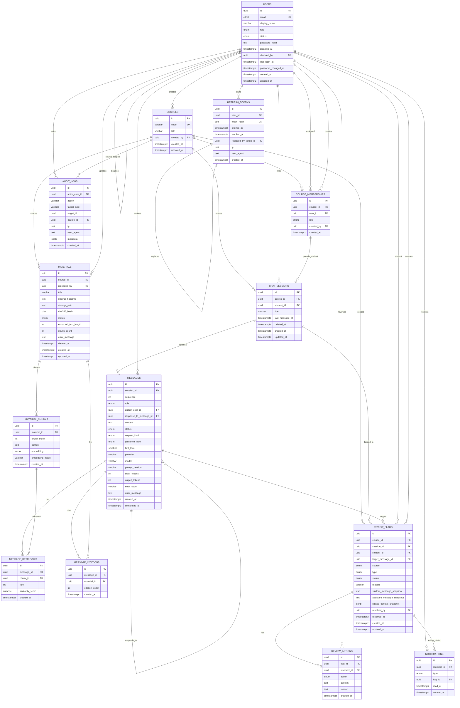

# Morshid P0 Database Schema

This document defines the P0 database schema for the protected Morshid demo. It
supports one Python Programming course, admin-created accounts, clean PDF
materials, course-scoped retrieval, private student chats, review flags,
instructor review actions, basic notifications, and audit logs.

The schema intentionally excludes P1/P2 concerns: reviewed-answer libraries,
analytics tables, CSV import workflows, retention automation, advanced RAG
metadata, and rich citation snapshots. Course isolation for derived rows is
enforced through root ownership, service guards, query joins, and tests.

## Design Invariants

- User accounts are admin-created. Disabled users are blocked server-side even if they
  still hold an old token.
- Course ownership is anchored in root tables: `course_memberships`, `materials`,
  `chat_sessions`, `review_flags`, and `audit_logs`.
- Derived chat and RAG rows do not duplicate `course_id`; queries derive course
  scope through their parent rows.
- Materials are soft-deleted in P0. Deleted materials are excluded from future
  retrieval, but old citations can still show the file title.
- P0 citations show only the source file used by the answer.
- Usage limits are enforced with Redis counters. Limit-hit events are recorded
  in `audit_logs`, not a separate usage event table.
- Instructor review screens use `review_flags` and bounded review context;
  they must not expose arbitrary unflagged private chats.

## Entity Relationship Diagram

This diagram mirrors the simplified P0 schema. It is an ER view for discussion
and implementation planning; the logical schema remains authoritative for CHECK
constraints, partial indexes, raw SQL migrations, and pgvector details.



## Logical Schema

The following DDL sketch captures the tables, constraints, and core
relationships for P0. It uses compact notation such as `uuid pk` and `fk` for
readability; implementation migrations should translate these declarations into
explicit PostgreSQL and Prisma migration syntax.

```sql
-- Required extensions
CREATE EXTENSION IF NOT EXISTS pgcrypto;
CREATE EXTENSION IF NOT EXISTS citext;
CREATE EXTENSION IF NOT EXISTS vector;

users(
  id uuid pk default gen_random_uuid(),
  email citext not null unique,
  display_name varchar(120) not null,
  role enum('ADMIN','INSTRUCTOR','STUDENT') not null,
  status enum('ACTIVE','DISABLED') not null default 'ACTIVE',
  password_hash text not null,
  disabled_at timestamptz,
  disabled_by uuid fk users(id) on delete set null,
  last_login_at timestamptz,
  password_changed_at timestamptz not null default now(),
  created_at timestamptz not null default now(),
  updated_at timestamptz not null default now(),
  check((status = 'DISABLED') = (disabled_at is not null))
)

refresh_tokens(
  id uuid pk default gen_random_uuid(),
  user_id uuid not null fk users(id) on delete cascade,
  token_hash text not null unique,
  expires_at timestamptz not null,
  revoked_at timestamptz,
  replaced_by_token_id uuid fk refresh_tokens(id) on delete set null,
  ip inet,
  user_agent text,
  created_at timestamptz not null default now()
)

courses(
  id uuid pk default gen_random_uuid(),
  code varchar(40) not null unique,
  title varchar(160) not null,
  created_by uuid fk users(id) on delete restrict,
  created_at timestamptz not null default now(),
  updated_at timestamptz not null default now()
)

course_memberships(
  id uuid pk default gen_random_uuid(),
  course_id uuid not null fk courses(id) on delete restrict,
  user_id uuid not null fk users(id) on delete restrict,
  role enum('INSTRUCTOR','STUDENT') not null,
  created_by uuid fk users(id) on delete set null,
  created_at timestamptz not null default now(),
  unique(course_id, user_id)
)

-- P0 upload validation accepts clean text-based PDFs only.
materials(
  id uuid pk default gen_random_uuid(),
  course_id uuid not null fk courses(id) on delete restrict,
  uploaded_by uuid not null fk users(id) on delete restrict,
  title varchar(180) not null,
  original_filename text not null,
  storage_path text not null,
  sha256_hash char(64),
  status enum('PROCESSING','READY','WARNING','FAILED') not null default 'PROCESSING',
  extracted_text_length int,
  chunk_count int,
  error_message text,
  deleted_at timestamptz,
  created_at timestamptz not null default now(),
  updated_at timestamptz not null default now(),
  check(extracted_text_length is null or extracted_text_length >= 0),
  check(chunk_count is null or chunk_count >= 0)
)

material_chunks(
  id uuid pk default gen_random_uuid(),
  material_id uuid not null fk materials(id) on delete cascade,
  chunk_index int not null,
  content text not null,
  embedding vector(1536) not null,
  embedding_model varchar(120) not null,
  created_at timestamptz not null default now(),
  unique(material_id, chunk_index),
  check(chunk_index >= 0)
)

chat_sessions(
  id uuid pk default gen_random_uuid(),
  course_id uuid not null fk courses(id) on delete restrict,
  student_id uuid not null fk users(id) on delete restrict,
  title varchar(160) not null,
  last_message_at timestamptz,
  deleted_at timestamptz,
  created_at timestamptz not null default now(),
  updated_at timestamptz not null default now(),
  fk(course_id, student_id) references course_memberships(course_id, user_id) on delete restrict
)

messages(
  id uuid pk default gen_random_uuid(),
  session_id uuid not null fk chat_sessions(id) on delete restrict,
  sequence int not null,
  role enum('STUDENT','ASSISTANT','SYSTEM') not null,
  author_user_id uuid fk users(id) on delete set null,
  response_to_message_id uuid fk messages(id) on delete set null,
  content text not null,
  status enum('PENDING','STREAMING','COMPLETED','FAILED','BLOCKED') not null,
  request_kind enum('CONCEPTUAL','PROBLEM_LIKE','ATTEMPT_DIAGNOSIS','CODE_DIAGNOSIS','UNSAFE','OFF_TOPIC','AMBIGUOUS'),
  guidance_label enum('COURSE_GROUNDED','GENERAL_NOT_FOUND','UNCERTAIN_AWAITING_REVIEW','INSTRUCTOR_REVIEWED','REFUSAL'),
  hint_level smallint,
  provider varchar(80),
  model varchar(120),
  prompt_version varchar(80),
  input_tokens int,
  output_tokens int,
  error_code varchar(80),
  error_message text,
  created_at timestamptz not null default now(),
  completed_at timestamptz,
  unique(session_id, sequence),
  check(sequence >= 1),
  check(hint_level is null or hint_level between 1 and 4),
  check(input_tokens is null or input_tokens >= 0),
  check(output_tokens is null or output_tokens >= 0)
)

message_retrievals(
  id uuid pk default gen_random_uuid(),
  message_id uuid not null fk messages(id) on delete cascade,
  chunk_id uuid fk material_chunks(id) on delete set null,
  rank int not null,
  similarity_score numeric(8,6),
  created_at timestamptz not null default now(),
  unique(message_id, rank),
  check(rank >= 1),
  check(similarity_score is null or similarity_score between 0 and 1)
)

message_citations(
  id uuid pk default gen_random_uuid(),
  message_id uuid not null fk messages(id) on delete cascade,
  material_id uuid not null fk materials(id) on delete restrict,
  citation_order int not null,
  created_at timestamptz not null default now(),
  unique(message_id, citation_order),
  check(citation_order >= 1)
)

review_flags(
  id uuid pk default gen_random_uuid(),
  course_id uuid not null fk courses(id) on delete restrict,
  session_id uuid not null fk chat_sessions(id) on delete restrict,
  student_id uuid not null fk users(id) on delete restrict,
  target_message_id uuid not null fk messages(id) on delete restrict,
  source enum('STUDENT','SYSTEM') not null,
  type enum('MANUAL_STUDENT_FLAG','GENERAL_NOT_FOUND','SOURCE_CONFLICT','POLICY_CHECK_FAILED','FINAL_ANSWER_RISK','CITATION_MISSING','LOW_CONFIDENCE') not null,
  status enum('OPEN','RESOLVED','REJECTED') not null default 'OPEN',
  reason varchar(200),
  student_message_snapshot text not null,
  assistant_message_snapshot text not null,
  limited_context_snapshot jsonb not null default '{}'::jsonb,
  resolved_by uuid fk users(id) on delete set null,
  resolved_at timestamptz,
  created_at timestamptz not null default now(),
  updated_at timestamptz not null default now(),
  check(reason is null or length(reason) <= 200),
  check((status in ('RESOLVED','REJECTED')) = (resolved_at is not null))
)

review_actions(
  id uuid pk default gen_random_uuid(),
  flag_id uuid not null fk review_flags(id) on delete restrict,
  reviewer_id uuid not null fk users(id) on delete restrict,
  action enum('APPROVE','EDIT','REPLACE','REJECT_REQUEST','RESOLVE') not null,
  content text,
  reason text,
  created_at timestamptz not null default now()
)

notifications(
  id uuid pk default gen_random_uuid(),
  recipient_id uuid not null fk users(id) on delete cascade,
  type enum('REVIEW_RESOLVED','REVIEW_REJECTED','USAGE_LIMIT_REACHED') not null,
  flag_id uuid fk review_flags(id) on delete restrict,
  read_at timestamptz,
  created_at timestamptz not null default now(),
  check(
    (type in ('REVIEW_RESOLVED','REVIEW_REJECTED') and flag_id is not null) or
    (type = 'USAGE_LIMIT_REACHED' and flag_id is null)
  )
)

audit_logs(
  id uuid pk default gen_random_uuid(),
  actor_user_id uuid fk users(id) on delete set null,
  action varchar(100) not null,
  target_type varchar(80) not null,
  target_id uuid,
  course_id uuid fk courses(id) on delete restrict,
  ip inet,
  user_agent text,
  metadata jsonb not null default '{}'::jsonb,
  created_at timestamptz not null default now()
)
```

## Key Indexes

These indexes cover the primary P0 access paths: authentication, course
membership checks, material readiness, chat history, retrieval joins, review
queues, unread notifications, and audit lookups.

```sql
CREATE INDEX idx_refresh_tokens_user ON refresh_tokens(user_id);
CREATE INDEX idx_memberships_course_role ON course_memberships(course_id, role);
CREATE INDEX idx_memberships_user ON course_memberships(user_id);

CREATE INDEX idx_materials_course_status
  ON materials(course_id, status, deleted_at);
CREATE INDEX idx_chunks_material ON material_chunks(material_id);
CREATE INDEX idx_chunks_embedding_hnsw
  ON material_chunks USING hnsw (embedding vector_cosine_ops);

CREATE INDEX idx_sessions_student_course
  ON chat_sessions(student_id, course_id, deleted_at, last_message_at);
CREATE INDEX idx_messages_session_sequence ON messages(session_id, sequence);
CREATE INDEX idx_retrievals_message ON message_retrievals(message_id);
CREATE INDEX idx_citations_message ON message_citations(message_id);

CREATE INDEX idx_flags_course_status ON review_flags(course_id, status, created_at);
CREATE INDEX idx_flags_student_date ON review_flags(student_id, created_at);
CREATE UNIQUE INDEX uq_open_flag_per_message
  ON review_flags(target_message_id)
  WHERE status = 'OPEN';

CREATE INDEX idx_actions_flag ON review_actions(flag_id, created_at);
CREATE INDEX idx_notifications_unread
  ON notifications(recipient_id, created_at)
  WHERE read_at IS NULL;
CREATE INDEX idx_audit_course_created ON audit_logs(course_id, created_at);
CREATE INDEX idx_audit_actor_created ON audit_logs(actor_user_id, created_at);
```

## Simplification Summary

- Removed `usage_events`. Usage counters live in Redis; limit hits are
  recorded in `audit_logs`.
- Trimmed `materials` to upload identity, storage path, SHA-256, status, simple
  extraction counts, one error message, and soft deletion.
- Removed material version/topic/week/mime/file-size metadata, extraction JSON,
  retrieval sanity JSON, warning arrays, error codes, and acceptance workflow
  columns.
- Trimmed `material_chunks` to chunk order, text, embedding, embedding model,
  and creation time.
- Kept `message_retrievals`, but reduced it to message, chunk, rank, score, and
  timestamp.
- Reduced `message_citations` to file-level citations: assistant message,
  material row, citation order, and timestamp.
- Removed citation snapshots. P0 keeps material rows through soft deletion, so
  old citations can still show the file.
- Removed repeated `course_id` values from derived child tables: chunks, messages,
  retrievals, citations, review actions, and notifications.
- Kept `review_actions`, but reduced it to flag, reviewer, action, optional
  content and reason, and timestamp.
- Kept `limited_context_snapshot`, but it should stay bounded to the allowed
  previous and next context, not a full thread dump.
- Reduced `notifications` to recipient, type, optional review flag, read state,
  and timestamp.
- Removed `course_memberships.status`; unassignment deletes the membership row
  and writes an audit log.
- Removed `chat_sessions.status`; `deleted_at` represents the soft-delete state.
- Removed `messages.policy_check_snapshot`; actionable policy failures create a
  review flag or audit log. Provider/model/prompt/tokens remain for basic AI
  observability.

## P0 Coverage Matrix

| P0 requirement | Schema support |
| --- | --- |
| Admin-created users with roles and disabled-account blocking | `users.role`, `users.status`, `disabled_at`, `disabled_by`, password fields, and `refresh_tokens` revocation. |
| One Python Programming course, one instructor, and three students | `courses` and `course_memberships`; seed data creates the P0 course and accounts. |
| Course membership and assignment checks | `course_memberships` plus service guards; `chat_sessions` also references the student/course membership pair. |
| Clean text-based PDF materials only | Upload validation enforces PDF-only P0; `materials` stores the accepted file identity and processing status. |
| Material processing status, extraction counts, chunks, embeddings | `materials.status`, `extracted_text_length`, `chunk_count`, `error_message`; `material_chunks.embedding`. |
| Retrieval sanity checks | Kept as application/evaluation output for P0, not as a dedicated table. Material readiness is represented by `materials.status`. |
| Private student chat sessions and messages | `chat_sessions.student_id`, `messages.session_id`, and service guards. Soft deletion uses `chat_sessions.deleted_at`. |
| Course-scoped RAG retrieval and citations | Retrieval joins `messages -> chat_sessions -> courses` and `material_chunks -> materials -> courses`; `message_citations` points to the cited file. |
| Guidance labels | `messages.guidance_label` covers course-grounded, general not found, uncertain awaiting review, instructor-reviewed, and refusal. |
| Socratic support | `messages.request_kind` and nullable `hint_level` cover request classification and four-level hint tracking. |
| Student and system review flags | `review_flags.source`, `type`, `status`, and `reason`; `idx_flags_student_date` supports the three-per-day manual review limit query. |
| Instructor review with limited context | `review_flags` stores flagged student/assistant snapshots plus bounded `limited_context_snapshot`; `review_actions` stores instructor actions. |
| Student notification and status after review | `notifications` stores minimal review and limit notifications; `review_flags.status` stores the durable review state. |
| Usage limits | Redis counters enforce limits; `notifications` can show `USAGE_LIMIT_REACHED`; `audit_logs` records limit events. |
| Auditability | `audit_logs` stores authentication, boundary, material, review, usage-limit, and unauthorized-access events. |
| Instructor cannot browse unflagged private chats | No table grants that access. Review UI/API must read from `review_flags` and bounded context only. |
| Citation survival after source deletion | Materials are soft-deleted with `deleted_at`; citation rows keep `material_id` pointing at the retained file row. |

## Raw SQL and Prisma Notes

- The `citext`, `pgcrypto`, and `vector` extensions must be created in raw SQL
  migrations.
- `embedding vector(1536)` and the HNSW vector index require raw SQL. If the
  embedding provider changes dimensions, migrate this column and re-embed
  chunks before switching.
- Partial indexes such as `uq_open_flag_per_message` and unread notifications
  are raw SQL in Prisma migrations.
- CHECK constraints for disabled-account coherence, non-negative counts/tokens,
  hint levels, notification type shape, and resolved timestamps should be raw
  SQL if Prisma cannot emit them.
- The `chat_sessions(course_id, student_id) -> course_memberships(course_id,
  user_id)` foreign key proves assignment exists, but student-vs-instructor role checks
  still belong in service guards unless the team adds database triggers.
- Course isolation for derived rows is intentionally simpler than the earlier
  composite-FK design. Retrieval and review queries must join through parent
  rows and tests must cover cross-course leakage.

## Open Questions

1. Embedding dimension/model: `vector(1536)` is still a placeholder until the
   approved embedding provider is final.
2. Warning status: decide whether `materials.status = 'WARNING'` is retrievable
   by default or requires an explicit instructor/admin action later.
